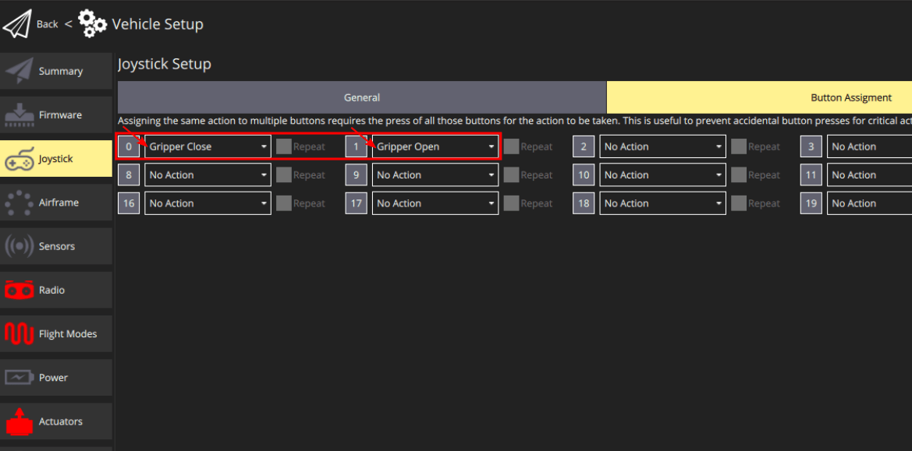

# Gripper Peripherals

Grippers are a commonly used mechanism for UAV delivery applications. There are multiple types of interfaces (e.g. PWM, CAN) for different products in the market.

## Supported Gripper types

PX4 supports following Gripper types, check the individual page to learn how to integrate them.

- [Servo Gripper with PWM](gripper_servo.md)

:::note
The [Roboclaw driver](../modules/modules_driver.md#roboclaw) isn't supported as a Gripper yet. However in the future it may get supported as a Gripper.
:::

## Gripper actuator mapping

To enable the output of the Gripper, set the Function of the output port the gripper is connected to as `Gripper`.

:::note
Make sure to set the correct PWM frequency (usually commercial servo / grippers only support 50Hz)! If you mis-configure the frequency you risk damaging the gripper.
:::

## Griper action joystick button mapping in QGC

QGC provides the Button mapping interface, which allows to map delivery mechanism actions to specific buttons of the [Joystick](../config/joystick.md) connected to QGC.

### Buttons Mapping

Navigate by clicking **"QGC Logo (upper-left)" > "Vehicle Setup" > "Joystick" > "Button Assignment"** tab. There are Gripper Open and Gripper Close actions available to map to a button.

You can test the actions by clicking on the buttons each and checking Gripper's movements. If the gripper doesn't move as expected, please make sure that the Gripper integration was set up properly.

If you press "Grab" button while the gripper is opening, it will automatically abort releasing behavior and go to the Close position, effectively cancelling the release command.

:::note
Note that currently in PX4 the Gripper isn't supported as a standalone driver, but is instead tied to the [payload delivery feature](../advanced_features/package_delivery.md).

Therefore unless you [configure the gripper for package delivery](#setting-up-gripper-for-package-delivery), gripper will not be functioning!
:::

## Setting up Gripper for Package Delivery

Gripper is commonly used for features like [Package Delivery](../advanced_features/package_delivery.md). This section describes how to setup the Payload Delivery for Gripper.

### Note on using Joystick button action during package delivery mission

If you forcefully command the gripper to 'Close' position while the package delivery is happening (gripper open action), gripper won't be able to finish the open action, and the mission will come to a halt for a payload delivery mission item timeout, then resume the mission.

### Enable payload delivery feature (Gripper)

Set [`PD_GRIPPER_EN`](../advanced_config/parameter_reference.md#PD_GRIPPER_EN) parameter to 1 (reboot required after change).

### Enabling Pre-arm mode

By default, the Gripper will be in a disarmed position when the vehicle is disarmed. However since in most cases, the operator wants to open / close the gripper for mounting the payload while the vehicle is disarmed, we need to set a parameter to allow pre-arming, which allows non-motor actuators to move freely when disarmed, but not the motors.

Set [`COM_PREARM_MODE`](../advanced_config/parameter_reference.md#COM_PREARM_MODE) to `Always`.

### Profiling the Gripper

Some mechanism specific settings need to be added to make sure the system is aware of the mechanism's physical properties. Since every gripper works differently (speed / range of motion / behavior).

### Gripper Mechanism Type

Set the [`PD_GRIPPER_TYPE`](../advanced_config/parameter_reference.md#PD_GRIPPER_TYPE) to the type of Gripper you have.

Note that for now we only support a [Servo Gripper](gripper_servo.md), so you will be setting the value to `Servo`.

### Gripper Actuation Time

You need to specify an actuation time, which specifies the time it takes to open or close the gripper. As most grippers don't have a sensor to detect successful actuation (close/opening), the payload delivery feature will rely on this value to estimate gripper's position.

To measure gripper actuation time, go to the MAVLink Shell in AMC and execute the following code while the drone is on a bench and the propellers are removed:

`> payload_deliverer gripper_test`

Then observe how long it takes for the gripper to go from open position to closed position, and vise versa for opening. Note down the actuation time for both cases and choose the maximum measurement for the actuation time.

As an alternative test method, you can utilize the [Joystick capability](#griper-action-joystick-button-mapping-in-qgc) to trigger gripper open and close actions as well.

:::note
If you get an error message such as "[payload_deliverer] not running", make sure that you have gone through the setup procedures above and either run `payload_deliverer start` command in the Nuttx shell
:::

After measuring the opening and closing actuation time, set [PD_GRIPPER_TO](../advanced_config/parameter_reference.md#PD_GRIPPER_TO) to the longer timeout of the two.

### Mission timeout

To use payload delivery feature as part of a mission, it is important to make sure that a potential actuation failure does not cause the mission to be halted or interrupted.

For missions there is an additional safeguard in form of a timeout, after which a mission is continued even if the gripper's successful actuation acknowledgement (which is published by the payload_deliverer module in charge of the Payload Delivery feature) is not received.

Set the [MIS_PD_TO](../advanced_config/parameter_reference.md#MIS_PD_TO) as the mission timeout, which must be greater than the [Gripper actuation time](#gripper-actuation-time) setting.

Possible causes could be actuator failures (currently not the case since Gripper state feedback sensor is not supported), but also internal communication errors (PX4's internal uORB messaging system can in rare-cases drop the acknowledgement message).

:::note
Currently, PWM Grippers rely on this parameter alone to determine whether the actuation was successful or not.
:::