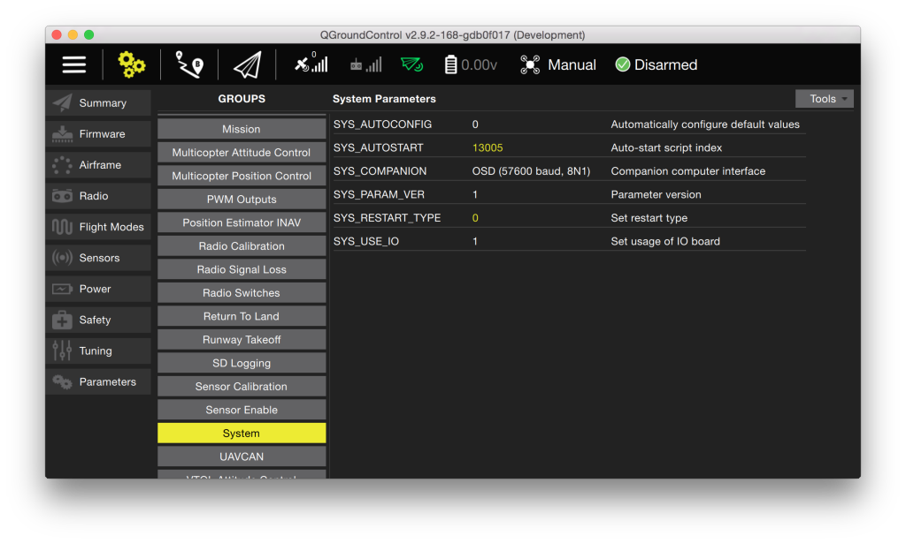

# MAVLink (OSD/Telemetry)

## TELEM1 Port

The telemetry 1 port defaults to 57600 baud, 8N1 and transmits a MAVLink
stream.

## TELEM2 Port

The MAVLink settings default to OSD mode at 57600 baud.

The **drop-down menu** for the SYS_COMPANION parameter allows to set
the optimal mode depending on the application scenario.

-   Companion computer mode at 921600 baud
-   Companion computer mode at 57600 baud
-   OSD mode at 57600 baud
-   Command / RC input mode (receive only) at 57600 baud
-   Normal telemetry mode at 57600 baud

