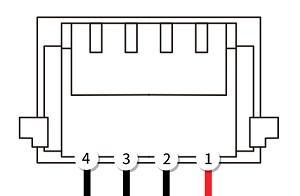
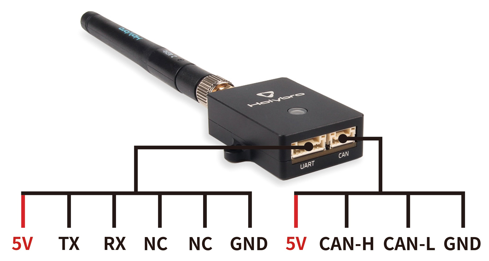

# Remote ID (Open Drone ID)

:::warning Experimental
Remote ID support is experimental in PX4 v1.14.
:::

Remote ID is a government mandated technology for UAVs in Japan, the United States of America and the European Union, designed to enable safe sharing of airspace between UAVs and other aircraft.
The specification requires that UAVs broadcast data such as: real-time location/altitude, serial number, operator ID/location, status, etc.

## Supported Hardware

PX4 integrates with Remote ID hardware that supports the [Open Drone ID](https://mavlink.io/en/services/opendroneid.html) MAVLink protocol (Open Drone ID is an open source implementation of Remote ID).

It has been tested with the following devices:

- [Cube ID](https://docs.cubepilot.org/user-guides/cube-id/cube-id) (CubePilot)
- [Db201](https://dronescout.co/dronebeacon-mavlink-remote-id-transponder/) (BlueMark)
- [Db202mav](https://dronescout.co/dronebeacon-mavlink-remote-id-transponder/) (BlueMark) - less expensive variant without CAN port.
- [Holybro RemoteID Module](https://holybro.com/products/remote-id) (Holybro)

:::note

- Other devices that support the MAVLink API should work (but have not been tested).
- PX4 does not support Remote ID over CAN in PX4 v1.14.
  :::

## Hardware Setup

Remote ID devices can be connected to any free/unused serial port on the flight controller.
Most commonly they are connected directly to the `TELEM2` port (if it is not being use for some other purpose) as this is already configured for MAVLink "by default".

### Cube ID

[Cube ID](https://docs.cubepilot.org/user-guides/cube-id/cube-id) can be connected using its serial port (DroneCAN cannot be used).
It comes with a 6-pin JST-GH 1.25mm cable that can be connected directly to the `TELEM` ports on most recent Pixhawk flight controllers.

If using a different port, or a flight controller that has different connector, you may need to modify the cable.
The pinout of the serial port is shown below.
The TX and RX on the flight controller must be connected to the RX and TX on the Remote ID, respectively.

#### Cube ID Serial Port

| Pin     | Signal   | Volt |
| ------- | -------- | ---- |
| 1 (red) | VCC_5V   | 5V   |
| 2 (blk) | TX (OUT) |      |
| 3 (blk) | RX (IN)  |      |
| 4 (blk) | GND      | 0    |

### BlueMark Db201/Db202mav

[Db201](https://dronescout.co/dronebeacon-mavlink-remote-id-transponder/) or [Db202mav](https://dronescout.co/dronebeacon-mavlink-remote-id-transponder/) can be connected using their serial port (DroneCAN cannot be used).
They come with a 6-pin JST-GH 1.25mm cable that can be connected directly to the `TELEM` ports on most recent Pixhawk flight controllers.

If using a different serial port (i.e. with fewer pins), or a flight controller that has different connector, you may need to modify the cable.
Information on the port pinout can be found in the [User Guide](https://download.bluemark.io/db200.pdf).

The beacons come preinstalled with recent [ArduRemoteID](https://github.com/ArduPilot/ArduRemoteID) firmware.
The [User Guide](https://download.bluemark.io/db200.pdf) explains how you can update firmware via the web interface, if needed.

More general setup, including how to mount the beacon, is also covered in the [User Guide](https://download.bluemark.io/db200.pdf)

### Holybro Remote ID Module

The [Holybro Remote ID Module](https://holybro.com/products/remote-id) can be connected using the serial port (DroneCAN cannot be used in PX4 v1.14).
It comes with a 6-pin JST-GH 1.25mm cable that can be connected directly to the `TELEM` ports on most recent Pixhawk flight controllers such as the Pixhawk 6C/6X or Cube Orange.

The module comes preinstalled with recent [ArduRemoteID](https://github.com/ArduPilot/ArduRemoteID) firmware.
The [User Guide](https://docs.holybro.com/radio/remote-id) explains how you can config and update firmware via the web interface, if needed.

#### Holybro Pinouts

Note that CAN port not supported in PX4 v1.14

# PX4 Configuration

### Port Configuration

Remote ID hardware is configured in the same way as any other [MAVLink Peripheral](../peripherals/mavlink_peripherals.md).

Assuming you have connected the device to the `TELEM2` port, [set the parameters](../advanced_config/parameters.md) as shown:

- [MAV_1_CONFIG](../advanced_config/parameter_reference.md#MAV_1_CONFIG) = `TELEM 2`
- [MAV_1_MODE](../advanced_config/parameter_reference.md#MAV_1_MODE) = Normal
- [MAV_1_RATE](../advanced_config/parameter_reference.md#MAV_1_RATE) = 0 (default sending rate for port).
- [MAV_1_FORWARD](../advanced_config/parameter_reference.md#MAV_1_FORWARD) = Enabled

Then reboot the vehicle.

You will now find a new parameter called [SER_TEL2_BAUD](../advanced_config/parameter_reference.md#SER_TEL2_BAUD).
The required baud rate depends on the remote ID used (for Cube ID it must be set to 57600).

<!-- In theory, a Remote ID (or other MAVLink peripheral) that supports WiFi or wired Ethernet network could also be connected over those links. -->

### Enable Remote ID

There is no need to explicitly enable Remote ID (supported Remote ID messages are either streamed by default or must be requested in the current implementation, even if no remote ID is connected).

### Prevent Arming based on Remote ID

To only allow arming when a Remote ID is ready, [set](../advanced_config/parameters.md#conditional-parameters) the parameter [COM_ARM_ODID](#COM_ARM_ODID) to `2` (it is disabled by default).

| Parameter                                                                                       | Description                                                                                                                                                                            |
| ----------------------------------------------------------------------------------------------- | -------------------------------------------------------------------------------------------------------------------------------------------------------------------------------------- |
| [COM_ARM_ODID](../advanced_config/parameter_reference.md#COM_ARM_ODID) | Enable Drone ID system detection and health check. `0`: Disable (default), `1`: Warn if Remote ID not detected but still allow arming, `2`: Only allow arming if Remote ID is present. |

## Implementation

PX4 v1.14 streams these messages by default (in streaming modes: normal, onboard, usb, onboard low bandwidth):

- [OPEN_DRONE_ID_LOCATION](https://mavlink.io/en/messages/common.html#OPEN_DRONE_ID_LOCATION) (1 Hz) - UAV location, altitude, direction, and speed.
- [OPEN_DRONE_ID_SYSTEM](https://mavlink.io/en/messages/common.html#OPEN_DRONE_ID_SYSTEM) (1 Hz) Operator location/altitude, multiple aircraft information (group/swarm, if applicable), full timestamp and possible category/class information.

  - Implementation assumes operator is located at vehicle home position (does not yet support getting operator position from GCS).
    This is believed to be compliant for broadcast-only Remote IDs.

The following message can be streamed on request (using [MAV_CMD_SET_MESSAGE_INTERVAL](https://mavlink.io/en/messages/common.html#MAV_CMD_SET_MESSAGE_INTERVAL)):

- [OPEN_DRONE_ID_BASIC_ID](https://mavlink.io/en/messages/common.html#OPEN_DRONE_ID_BASIC_ID) - UAV identity information (essentially a serial number)
  - PX4 v1.14 specifies a serial number ([MAV_ODID_ID_TYPE_SERIAL_NUMBER](https://mavlink.io/en/messages/common.html#MAV_ODID_ID_TYPE_SERIAL_NUMBER)) but does not use the required format (ANSI/CTA-2063 format).

PX4 prevents arming based on Remote ID health if parameter [COM_ARM_ODID](../advanced_config/parameter_reference.md#COM_ARM_ODID) is set to `2`.
The UAV will then require `HEARTBEAT` messages from the Remote ID as a precondition for arming the UAV.
You can also set the parameter to `1` to warn but still allow arming when Remote ID `HEARTBEAT` messages are not detected.

The following Open Drone ID MAVLink messages are not supported in PX4 v1.14 (to be added by [PX4#21647](https://github.com/PX4/PX4-Autopilot/pull/21647)):

- [OPEN_DRONE_ID_AUTHENTICATION](https://mavlink.io/en/messages/common.html#OPEN_DRONE_ID_AUTHENTICATION) - Provides authentication data for the UAV.
- [OPEN_DRONE_ID_SELF_ID](https://mavlink.io/en/messages/common.html#OPEN_DRONE_ID_SELF_ID) - Operator identity (plain text).
- [OPEN_DRONE_ID_OPERATOR_ID](https://mavlink.io/en/messages/common.html#OPEN_DRONE_ID_OPERATOR_ID) - Operator identity.
- [OPEN_DRONE_ID_ARM_STATUS](https://mavlink.io/en/messages/common.html#OPEN_DRONE_ID_ARM_STATUS) - Status of Remote ID hardware. Use as condition for vehicle arming, and for Remote ID health check.
- [OPEN_DRONE_ID_SYSTEM_UPDATE](https://mavlink.io/en/messages/common.html#OPEN_DRONE_ID_SYSTEM_UPDATE) - Subset of `OPEN_DRONE_ID_SYSTEM` that can be sent with information at higher rate.

## Compliance

PX4 may not be compliant with the relevant specifications in version 1.14 (which is why this feature is currently experimental).
A working group has been established to evaluate the gaps.

Some known issues are:

- Vehicles must arm conditional on receiving the Remote ID [OPEN_DRONE_ID_ARM_STATUS](https://mavlink.io/en/messages/common.html#OPEN_DRONE_ID_ARM_STATUS) message, with a status that indicates the Remote ID hardware is ready to broadcast.
  - PX4 v1.14 does not process `OPEN_DRONE_ID_ARM_STATUS`, and arming is only conditional on the Remote ID device `HEARTBEAT`.
- Health of the Remote ID depends on both receiving a `HEARTBEAT` and the `OPEN_DRONE_ID_ARM_STATUS`.
  When flying, a non-armed status for the Remote ID must be published in [OPEN_DRONE_ID_LOCATION.status](https://mavlink.io/en/messages/common.html#OPEN_DRONE_ID_LOCATION) as a Remote ID malfunction.
  - PX4 v1.14 does not yet receive `OPEN_DRONE_ID_ARM_STATUS`.
- `OPEN_DRONE_ID_ARM_STATUS` must be forwarded to the GCS, if present for additional error reporting.
- [OPEN_DRONE_ID_BASIC_ID](https://mavlink.io/en/messages/common.html#OPEN_DRONE_ID_BASIC_ID) specifies a serial number in an invalid format (not ANSI/CTA-2063 format).
- The vehicle ID is expected to be tamper resistent.

[PX4-Autopilot/21647](https://github.com/PX4/PX4-Autopilot/pull/21647) is intended to address the known issues.
