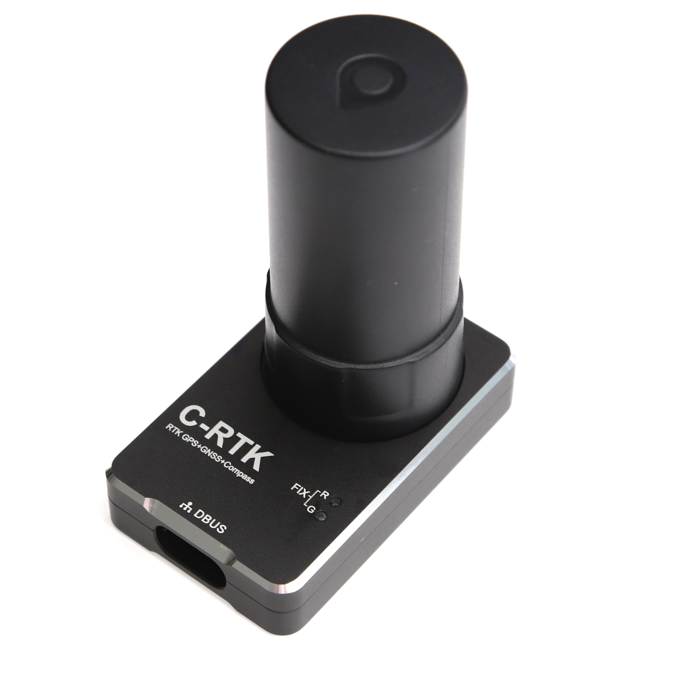

# CUAV C-RTK

The [CUAV C-RTK GPS receiver](http://doc.cuav.net/gps/c-rtk/en/) is a RTK module for mass market launched by CUAV. The complete RTK system can be composed of two C-RTK modules (one for aircraft and one for base station).Using RTK, PX4 can get its position with centimetre-level accuracy, which is much more accurate than can be provided by a normal GPS.

## Purchase

[cuav taobao](https://item.taobao.com/item.htm?id=565380634341&spm=2014.21600712.0.0)
[cuav aliexpress](https://www.aliexpress.com/store/product/CUAV-NEW-Flight-Controller-GPS-C-RTK-differential-positioning-navigation-module-GPS-for-PIX4-Pixhawk-pixhack/3257035_32853894248.html?spm=2114.12010608.0.0.75592fadQKPPEn)

## Configuration

RTK setup and use on PX4 via *QGroundControl* is largely plug and play (see [RTK GPS](../advanced_features/rtk-gps.md) for more information).

> **Tip** The Drotek UCenter tool is not required for configuration - everything is handled by *QGroundControl*.

## Wiring and Connections

The module inputs/outputs are [shown here](http://doc.cuav.net/gps/c-rtk/en/Instructions.html) (CUAV docs).
