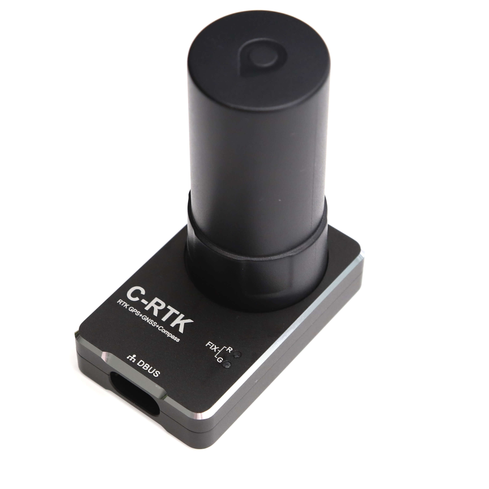

# CUAV C-RTK

The [CUAV C-RTK GPS receiver](http://doc.cuav.net/gps/c-rtk/en/) is a RTK module for mass market launched by CUAV. The complete RTK system consists of at least two C-RTK modules \(one for the base station and the others for the aircraft\). Using RTK, PX4 can get its position with centimetre-level accuracy, which is much more accurate than can be provided by a normal GPS.

## Purchase

* [cuav taobao](https://item.taobao.com/item.htm?id=565380634341&spm=2014.21600712.0.0)
* [cuav aliexpress](https://www.aliexpress.com/store/product/CUAV-NEW-Flight-Controller-GPS-C-RTK-differential-positioning-navigation-module-GPS-for-PIX4-Pixhawk-pixhack/3257035_32853894248.html?spm=2114.12010608.0.0.75592fadQKPPEn)

## Configuration

RTK setup and use on PX4 via _QGroundControl_ is largely plug and play \(see [RTK GPS](../advanced_features/rtk-gps.md) for more information\).

## Wiring and Connections

C-RTK GPS with 6-pin connector and 4-pin connector, 6-pin connector can be plugged directly into [Pixhack v3](http://doc.cuav.net/gps/c-rtk/en/Instructions.html) GPS UART port, If you only need rtk gps, 4-pin connector does not need to be connected to flight control.

The Pixhawk 3 Pro and Pixracer have 6-pin GPS port connectors. For these controllers, you can modify the order of the GPS cables \(shown below\).

4-pin connector for GPS（m8n module)  - This cable can also be connected if desired.

### Pinout
The C-RTK GPS pinout is provided below. This can be used to help modify the connector for other autopilot boards.

| pin | C-RTK GPS 6P  | pin | Pixhawk 3 Pro GPS |C-RTK GPS 4P
| --- | ------------- | --- | ----------------- |-----------------|
| 1   | SDA           | 1   | VCC               |   |
| 2   | SCL           | 2   | GPS_TX            |  |
| 3   | GPS_RX        |3   | GPS_RX             |    GPS_RX|
| 4   | GPS_TX        | 4   | SCL               |  GPS_TX |
| 5   | VCC_5V        | 5   | SDA               | VCC_5v |
| 6   | GND           | 6 | GND                 |GND|

           

