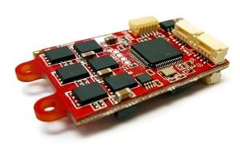
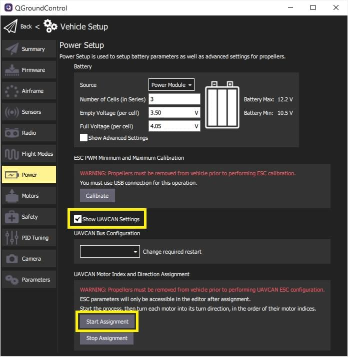

# UAVCAN ESCs (Motor Controllers)

PX4 supports the [UAVCAN](https://uavcan.org/) bus for connecting peripherals, including ESCs, GPS modules, various types of sensors, etc.

UAVCAN ESCs have a number of advantages over [PWM ESCs and Servos](../peripherals/pwm_escs_and_servo.md):
- UAVCAN has been specifically designed to deliver robust and reliable connectivity over relatively large distances.
  It enables safe use of ESCs on bigger vehicles and communication redundancy.
- The bus is bi-directional, enabling health monitoring and diagnostics.
- Wiring is less complicated as you can have a single bus for connecting all your ESCs and other UAVCAN peripherals.
- Setup is easier as you configure ESC numbering by manually spinning each motor.

PX4 can be used with UAVCAN ESC that run [Sapog](https://github.com/PX4/sapog#px4-sapog) firmware; an advanced open source sensorless PMSM/BLDC motor controller firmware designed for use in propulsion systems of electric unmanned vehicles.

> **Note** At time of writing PX4 supports UAVCAN v0 (not v1.0).

## Purchase

Commercially available ESCs running Sapog firmware include:
- [Zubax Orel 20](https://zubax.com/products/orel_20)

  

- [Holybro Kotleta20](https://shop.holybro.com/kotleta20_p1156.html)

  
  

## Setup 

The following sections explain how to use Sapog-based ESCs with PX4.
The instructions should work for any Sapog-based ESC design.

### Connecting

Connect all of the on-board CAN devices into a chain and make sure the bus is terminated at the end nodes.
The order in which the ESC are connected/chained does not matter.
For more information information about proper bus connections see [UAVCAN Device Interconnection](https://kb.zubax.com/display/MAINKB/UAVCAN+device+interconnection) (Zubax KB).

### Configuring Sapog

PX4 supports automatic ESC enumeration, so no manual configuration is needed.
During the auto-enumeration process, the following configuration parameters will be assigned automatically for each enumerated ESC:
- `esc_index`
- `ctl_dir`

Learn more about configuration parameters in the [Sapog reference manual](https://files.zubax.com/products/io.px4.sapog/Sapog_v2_Reference_Manual.pdf).

> **Tip** You can skip the automated enumeration procedure by configuring the above listed parameters manually on each ESC using the [UAVCAN GUI Tool](https://uavcan.org/GUI_Tool/Overview/).

> **Note** You may need to perform some tuning of motor control characteristics.
  That is "out of the scope" and may be done later.

### Configuring PX4

Power the vehicle using the battery (you must power the whole vehicle, not just the flight controller!) and connect *QGroundControl*.
Then navigate to the [Vehicle Setup > Parameters](../advanced_config/parameters.md) screen.

#### Enabling the UAVCAN driver

Set the configuration parameter [UAVCAN_ENABLE](../advanced_config/parameter_reference.md#UAVCAN_ENABLE) to the value *Sensors and Motors* (3) and then reboot the flight controller.

If applicable, also set the parameter [UAVCAN_ESC_IDLT](../advanced_config/parameter_reference.md#UAVCAN_ESC_IDLT) to 1 in order to ensure that the motors are always running at least at the idle throttle while the system is armed.
Some systems will not benefit from this behavior, e.g. glider drones.

#### Enumerating the ESC

You can skip this section if there is only one ESC in your setup, because the ESC index is already set to zero by default.

To enumerate the ESC:
1. Start the process of ESC auto-enumeration by pressing the **Start Assignment** button, as shown on the screenshot below.

   

   You will hear a sound indicating that the flight controller has entered the ESC enumeration mode.
1. Manually turn each motor in the correct direction of its rotation, starting from the first motor and finishing with the last motor.
   Each time you turn a motor, you should hear a confirmation.
   
   > **Note** Make sure to turn each of the motors in the correct direction, because the ESC will automatically learn and remember the direction (i.e. motors that spin clockwise during normal operation must also be turned clockwise during enumeration).

1. After the last motor is enumerated, the confirmation sound should change to indicate that the enumeration procedure is complete.

The following video demonstrates the process:


https://www.youtube.com/watch?v=4nSa8tvpbgQ


## Further Information

- [Sapog v2 Reference Manual](https://files.zubax.com/products/io.px4.sapog/Sapog_v2_Reference_Manual.pdf)
- [UAVCAN Device Interconnection](https://kb.zubax.com/display/MAINKB/UAVCAN+device+interconnection) (Zubax KB)
- [Using Sapog based ESC with PX4](https://kb.zubax.com/display/MAINKB/Using+Sapog-based+ESC+with+PX4) (Zubax KB)

