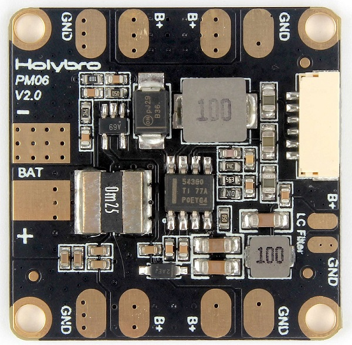
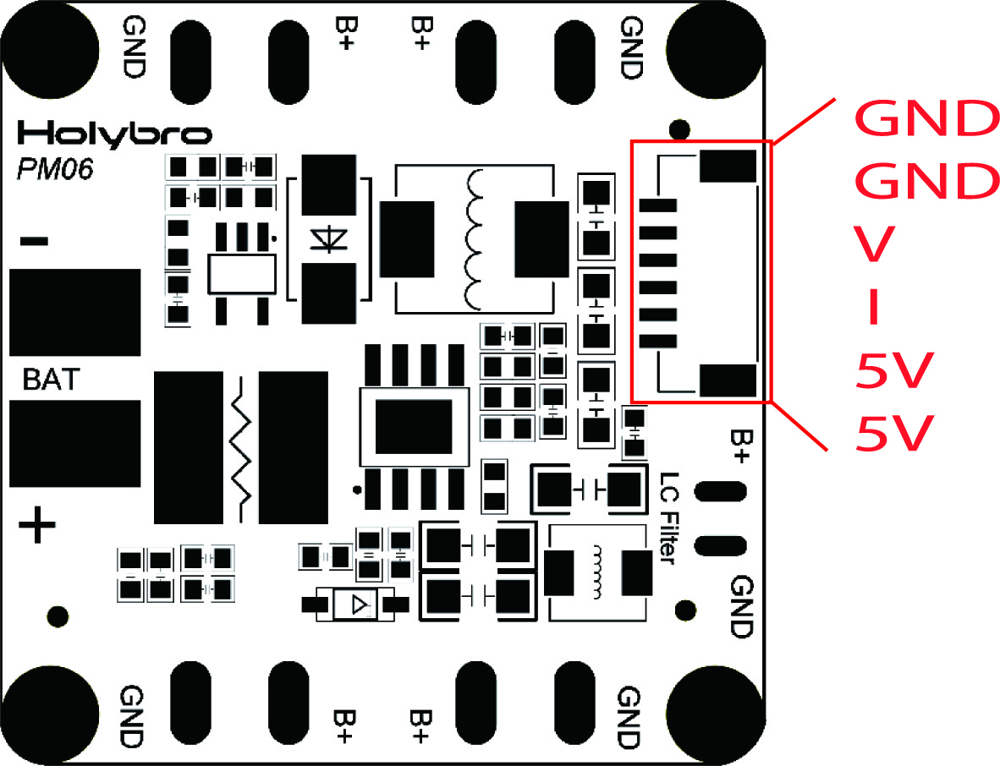

# Holybro Micro Power Module (PM06)

This power module provides regulated power for a flight controller and ESCs, and sends information to the autopilot about the battery’s voltage and current draw.
It is supplied with the [Pixhawk 4 Mini](../flight_controller/pixhawk4_mini.md), but can also be separately purchased.

 

## Specifications

- **PCB Current:** 120A continued
- **UBEC Current:** 3A Max
- **Power input:** DC 7V~42V(2S~10S)
- **Power output:** DC 5.1V~5.3V
- **Dimensions:** 35x35x5mm
- **Mounting hole:** 30.5mm*30.5mm
- **Weight:** 7g

## Package Contents

- PM06 board (1)
- 80mm XT60 connector wire (1)
- 6pin GH cable (1)
- 6pin JST cable (1)

## Purchase

[PM06 V2 Power Management Board](https://shop.holybro.com/micro-power-module-pm06_p1036.html) 

## Wiring/Connections

Wiring and connection examples can be found in: [Pixhawk 4 Mini > Power](../assembly/quick_start_pixhawk4_mini.md#power).

