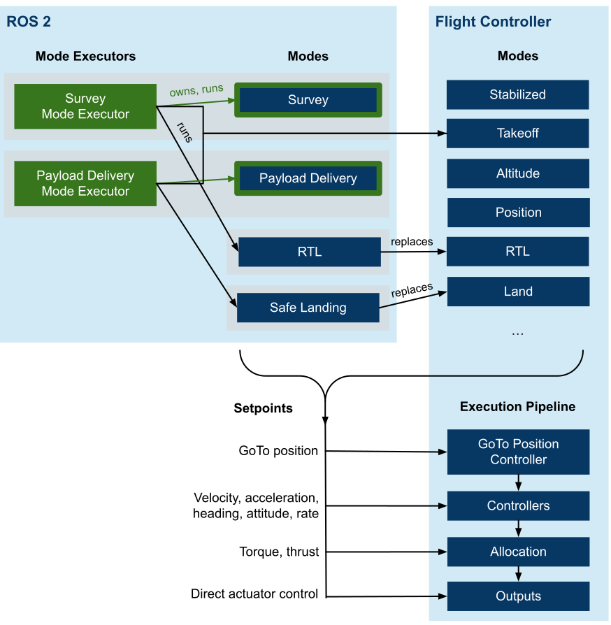

# PX4 ROS 2 interface library

The [PX4 ROS 2 interface library](https://github.com/Auterion/px4-ros2-interface-lib) is a C++ library to simplify controlling PX4 from ROS 2.
It allows developers to write external modes that are dynamically registered with PX4 and behave the same way as internal ones.
A mode can send different types of setpoints, ranging from high-level navigation tasks all the way down to direct actuator controls.

## Overview

This diagram provides a conceptual overview:



<!-- Source: https://docs.google.com/drawings/d/1WByCfgcytnaow7r41VhYJL8OGrw1RjFO51GoPMQBCNA/edit -->

The following sections define and explain the terms used in the diagram.

### Definitions

#### Mode
A mode has the following properties:
- It is a component that can send setpoints to the vehicle, which control its motion (such as velocity or direct actuator commands).
- A mode can't activate other modes (by sending commands), and must be activated by the user (through RC/GCS), the flight controller in a failsafe situation, a _mode executor_, or some other external system.
- It selects a setpoint type and sends it while it is active.
  A mode can switch between multiple setpoint types.
- Has a name displayed by the GCS.
- Can configure its mode requirements (for example that it requires a valid position estimate).
- A mode can perform different tasks, such as flying to a target, lowering a winch, releasing a payload and then fly back.

#### Mode Executor
A mode executor is an optional component for scheduling modes.
For example, the mode executor for a custom payload delivery or survey mode might first trigger a take-off, then switch to the custom mode, and when that completes trigger an RTL.

Specifically, it has the following properties:
- A mode executor is an optional component one level higher than a mode. It is a state machine that can activate modes, and wait for their completion.
- It can only do so while it is in charge.
  For that, an executor has exactly one _owned mode_ (and a mode can be owned by at most one executor).
  This mode serves as activation for the executor: when the user selects the mode, the owning executor gets activated and can select any mode.
  It stays in charge until the user switches modes (by RC or from a GCS), or a failsafe triggers a mode switch.
  Should the failsafe clear, the executor gets reactivated.
- This allows multiple executors to coexist.
- Executors cannot activate other executors.
- Within the library, a mode executor is always implemented in combination with a custom mode.

:::note
- These definitions guarantee that a user can take away control from a custom mode or executor at any point in time by commanding a mode switch through RC or a GCS.
- A mode executor is transparent to the user.
  It gets indirectly selected and activated through the owning mode, and thus the mode should be named accordingly.
:::

#### Configuration Overrides

Both modes and executors can define configuration overrides, allowing to customize certain behaviors while the mode or executor is active.

These are currently implemented:

- Disabling auto-disarm. This allows for landing and then taking off again (e.g. to release a payload).
- Ability to defer non-essential failsafes.
  It allows for example an executor to run a critical action without being interrupted by low-battery failsafe, such as controlling a winch.

### Comparison to Offboard Control

The above concepts provide a number of advantages over traditional [offboard control](../ros/offboard_control.md):

- Multiple nodes or applications can coexist and even run at the same time. It is clearly defined which node can control the vehicle at any given time.
- Exposing a selectable mode to the GCS.
- Integrated with the failsafe state machine and arming checks.
- It is well-defined which setpoint types can be sent.
- It is possible to replace a flight controller internal mode (such as RTL).

## Installation and first Test

The following steps are required to get started:

1. Make sure you have a working [ROS 2 setup](../ros/ros2_comm.md), with _px4_msgs_ in the ROS 2 workspace.
2. Clone the repository into the workspace:

   ```shell
   cd $ros_workspace/src
   git clone --recursive https://github.com/Auterion/px4-ros2-interface-lib
   ```

   :::note
   To ensure compatibility, use the latest _main_ branches for PX4, _px4_msgs_ and the library.
   See also [here](https://github.com/Auterion/px4-ros2-interface-lib#compatibility-with-px4).
   :::

3. Build the workspace:

   ```shell
   cd ..
   source install/setup.bash
   colcon build
   ```

4. In a different shell, start PX4 SITL (you can use any model or simulator):

   ```shell
   cd $px4-autopilot
   make px4_sitl gazebo-classic
   ```

5. Run the micro XRCE agent in a new shell (you can keep it running afterward):

   ```shell
   MicroXRCEAgent udp4 -p 8888
   ```

6. Start QGroundControl.

   :::note
   Use QGroundControl Daily, which supports dynamically updating the list of modes.
   :::

7. Back in the ROS 2 terminal, run one of the example modes:

   ```shell
   ros2 run example_mode_manual_cpp example_mode_manual
   ```

   You should get an output like this showing 'My Manual Mode' mode being registered:

   ```
   [DEBUG] [example_mode_manual]: Checking message compatibility...
   [DEBUG] [example_mode_manual]: Subscriber found, continuing
   [DEBUG] [example_mode_manual]: Publisher found, continuing
   [DEBUG] [example_mode_manual]: Registering 'My Manual Mode' (arming check: 1, mode: 1, mode executor: 0)
   [DEBUG] [example_mode_manual]: Subscriber found, continuing
   [DEBUG] [example_mode_manual]: Publisher found, continuing
   [DEBUG] [example_mode_manual]: Got RegisterExtComponentReply
   [DEBUG] [example_mode_manual]: Arming check request (id=1, only printed once)
   ```

8. On the PX4 shell, you can check that PX4 registered the new mode:

   ```shell
   commander status
   ```

   The output should contain:

   ```{5}
   INFO  [commander] Disarmed
   INFO  [commander] navigation mode: Position
   INFO  [commander] user intended navigation mode: Position
   INFO  [commander] in failsafe: no
   INFO  [commander] External Mode 1: nav_state: 23, name: My Manual Mode
   ```

9. At this point you should be able to see the mode in QGroundControl as well:

   

10. Select the mode, make sure you have a manual control source (physical or virtual joystick), and arm the vehicle.
    The mode will then activate, and it should print the following output:

    ```
    [DEBUG] [example_mode_manual]: Mode 'My Manual Mode' activated
    ```

11. Now you are ready to create your own mode.


## How to use the library

General notes on how to use the library:

- coordinate convention: TODO

The following sections describe specific functionality.
Apart from that, any other PX4 topic can be subscribed or published directly.

### Mode Class Definition

This section steps through an example for a custom mode class.
For a complete application, check out the [examples in the repository](https://github.com/Auterion/px4-ros2-interface-lib/tree/main/examples/cpp), such as [examples/cpp/modes/manual](https://github.com/Auterion/px4-ros2-interface-lib/blob/main/examples/cpp/modes/manual/include/mode.hpp).

```cpp{1,5,7-9,24-31}
class MyMode : public px4_ros2::ModeBase // [1]
{
public:
  explicit MyMode(rclcpp::Node & node)
  : ModeBase(node, Settings{"My Mode"}) // [2]
  {
    // [3]
    _manual_control_input = std::make_shared<px4_ros2::ManualControlInput>(*this);
    _rates_setpoint = std::make_shared<px4_ros2::RatesSetpointType>(*this);
  }

  void onActivate() override
  {
    // Called whenever our mode gets selected
  }

  void onDeactivate() override
  {
    // Called when our mode gets deactivated
  }

  void updateSetpoint(const rclcpp::Duration & dt) override
  {
    // [4]
    const Eigen::Vector3f thrust_sp{0.F, 0.F, -_manual_control_input->throttle()};
    const Eigen::Vector3f rates_sp{
      _manual_control_input->roll() * 150.F * M_PI / 180.F,
      -_manual_control_input->pitch() * 150.F * M_PI / 180.F,
      _manual_control_input->yaw() * 100.F * M_PI / 180.F
    };
    _rates_setpoint->update(rates_sp, thrust_sp);
  }

private:
  std::shared_ptr<px4_ros2::ManualControlInput> _manual_control_input;
  std::shared_ptr<px4_ros2::RatesSetpointType> _rates_setpoint;
};
```

- **[1]**: First we create a class that inherits from `px4_ros2::ModeBase`
- **[2]**: In the constructor, we pass the mode name. This also allows us to configure some other things, like replacing a flight controller internal mode.
- **[3]**: This is where we create all objects that we want to use later on.
  This can be RC input, setpoint type(s), or telemetry. `*this` is passed as a `Context` to each object, which associates the object with the mode.
- **[4]**: Whenever the mode is active, this method gets called regularly (the update rate depends on the setpoint type).
  Here is where we can do our work and generate a new setpoint.

After creating an instance of that mode, `mode->doRegister()` must be called which does the actual registration with the flight controller and returns `false` if it fails.
In case a mode executor is used, `doRegister()` must be called on the mode executor, instead of for the mode.

### Setpoint Types

A mode can choose its setpoint type(s) it wants to use to control the vehicle.
The used types also define the compatibility with different vehicle types.

The following sections provide a list of commonly used setpoint types.
You can also add your own type by adding a class that inherits from `px4_ros2::SetpointBase`, sets the configuration flags according to what the setpoint requires, and then publishes any topic containing a setpoint.

#### GoTo Position Setpoints

TODO

#### Direct Actuator Control

Actuators can be directly controlled using the [px4_ros2::DirectActuatorsSetpointType](https://github.com/Auterion/px4-ros2-interface-lib/blob/main/px4_ros2_cpp/include/px4_ros2/control/setpoint_types/direct_actuators.hpp) setpoint type.
Motors and servos can be set independently. Be aware that the assignment is vehicle and setup-specific.
For example to control a quadrotor, you need to set the first 4 motors according to its [output configuration](../concept/control_allocation.md).

:::note
If you want to control an actuator that does not control the vehicle's motion, but for example a payload servo, see [below](#controlling-an-independent-actuator-servo).
:::

### Controlling an Independent Actuator/Servo

If you want to control an independent actuator (a servo), follow these steps:

1. [Configure the output](../payloads/#generic-actuator-control-with-mavlink)
2. Create an instance of [px4_ros2::OffboardActuatorControls](https://github.com/Auterion/px4-ros2-interface-lib/blob/main/px4_ros2_cpp/include/px4_ros2/control/offboard_actuators.hpp) in the constructor of your mode
3. Call the `set` method to control the actuator(s). This can be done independently of any active setpoints.

### Telemetry

Telemetry, such as local or global position estimates can be found under [px4_ros2/odometry](https://github.com/Auterion/px4-ros2-interface-lib/tree/main/px4_ros2_cpp/include/px4_ros2/odometry).

### Failsafes and Mode Requirements

Each mode has a set of requirement flags. These are generally automatically set, depending on which objects are used within the context of a mode. For example when adding manual control input with

```cpp
_manual_control_input = std::make_shared<px4_ros2::ManualControlInput>(*this);
```

the requirement flag for manual control gets set.
Specifically, setting a flag has the following consequences in PX4, if the condition is not met:

- arming is not allowed, while the mode is selected
- when already armed, the mode cannot be selected
- when armed and the mode is selected, the relevant failsafe is triggered (e.g. RC loss for the manual control requirement).
  Check the [safety page](../config/safety.md) for how to configure failsafe behavior.
  A failsafe is also triggered when the mode crashes or becomes unresponsive while it is selected.

This is the corresponding flow diagram for the manual control flag:


<!-- source: https://drive.google.com/file/d/1g_NlQlw7ROLP_mAi9YY2nDwP0zTNsFlB/view -->

It is possible to manually update any mode requirement after the mode is registered. For example to add home position as requirement:

```cpp
modeRequirements().home_position = true;
```

The full list of flags can be found in [requirement_flags.hpp](https://github.com/Auterion/px4-ros2-interface-lib/blob/main/px4_ros2_cpp/include/px4_ros2/common/requirement_flags.hpp).

#### Deferring Failsafes

A mode or mode executor can temporarily defer non-essential failsafes.
To do so, use the method `deferFailsafesSync`. And to get notified when a failsafe would be triggered, override the method `void onFailsafeDeferred()`.
Check the [integration test](https://github.com/Auterion/px4-ros2-interface-lib/blob/main/px4_ros2_cpp/test/integration/overrides.cpp) for an example.

### Assigning a Mode to an RC Switch or Joystick Action

External modes can be assigned to [RC switches](../config/flight_mode.md) or joystick actions.
When assigning a mode to an RC switch, you need to know the index.
Use `commander status` while the mode is running to get that information.
For example:

```plain
   INFO  [commander] External Mode 1: nav_state: 23, name: My Manual Mode
```

means you would select **External Mode 1** in QGC:


:::note
PX4 ensures a given mode is always assigned to the same index by storing a hash of the mode name.
This makes it independent of startup ordering in case of multiple external modes.
:::

### Replacing an Internal Mode

An external mode can replace an existing internal mode, such as [Return](../flight_modes/return.md) mode (RTL).
By doing so, whenever RTL gets selected (through the user or a failsafe situation), the external mode is used instead of the internal one.
The internal one is only used as a fallback when the external one becomes unresponsive or crashes.

The replacement mode can be set in the settings of the `ModeBase` constructor:

```cpp
Settings{kName, false, ModeBase::kModeIDRtl}
```

## CI: Integration Tests

When opening a pull request to PX4, CI runs the integration tests of the library.
These can also be run locally from PX4:

```shell
./test/ros_test_runner.py
```

And to run only a single case:

```shell
./test/ros_test_runner.py --verbose --case <case>
```

You can list the available test cases with:

```shell
./test/ros_test_runner.py --list-cases
```
