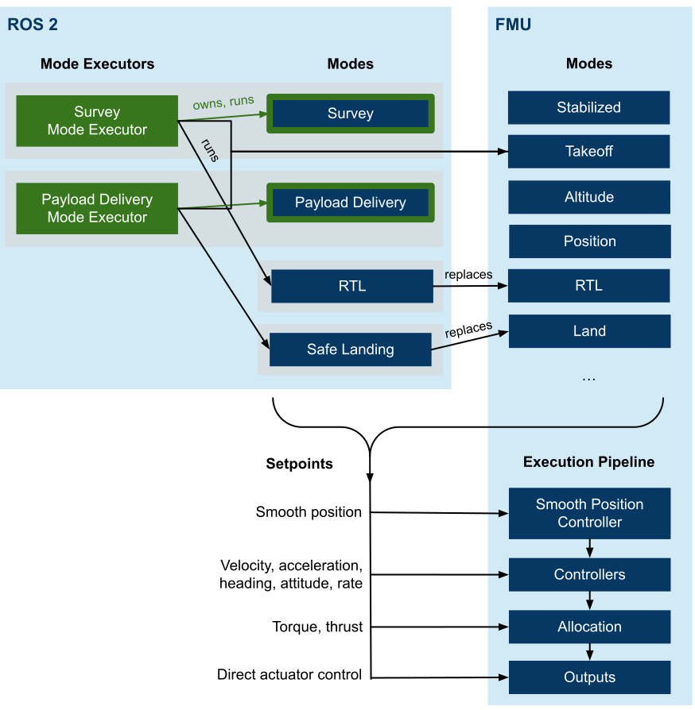
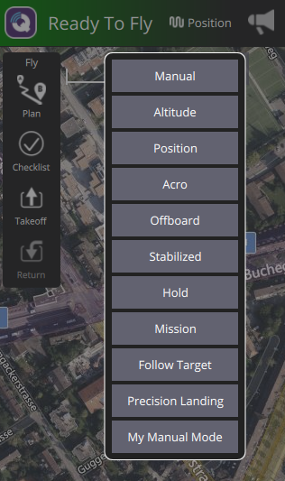
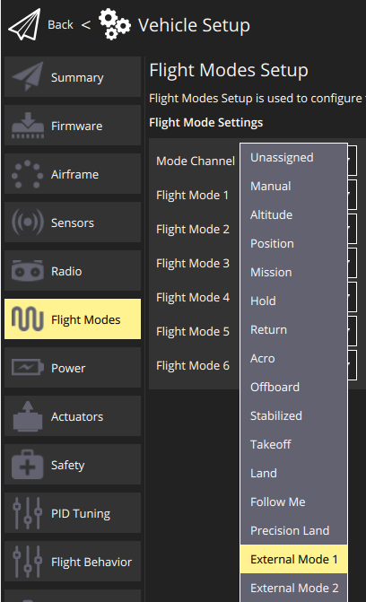

# PX4 SDK

The [PX4 SDK](https://github.com/PX4/px4_sdk) is a C++ library to simplify controlling PX4 from ROS 2.
It allows to write external modes that are dynamically registered with PX4 and behave the same way as internal ones.
A mode can send different types of setpoints, ranging from high-level navigation tasks all the way down to direct actuator controls.

## Overview

This diagram provides a conceptual overview:



<!-- Source: https://docs.google.com/drawings/d/1WByCfgcytnaow7r41VhYJL8OGrw1RjFO51GoPMQBCNA/edit -->

The following sections define and explain the terms used in the diagram.

### Definitions

#### Mode

- A mode is a component that can send setpoints to the vehicle, which control its motion (such as velocity or direct actuator commands).
- It is passive, meaning it does not activate other modes (by sending commands), and it must be activated by someone else (either the user through RC/GCS, the FMU in a failsafe situation or by a _mode executor_).
- It selects a setpoint type and sends it while it is active.
  A mode can switch between multiple setpoint types.
- Has a name displayed by the GCS.
- Can configure its mode requirements (for example that it requires a valid position estimate).
- A mode can consist of different tasks (for example flying to a target, lowering a winch, releasing a payload and then fly back).

#### Mode Executor

- A mode executor is an optional component one level higher than a mode. It is a state machine that can activate modes, and wait for their completion.
- It can only do so while it is in charge.
  For that, an executor has exactly one _owned mode_ (and a mode can be owned by at most one executor).
  This mode serves as activation for the executor: when the user selects the mode, the owning executor gets activated and can select any mode.
  It stays in charge until the user switches modes (by RC or from a GCS), or a failsafe triggers a mode switch.
  Should the failsafe clear, the executor gets reactivated.
- This allows multiple executors to coexist.
- Executors cannot activate other executors.
- Within the SDK, a mode executor is always implemented in combination with a custom mode.

:::note
- These definitions guarantee that a user can take away control from a custom mode or executor at any point in time by commanding a mode switch through RC or a GCS.
- A mode executor is transparent to the user.
  It gets indirectly selected and activated through the owning mode, and thus the mode should be named accordingly.
:::

##### When would you use a mode executor?

The most common use-case is the execution of an autonomous 'mission', such as a survey or a payload delivery: the executor triggers a take-off, then switches to a custom mode which performs the survey, and when completed, triggers an RTL.

#### Configuration Overrides

Both modes and executors can define configuration overrides, allowing to customize certain behaviors while the mode or executor is active.

These are currently implemented:

- Disabling auto-disarm. This allows for landing and then taking off again (e.g. to release a payload).
- Ability to defer non-essential failsafes.
  It allows for example an executor to run a critical action without being interrupted by low-battery failsafe, such as controlling a winch.

### Comparison to Offboard Control

The above concepts provide a number of advantages over traditional [offboard control](../ros/offboard_control.md):

- Multiple nodes or applications can coexist and even run at the same time. It is clearly defined which node can control the vehicle at any given time.
- Exposing a selectable mode to the GCS.
- Integrated with the failsafe state machine and arming checks.
- It is well-defined which setpoint types can be sent.
- It is possible to replace an FMU-internal mode (such as RTL).

## Getting Started

The following steps are required to get started:

1. Make sure you have a working [ROS 2 setup](../ros/ros2_comm.md), with _px4_msgs_ in the ROS 2 workspace.
2. Clone the SDK into the workspace:

   ```shell
   cd $ros_workspace/src
   git clone --recursive https://github.com/PX4/px4_sdk.git
   ```

   :::note
   To ensure compatibility, use the latest _main_ branches for PX4, _px4_msgs_ and the SDK.
   See also [here](https://github.com/PX4/px4_sdk#compatibility-with-px4).
   :::

3. Build the workspace:

   ```shell
   cd ..
   source install/setup.bash
   colcon build
   ```

4. In a different shell, start PX4 SITL (you can use any model or simulator):

   ```shell
   cd $px4-autopilot
   make px4_sitl gazebo-classic
   ```

5. Run the micro XRCE agent in a new shell (you can keep it running afterward):

   ```shell
   MicroXRCEAgent udp4 -p 8888
   ```

6. Start QGroundControl.

   :::note
   Use QGroundControl Daily, which supports dynamically updating the list of modes.
   :::

7. Back in the ROS 2 terminal, run one of the example modes:

   ```shell
   ros2 run example_mode_manual_cpp example_mode_manual
   ```

   You should get an output like this:

   ```
   [DEBUG] [example_mode_manual]: Checking message compatibility...
   [DEBUG] [example_mode_manual]: Subscriber found, continuing
   [DEBUG] [example_mode_manual]: Publisher found, continuing
   [DEBUG] [example_mode_manual]: Registering 'My Manual Mode' (arming check: 1, mode: 1, mode executor: 0)
   [DEBUG] [example_mode_manual]: Subscriber found, continuing
   [DEBUG] [example_mode_manual]: Publisher found, continuing
   [DEBUG] [example_mode_manual]: Got RegisterExtComponentReply
   [DEBUG] [example_mode_manual]: Arming check request (id=1, only printed once)
   ```

8. On the PX4 shell, you can check that PX4 registered the new mode:

   ```shell
   commander status
   ```

   The output should contain:

   ```{5}
   INFO  [commander] Disarmed
   INFO  [commander] navigation mode: Position
   INFO  [commander] user intended navigation mode: Position
   INFO  [commander] in failsafe: no
   INFO  [commander] External Mode 1: nav_state: 23, name: My Manual Mode
   ```

9. At this point you should be able to see the mode in QGroundControl as well:

   

10. Select the mode, make sure you have a manual control source (physical or virtual joystick), and arm the vehicle.
    The mode will then activate, and it should print the following output:

    ```
    [DEBUG] [example_mode_manual]: Mode 'My Manual Mode' activated
    ```

11. Now you are ready to create your own mode.

## Mode Tutorial

This section steps through an example for a custom mode class.
For a complete application, check out the [examples in the repository](https://github.com/PX4/px4_sdk/tree/main/examples/cpp).

```cpp{1,5,7-9,24-31}
class MyMode : public px4_sdk::ModeBase // [1]
{
public:
  explicit MyMode(rclcpp::Node & node)
  : ModeBase(node, Settings{"My Mode"}) // [2]
  {
    // [3]
    _manual_control_input = std::make_shared<px4_sdk::ManualControlInput>(*this);
    _rates_setpoint = std::make_shared<px4_sdk::RatesSetpointType>(*this);
  }

  void onActivate() override
  {
    // Called whenever our mode gets selected
  }

  void onDeactivate() override
  {
    // Called when our mode gets deactivated
  }

  void updateSetpoint(float dt_s) override
  {
    // [4]
    Eigen::Vector3f thrust_sp{};
    thrust_sp(2) = -_manual_control_input->throttle();
    Eigen::Vector3f rates_sp{};
    rates_sp(0) = _manual_control_input->roll() * 150.F * M_PI / 180.F;
    rates_sp(1) = -_manual_control_input->pitch() * 150.F * M_PI / 180.F;
    rates_sp(2) = _manual_control_input->yaw() * 100.F * M_PI / 180.F;
    _rates_setpoint->update(rates_sp, thrust_sp);
  }

private:
  std::shared_ptr<px4_sdk::ManualControlInput> _manual_control_input;
  std::shared_ptr<px4_sdk::RatesSetpointType> _rates_setpoint;
};
```

- **[1]**: First we create a class that inherits from `px4_sdk::ModeBase`
- **[2]**: In the constructor, we pass the mode name. This also allows to configure some other things, like replacing an FMU-internal mode.
- **[3]**: This is where we create all objects that we want to use later on.
  This can be RC input, setpoint type(s), or telemetry. `*this` is passed as a `Context` to each object, which associates the object with the mode.
- **[4]**: Whenever the mode is active, this method gets called regularly (the update rate depends on the setpoint type).
  Here is where we can do our work and generate a new setpoint.

## How to use the SDK

General notes on how to use the SDK:

- coordinate convention: TODO

The following sections describe specific functionality.
Apart from that, any other PX4 topic can be subscribed or published directly.

### Setpoint Types

A mode can choose its setpoint type(s) it wants to use to control the vehicle.
The used types also define the compatibility with different vehicle types.

The following sections provide a list of commonly used setpoint types.
You can also add your own type by adding a class that inherits from `px4_sdk::SetpointBase`, sets the configuration flags according to what the setpoint requires, and then publishes any topic containing a setpoint.

#### Smooth Position

TODO

#### Direct Actuator Control

Actuators can be directly controlled using the [px4_sdk::DirectActuatorsSetpointType](https://github.com/PX4/px4_sdk/blob/main/px4_sdk_cpp/include/px4_sdk/control/setpoint_types/direct_actuators.hpp) setpoint type.
Motors and servos can be set independently. Be aware that the assignment is vehicle and setup-specific.
For example to control a quadrotor, you need to set the first 4 motors according to its [output configuration](../concept/control_allocation.md).

:::note
If you want to control an actuator that does not control the vehicle's motion, but for example a payload servo, see [below](#controlling-an-independent-actuator-servo).
:::

### Controlling an Independent Actuator/Servo

If you want to control an independent actuator (a servo), follow these steps:

1. [Configure the output](../payloads/#generic-actuator-control-with-mavlink)
2. Create an instance of [px4_sdk::OffboardActuatorControls](https://github.com/PX4/px4_sdk/blob/main/px4_sdk_cpp/include/px4_sdk/control/offboard_actuators.hpp) in the constructor of your mode
3. Call the `set` method to control the actuator(s). This can be done independently of any active setpoints.

### Telemetry

Telemetry, such as local or global position estimates can be found under [px4_sdk/odometry](https://github.com/PX4/px4_sdk/tree/main/px4_sdk_cpp/include/px4_sdk/odometry).

### Failsafes and Mode Requirements

Each mode has a set of requirement flags. These are generally automatically set, depending on which objects are used within the context of a mode. For example when adding manual control input with

```cpp
_manual_control_input = std::make_shared<px4_sdk::ManualControlInput>(*this);
```

the requirement flag for manual control gets set.
Specifically, setting a flag has the following consequences in PX4, if the condition is not met:

- arming is not allowed, while the mode is selected
- when already armed, the mode cannot be selected
- when armed and the mode is selected, the relevant failsafe is triggered (e.g. RC loss for the manual control requirement).
  Check the [safety page](../config/safety.md) for how to configure failsafe behavior.
  A failsafe is also triggered when the mode crashes or becomes unresponsive while it is selected.

It is possible to manually update any mode requirement after the mode is registered. For example to add home position as requirement:

```cpp
modeRequirements().home_position = true;
```

#### Deferring Failsafes

A mode or mode executor can temporarily defer non-essential failsafes.
To do so, use the method `deferFailsafesSync`. And to get notified when a failsafe would be triggered, override the method `void onFailsafeDeferred()`.
Check the [integration test](https://github.com/PX4/px4_sdk/blob/main/px4_sdk_cpp/test/integration/overrides.cpp#L167) for an example.

### Assigning a Mode to an RC Switch or Joystick Action

External modes can be assigned to RC switches or joystick actions.
When assigning a mode to an RC switch, you need to know the index.
Use `commander status` while the mode is running to get that information.
For example:

```plain
   INFO  [commander] External Mode 1: nav_state: 23, name: My Manual Mode
```

means you would select **External Mode 1** in QGC:


:::note
PX4 ensures a given mode is always assignment to the same index by storing a hash of the mode name.
This makes it independent of startup ordering in case of multiple external modes.
:::

### Replacing an Internal Mode

An external mode can replace an existing internal mode, such as RTL. By doing so, whenever RTL gets selected (through the user or a failsafe situation), the external mode is used instead of the internal one.
The internal one is only used as a fallback when the external one becomes unresponsive or crashes.

The replacement mode can be set in the settings of the `ModeBase` constructor:

```cpp
Settings{kName, false, ModeBase::kModeIDRtl}
```

## CI: Integration Tests

When opening a pull request to PX4, CI runs the integration tests of the SDK.
These can also be run locally from PX4:

```shell
./test/ros_test_runner.py
```

And to run only a single case:

```shell
./test/ros_test_runner.py --verbose --case <case>
```

You can list the available test cases with:

```shell
./test/ros_test_runner.py --list-cases
```
