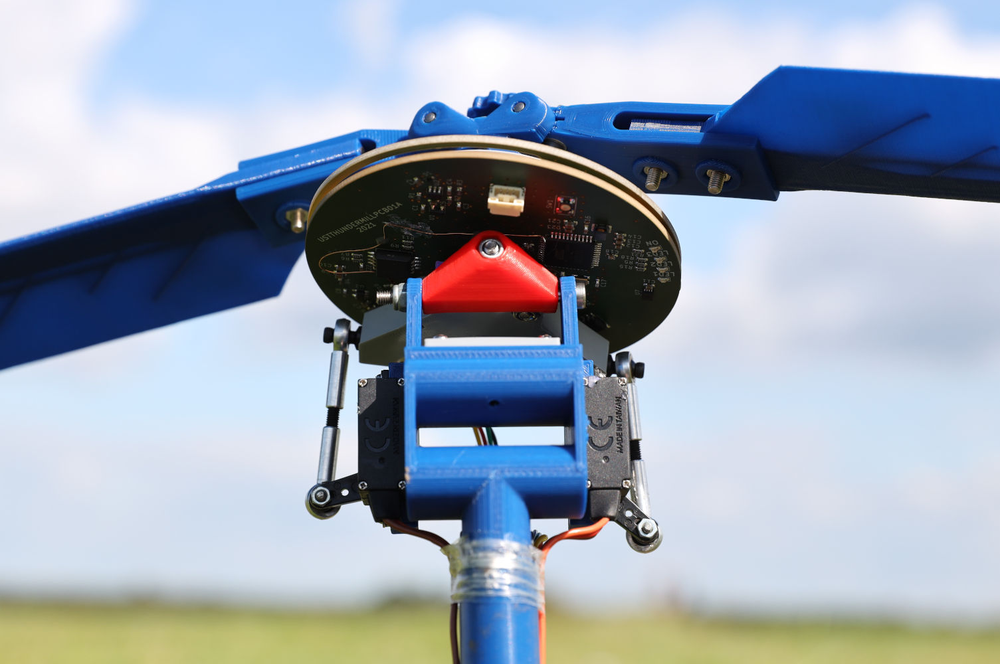

# TFSLOT - Venturi effect airspeed sensor

[TFSLOT](https://github.com/ThunderFly-aerospace/TFSLOT01) is an open-source airspeed sensor based on the [Venturi effect](https://en.wikipedia.org/wiki/Venturi_effect) with IMU

IMAGE OF TFSLOT

IMAGE OF TFASPDIMU02

[TFSLOT](https://github.com/ThunderFly-aerospace/TFSLOT01) is an airspeed sensor based on venturi effects. In the basic configuration, the TFSLOT is equipped with the [TFASPDIMU02](https://github.com/ThunderFly-aerospace/TFASPDIMU02) sensor board, which contains a differential pressure sensor ([Sensirion SDP3x](https://www.sensirion.com/sdp3x/)) and a 9-axis motion tracking sensor ([ICM-20948](https://invensense.tdk.com/products/motion-tracking/9-axis/icm-20948/)). IMU unit can be used as an external compass. 

* This design brings several advantages when used on small-scale and slow-flying UAV’s.
* Better resolution at low airspeeds (below 10 m/s)
* Configurable sensitivity brought by changing the profile 
* Less tendency to clogging (For example, by clay after landing)
* Weatherproof (rain, snow, ..)
* Direct differential pressure sensor integration without any additional tubing. Less chance of sensor malfunction
* Possibility of direct integration into the construction of the drone. Design is fully opensource
* Integrated external IMU unit


Thanks to the printed tube, it is very easy to change the measuring profile and thus to change the sensitivity in certain speed ranges. In the basic form, it is optimized so that the measured differential pressure corresponds to the pressure from the pitot tube. 


_First integration of TFSLOT into [TF-G2](https://github.com/ThunderFly-aerospace/TF-G2/) autogyro_

:::note

Full documentation and source files can be found on [GitHub](https://github.com/ThunderFly-aerospace/TFSLOT01)

:::

## Where to buy

TFSLOT is possible to buy at [Tindie store](https://www.tindie.com/products/thunderfly/tfslot01a-inovative-drone-airspeed-sensor/) or by sending us an inquiry via email at info@thunderfly.cz


## Connection

[TFASPDIMU02](https://github.com/ThunderFly-aerospace/TFASPDIMU02) is equipped with I2C JST-GH connector, which conforms to the pinout of the [dronecode standard](https://github.com/pixhawk/Pixhawk-Standards/blob/master/DS-009%20Pixhawk%20Connector%20Standard.pdf). Therefor the sensor can be connected directly to an I2C port of autopilot using an I2C 4pin JST-GH cable.

## Configuration


Because there is an [IMU IC](https://invensense.tdk.com/products/motion-tracking/9-axis/icm-20948/) connected in front of the sensor, the IMU IC needs to be set into a bridge mode. Following this the airspeed sensor driver can be run. This can be done using the following command sequences. The commands assume a connection to I2C2 port. 

```
  icm20948_i2c_passthrough start -X -b 2 -a 0x68
  sdp3x_airspeed start -X -b 2
```

This sequence can be stored on the SD card in the `/etc/config.txt file`. You can read more about the configuration on the SD card on a [separate page](../concept/system_startup.md#replacing-the-system-startup).

Because the conversion of differential pressure to airspeed differs from the Pitot tube, this profile needs to be changed. This is done by setting parameter [`CAL_AIR_CMODEL`](../advanced_config/parameter_reference.md#CAL_AIR_CMODEL) to 3 (Venturi effect based airspeed sensor) 


## Calibration

Calibration is a bit difficult because the current firmware version does not support calibration with negative values. Because the used sensor measures both airflow directions symmetrically and has zero offset, there is no need to calibrate repeatedly before every takeoff. But you have to ensure that there is no airflow during the calibration process.

The easiest way to do the calibration is to take the adhesive tape and tape it between the pressure inlets to the sensor. Then start the calibration process and blow from the back when prompted. If the pressure of at least 50 Pa is created, the calibration will be successful. 

