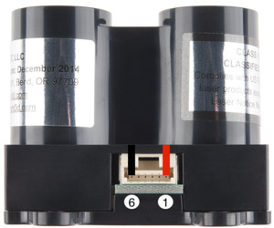
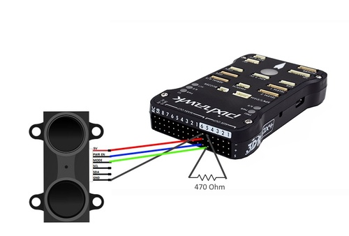
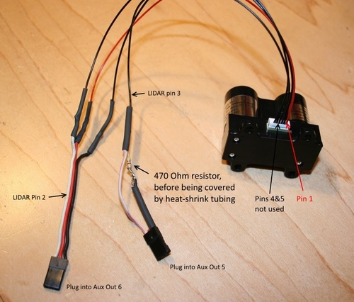

# Lidar-Lite

LIDAR-Lite is a compact, high-performance optical distant measurement sensor solution for drone, robot or unmanned vehicle applications. It can be connected to either I2C or PWM.

 
 
> **Info** The *Lidar-Lite v3* may be used in the [The Intel® Aero Ready to Fly Drone](../flight_controller/intel_aero.md#lidar_lite).

## Where to Buy

* [LIDAR-Lite v3](https://buy.garmin.com/en-AU/AU/p/557294) (5cm - 40m)

## Wiring

The *Lidar-Lite v3* can be used with either PWM or I2C. PWM is recommended if using an older model.

> **Note** The I2C interface of non-blue-label Lidar-Lite (v1) devices has stability limitations and all silver-label generations of Lidar-Lite sensors are therefore excluded from the I2C interface. The use of the PWM interface (as detailed below) is advised for these sensors. The blue label (v2) devices can exhibit a constant offset if powered on with less than 5V under some conditions. This is currently (Q4/2015) under investigation by the manufacturer and potentially can be resolved by adhering to specific operational conditions. The recommended robust setup is a v1 device interfaced via PWM.

The servo must be separately powered via some ESC/BEC (whether connected via PWM or I2C).

### PWM Interface Wiring

Pixhawk AUX servo pin | Lidar-Lite pin | Comment
--- | --- | ---
AUX row 5 (bottom) | 3 / PWM   | PWM input of the Lidar Lite. **Needs a 470 Ohm pull-down (to GND)**
AUX row 6 (center) | 1 / +5V   | Power supply
AUX row 6 (top)    | 6 / GND   | Ground
AUX row 6 (bottom) | 2 / RESET | Reset line of the sensor |

### I2C Interface Wiring

TBD

## Software Configuration

The rangefinder/port is enabled using [SENS_EN_LL40LS](../advanced_config/parameter_reference.md#SENS_EN_LL40LS) - set to `1` for PWM, or `2` for I2C.

> **Tip** The driver for this rangefinder is usually present in firmware. If missing, you would also need to add the driver (`drivers/ll40ls`) to the board configuration..
