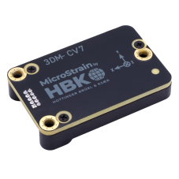

# MicroStrain

MicroStrain by HBK provides high-performance inertial sensors engineered for reliability and precision in challenging environments. Widely used across industries like aerospace, robotics, industrial automation, and research, MicroStrain sensors are optimized for real-time, accurate motion tracking and orientation data.

The driver currently supports:

- [`MicroStrain CV7-AHRS`](https://www.microstrain.com/inertial-sensors/3dm-cv7-ahrs)
- [`MicroStrain CV7-AR`](https://www.microstrain.com/inertial-sensors/3dmcv7-ar)

User manuals and datasheets are available on their corresponding product page.

## Where to Buy

MicroStrain sensors can be purchased through HBK’s official [MicroStrain product page](https://www.microstrain.com/inertial-sensors/all-sensors) or through authorized distributors globally. For large orders, custom requirements, or technical inquiries, reach out directly to [sales](https://www.microstrain.com/contact-sales)

## Hardware Setup

### Wiring

Connect the MicroStrain sensor to any unused serial port on the Flight Controller. This port needs to be specified while starting the device.

### Mounting

The MicroStrain sensor can be mounted in any orientation. 
The default coordinate system uses X for the front, Y for the right, and Z for down, with directions marked on the device.

## Firmware Configuration

### PX4 Configuration

To use the MicroStrain driver:

1. Include the module in firmware in the [kconfig board configuration](../hardware/porting_guide_config.md#px4-board-configuration-kconfig) by setting the kconfig variables: `CONFIG_DRIVERS_INS_MICROSTRAIN` or `CONFIG_COMMON_INS`.
2. Update the [EKF2_MULTI_IMU](../advanced_config/parameter_reference.md#EKF2_MULTI_IMU) parameter to account for the added MicroStrain sensor
3. To prioritize the MicroStrain sensors, the priority of individual sensors can be adjusted between the range 0-100. This can be done with the use of the following parameters:

   - [CAL_ACCn_PRIO](../advanced_config/parameter_reference.md#CAL_ACC0_PRIO)
   - [CAL_GYROn_PRIO](../advanced_config/parameter_reference.md#CAL_GYRO0_PRIO)
   - [CAL_MAGn_PRIO](../advanced_config/parameter_reference.md#CAL_MAG0_PRIO)
   - [CAL_BAROn_PRIO](../advanced_config/parameter_reference.md#CAL_BARO0_PRIO)

   where n corresponds to the index the sensor corresponds to.

   ::: tip
   Sensors can be identified by their device id, which can be found by checking the parameters:

   - [CAL_ACCn_ID](../advanced_config/parameter_reference.md#CAL_ACC0_ID)
   - [CAL_GYROn_ID](../advanced_config/parameter_reference.md#CAL_GYRO0_ID)
   - [CAL_MAGn_ID](../advanced_config/parameter_reference.md#CAL_MAG0_ID)
   - [CAL_BAROn_ID](../advanced_config/parameter_reference.md#CAL_BARO0_ID)
   :::

4. Reboot and start the driver

## MicroStrain Configuration

The accel and the gyro data will be published by default at 500Hz and the mag and baro data at 50Hz.
This can be changed by adjusting,

- [MS_IMU_RATE_HZ](../advanced_config/parameter_reference.md#MS_IMU_RATE_HZ)
- [MS_MAG_RATE_HZ](../advanced_config/parameter_reference.md#MS_IMU_RATE_HZ)
- [MS_BARO_RATE_HZ](../advanced_config/parameter_reference.md#MS_IMU_RATE_HZ)

The device will be set to a baudrate of 921600 and and the driver configures data outputs based on the specific sensor model and available data streams.

## Published Data

The MicroStrain driver publishes sensor data which can be found in the following UOrb topics:

- [sensor_accel](../msg_docs/SensorAccel.md)
- [sensor_gyro](../msg_docs/SensorGyro.md)
- [sensor_mag](../msg_docs/SensorMag.md)
- [sensor_baro](../msg_docs/SensorBaro.md)

::: tip
Published topics can be viewed using the `listener` command.
:::
