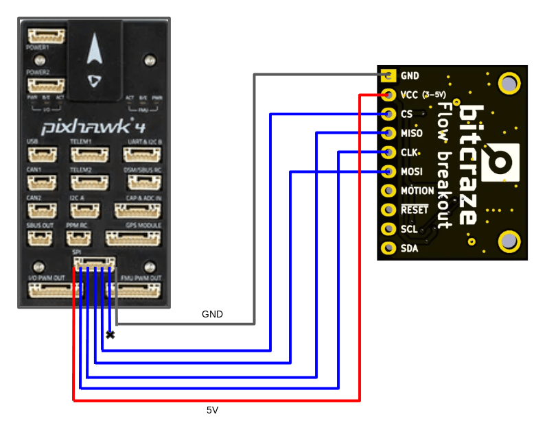
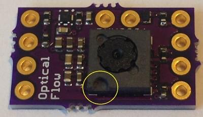
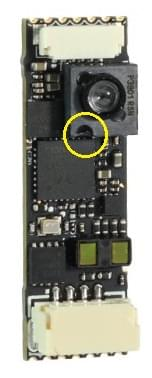

# PMW3901-Based Flow Sensors

PMW3901 is an [optical flow](../sensor/optical_flow.md) ASIC that computes the flow internally and provides a difference in pixels between each frame.
It is basically a tracking sensor similar to what you would find in a computer mouse, but adapted to work between 80 mm and infinity.
The PMW3901 is used in a number of products, inducing some from Bitcraze, Tindie, Hex, Thone and Alientek (see full listing below).

The following video shows an S500 frame with a Pixhawk 4 and the Bitcraze PMW3901 flow deck.
GPS was fully disabled in this test to see the real performance of the flow module.

**REPLACE WITH RIGHT VIDEO!**



## Boards using PMW3901

The following table shows some of the boards that use this sensor, listing the number of interfaces, the number of sensors, the input voltage, and the size.
The board name contains the link to where to buy the specific board.

Manufacture | Board | Interface | Flow | Range Finder | Gyro | Voltage (V) | Size (mm) | Max Height (m)
--- | --- | --- | --- | --- | --- | --- | ---
Bitcraze | [Flow breakout](https://www.bitcraze.io/flow-breakout) | SPI | X | X | - | 3 - 5 | 21x20 | 1
Tindie | [PMW3901 Optical Flow Sensor](https://www.tindie.com/products/onehorse/pmw3901-optical-flow-sensor/) | SPI | X | - | - | 3 - 5 | AxB | -
Hex | [HereFlow PMW3901 Optical Flow Sensor](http://www.proficnc.com/all-products/185-pixhawk2-suite.html) | CAN | X | X | X | 3 - 5 | AxB | 4
Thone | [ThoneFlow-3901U](https://www.seeedstudio.com/ThoneFlow-3901U-UART-Serial-Version-PMW3901-Optical-Flow-Sensor-p-4040.html) | UART | X | - | - | 3 - 5 | AxB | -
Alientek | [ATK-PMW3901](https://www.aliexpress.com/i/32979605707.html) | SPI | X | - | - | 3.3 - 4.2 | 27.5x16.5 | -

An external [rangefinder/distance sensor](../sensor/rangefinders.md) is *required* for the boards that don't have a rangefinder (e.g. *Tindie* or *Thone*) and recommended for the other boards (as their range is quite limited).

## Specifications

* TODO
* TODO
* TODO

## Pixhawk Setup

### Bitcraze Flow breakout {#bitcraze}

The Bitcraze optical flow module directly exposes the SPI interface from the PMW3901 module.

The board also has a distance sensor that can be wired via I2C.
This distance sensor is the VL53L0x ToF sensor from STMicroelectronics.
The range of the sensor is very limited (2 meters) and will be reduced when flying in the sunlight.
We therefore highly recommend to use another external distance sensor.
This board was mainly tested with the [Lidar Lite V3](../sensor/lidar_lite.md) on larger vehicles and with the [Lanbao CM8JL65](../sensor/cm8jl65_ir_distance_sensor.md) on smaller vehicles.

The range needed is dependent on the application.
When flying indoors, generally 4 meters height are enough.
If optical flow is also needed outdoors to support the position control in environments where GPS might have issues, then more range is advised (10 meters or more).

The PMW3901 driver was written to be directly plugged into the SPI port on the Pixhawk 4 using the chip select 1.
The support for this driver on other boards can then easily be extended to other boards by modifying the `SPI_BUS` and the `SPI_DEV` in the [PMW3901 driver](https://github.com/PX4/Firmware/tree/{{ book.px4_version}}/src/drivers/optical_flow/pmw3901).

The following diagram shows how to wire the sensor to a Pixhawk 4.

When plugged into the SPI port of the Pixhawk 4, the Bitcraze flow module will be automatically detected at bootup.
No parameters will have to configured, unless you decide to change the [orientation of the sensor](#orientation).

### Tindie

The Tindie optical flow module exposes the SPI interface from the PMW3901 module exactly as on the Bitcraze module.
The only difference here is the size of the board and the fact that this module doesn't have a distance sensor onboard.
Unlike the Bitcraze module where you could try to use the onboard distance sensor, with this one it is mandatory to use one of the [distance sensors](../sensor/rangefinders.md) supported by PX4.

### Hex

The Hex optical flow module is a very small board containing the PMW3901 flow module, the VL53L1X distance sensor and an IMU to better synchronize the flow data with the gyro data.
These three sensors are then sampled by a microcontroller onboard.
The goal of the microcontroller is to then expose 2 UAVCAN messages containing all the necessary data.

This board can be connected to the CAN port on any Pixhawk board.
All tests were performed connecting it to the CAN1 port on a Pixhawk 4.
Differently from the other sensors, this one needs UAVCAN running on PX4.
To enable UAVCAN you will have to set the UAVCAN_ENABLE parameter to 2 (if you have have UAVCAN sensors but no motor controllers) or to 3 (if you have also your motor controllers on CAN).

As for the other optical flow boards, it is recommended to use an external distance sensor instead of the onboard one due to the limited range of the VL53L1X.

TODO

Regarding rotations, also this board will have a default orientation and if necessary this could be modified through a parameter.

### Thone
WORK IN PROGRESS

### AlienTek

WORK IN PROGRESS
<!-- Minimal English specs here: https://www.aliexpress.com/item/32923971729.html -->

## Mounting/Orientation {#orientation}

The flow modules are typically mounted near the centre of the vehicle.
If mounted off-centre you will need to set offsets: [Optical Flow > EKF2](../sensor/optical_flow.md#ekf2).

> **Note** An external distance sensor may be mounted anywhere but should point down and be configured as usual.

The flow modules may be mounted with any yaw orientation relative to vehicle body frame, but you must set the value used in [SENS_FLOW_ROT](../advanced_config/parameter_reference.md#SENS_FLOW_ROT).

The "zero" rotation is when the board and [vehicle](../getting_started/px4_basic_concepts.md#heading-and-directions) X-axes are aligned (i.e. the "front" of the vehicle and the board are in the same direction), with rotations increasing in a clockwise direction.

PMW3901 modules have a small notch indicating the direction of the **back** of the board. 
The diagram shows the orientation of the Bitcraze board to the vehicle that corresponds to `SENS_FLOW_ROT=0` (note the notch at the back).

You can use the notch to find the orientation of the other boards in the same way:

Tindie

Hex Hereflow

Thone

Alientek (also has an arrow indicating the front!)

## Configuration {#configuration}

Configuration is straightforward:
- [Optical Flow > EKF2](../sensor/optical_flow.md#ekf2) explains how to fuse optical flow data in the EKF2 estimator and set position offsets for the mounting position of the flow sensor.
- [SENS_FLOW_ROT](../advanced_config/parameter_reference.md#SENS_FLOW_ROT) sets the orientation of the flow sensor relative to vehicle heading.
- The distance sensor should be enabled as described in their setup documentation (no flow-specific configuration is required).
- Individual flow sensors are setup as described in each of the sections above. 

## Troubleshooting

TODO (if necessary)
