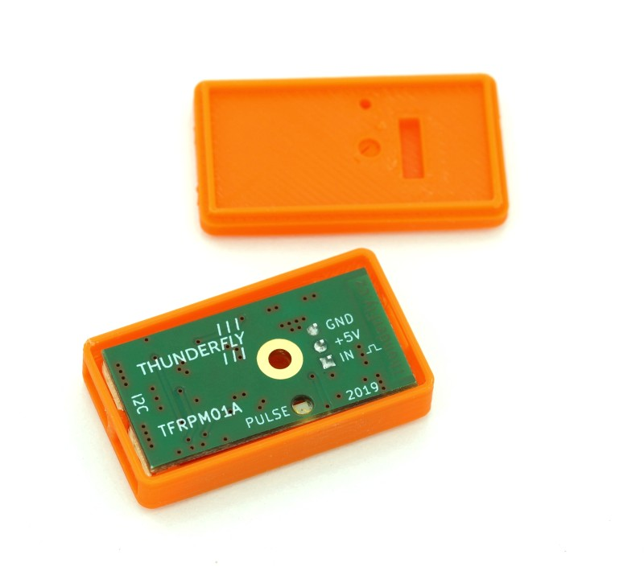

# ThunderFly TFRPM01 sensor

The [TFRPM01](https://github.com/ThunderFly-aerospace/TFRPM01) is a small, and low system demanding revolution-counter.
It must be connected to a I²C bus.




## Hardware Setup

TFRPM01 needs to be connected to any I2C port. The sensor hardware needs an pulse signal. The pulses could be generated by several ways. The usually used principles follows. The TFRPM01 sensor has 3pin pin-header connector with pull-up equipped input where multiple probe types could be connected.

### Hall sensor probe

### Optical sensor probe


## Parameter Setup

There are multiple configurable parameters, although usually nothing need to be changed to get sensor working.

   * [PCF8583_POOL](../advanced_config/parameter_reference.md#PCF8583_POOL)
   * [PCF8583_ADDR](../advanced_config/parameter_reference.md#PCF8583_ADDR)
   * [PCF8583_RESET](../advanced_config/parameter_reference.md#PCF8583_RESET)
   * [PCF8583_MAGNET](../advanced_config/parameter_reference.md#PCF8583_MAGNET)


> **Note** If the configuration parameters is not available in *QGroundControl* then you may need to [add the driver to the firmware](../peripherals/serial_configuration.md#parameter_not_in_firmware):
  ```
  drivers/rpm/pcf8583
  ```
