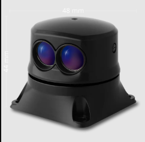

# LightWare SF45/B (50m) rotating Lidar

## Basics

This sensor is implemented in PX4 so that it published s [ObstacleDistance UORB](../msg_docs/ObstacleDistance.md) Message which then can be used for [Collision Prevention](../computer_vision/collision_prevention.md).

The measurements in each sector will correspond to the lowest measurement the sensor had in that corresponding sector.

## LightWare Studio Setup

In the [LightWare Studio](https://www.lightwarelidar.com/resources-software) app Set following settings:
| Parameter| Description|
| -------- | ---------- |
| Baud rate| 921600|

Then also make sure the scan angles are set so that nothing on the drone interferes with the measurements.
The Driver and Collision Prevention automatically handle angles different from the maximum angles. 

## PX4 Setup:
:::info
The lidar driver is not included in the default build. make sure to add it when flashing PX4
### Add the driver to the PX4 build

for this add the [lightware_sf45_serial](../modules/modules_driver_distance_sensor.md#lightware-sf45-serial) driver in [menuconfig](../hardware/porting_guide_config.md#px4-menuconfig-setup):
1. Under **drivers > Distance sensors** select `lightware_sf45_serial`.
2. Recompile and upload to the flight controller.

### Set the following parameters via QGC:

| Parameter| Description|
| -------- | ---------- |
| [SENS_EN_SF45_CFG](../advanced_config/parameter_reference.md#SENS_EN_SF45_CFG)		|  Set to the serial port you have the sensor connected to.	|  
| [SF45_ORIENT_CFG](../advanced_config/parameter_reference.md#SF45_ORIENT_CFG)			| Set the orientation of the sensor (facing up or down)		|
| [SF45_UPDATE_CFG](../advanced_config/parameter_reference.md#SF45_UPDATE_CFG)			|   Set the update rate										|
| [SF45_YAW_CFG](../advanced_config/parameter_reference.md#SF45_YAW_CFG)					|  Set the yaw orientation 									|

In QGroundControl you should see an [OBSTACLE_DISTANCE](https://mavlink.io/en/messages/common.html#OBSTACLE_DISTANCE) 

The obstacle overlay in QGC will look like this:

