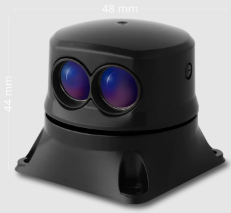

# Lightware SF45/B Rotary Lidar

LightWare [SF45/B](https://lightwarelidar.com/shop/sf45-b-50-m/) is an extremely small and light rotating Lidar with a range of 50m.
It can be used to enable [Collision Prevention](../computer_vision/collision_prevention.md) without a companion computer.

:::info
The lidar driver is not included in the default build of PX4.
You will need to [create and use a custom build](#add-the-driver-to-the-px4-build).
:::

## LightWare Studio Setup

In the [LightWare Studio](https://www.lightwarelidar.com/resources-software) app set following values:

| Parameter | Description |
| --------- | ----------- |
| Baud rate | 921600      |

Make sure the scan angles are set so that nothing on the drone interferes with the measurements.
The driver and [Collision Prevention](../computer_vision/collision_prevention.md) automatically handle angles different from the maximum angles.

## Hardware Setup

The rangefinder can be connected to any unused serial port, such as `TELEM2`.
[Parameter Configuration](#parameter-configuration) explains how to configure the port to use and the other properties of the rangefinder.

## PX4 Setup

### Add the Driver to the PX4 Build

The driver for this LiDar is not included in PX4 firmware by default.

You will need to:

1. Add the [lightware_sf45_serial](../modules/modules_driver_distance_sensor.md#lightware-sf45-serial) driver to firmware:
   - Install and open [menuconfig](../hardware/porting_guide_config.md#px4-menuconfig-setup)
   - In [menuconfig](../hardware/porting_guide_config.md#px4-menuconfig-setup), navigate to **Drivers > Distance sensors**
   - Select/Enable `lightware_sf45_serial`
2. [Build PX4](../dev_setup/building_px4.md) for your flight controller target and then upload the new firmware.

### Parameter Configuration

You will need to configure PX4 to indicate the serial port to which the sensor is connected (as per [Serial Port Configuration](../peripherals/serial_configuration.md)) and also the orientation and other properties of the sensor.

The [parameters to change](../advanced_config/parameters.md) are listed in the table.

| Parameter                                                                                                   | Description                                              |
| ----------------------------------------------------------------------------------------------------------- | -------------------------------------------------------- |
| [SENS_EN_SF45_CFG](../advanced_config/parameter_reference.md#SENS_EN_SF45_CFG) | Set to the serial port you have the sensor connected to. |
| [SF45_ORIENT_CFG](../advanced_config/parameter_reference.md#SF45_ORIENT_CFG)    | Set the orientation of the sensor (facing up or down)    |
| [SF45_UPDATE_CFG](../advanced_config/parameter_reference.md#SF45_UPDATE_CFG)    | Set the update rate                                      |
| [SF45_YAW_CFG](../advanced_config/parameter_reference.md#SF45_YAW_CFG)             | Set the yaw orientation                                  |

## Testing

You can confirm that the sensor is correctly configured by connecting QGroundControl, and observing that [OBSTACLE_DISTANCE](https://mavlink.io/en/messages/common.html#OBSTACLE_DISTANCE) is present in the [MAVLink Inspector](https://docs.qgroundcontrol.com/master/en/qgc-user-guide/analyze_view/mavlink_inspector.html).

The obstacle overlay in QGC will look like this:

## Driver Implementation

The [sensor driver](../modules/modules_driver_distance_sensor.md#lightware-sf45-serial) publishes the [ObstacleDistance](../msg_docs/ObstacleDistance.md) UORB Message that is used by PX4 [Collision Prevention](../computer_vision/collision_prevention.md).
The measurements in each sector will correspond to the lowest measurement the sensor had in that corresponding sector.
The data is then published to the [OBSTACLE_DISTANCE](https://mavlink.io/en/messages/common.html#OBSTACLE_DISTANCE) MAVLink message.
