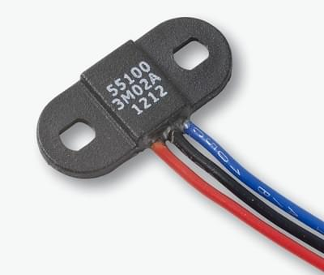

# ThunderFly TFRPM01 Revolution Counter

The [TFRPM01](https://github.com/ThunderFly-aerospace/TFRPM01) tachometer is a small, and low system demanding revolution-counter.

The board itself does not include the actual sensor but can be used with many different sensors/probe types for revolution counting.
It has an I²C connector for connecting to PX4 and is connected to the actual sensor via a 3-pin connector.
It also has an LED that offers basic diagnostic information.


:::note
The TFRPM01 sensor is open-source hardware commercially available from [ThunderFly s.r.o.](https://www.thunderfly.cz/) (manufacturing data is [available on GitHub](https://github.com/ThunderFly-aerospace/TFRPM01)).
:::

## Hardware Setup

The board is equipped with (two through pass) I²C connectors for connecting to PX4 and has a 3-pin connector that can be used to connect to various sensors:
- TFRPM01 may be connected to any I²C port.
- TFRPM01 has a 3pin pin-header connector (with pull-up equipped input) that can be connected to different probe types.
  - The sensor/probe hardware needs a pulse signal.
    The signal input accepts +5V TTL logic or [open collector](https://en.wikipedia.org/wiki/Open_collector) outputs.
    The maximum pulse frequency is 20 kHz with a 50% duty cycle.
  - The probe connector provides a +5V power supply from the I²C bus, the maximum power which could be used is limited by RC filter (see schematics for details).

TFRPM01A electronics is equipped with signaling LED that can be used to check that the probe is connected properly.
The LED lights up when the pulse input is grounded or exposed to logical 0, so you can check the probe is working correctly just by manually spinning a rotor.

### Hall-Effect Sensor Probe

Hall-Effect sensors (magnetically operated) are ideal for harsh environments, where dirt, dust, and water can contact the sensed rotor.

Many different hall effect sensors are commercially available.
For example, a [5100 Miniature Flange Mounting Proximity Sensor](https://m.littelfuse.com/~/media/electronics/datasheets/hall_effect_sensors/littelfuse_hall_effect_sensors_55100_datasheet.pdf.pdf) is a good choice.




### Optical Sensor Probe

An optical sensor can also be used (and maybe a better fit, depending on the measurement requirements).
Both transmissive and reflective sensor types may be used for pulse generation.


## Software Setup

### Starting driver

The driver does not start automatically in any airframes. You can start it manually from the console or add it to the [startup script](../concept/system_startup.md#customizing-the-system-startup) on SD card.

#### Start driver from console

Start driver from the [console](https://docs.qgroundcontrol.com/master/en/analyze_view/mavlink_console.html) with the command:
```
pcf8583 start -X -b <bus number>
```
instead of `<bus number>` you must specify the bus number to which the device is connected. `-X` means that it is an external bus.

:::note
Bus number `-b <bus number>` does not match the bus numbering on the autopilot. After running the command, the driver shows the bus number corresponding to the label on the box.

When using CUAV V5+ or CUAV Nano:

| bus label | -b number |
|-----------|-----------|
| 1    |  -X -b 4  |
| 2    |  -X -b 2  |
| 3    |  -X -b 1  |

:::


### Function validation
You can verify functionality in multiple ways.

#### Use of the PX4 (NuttX) MAVLink console

The status of the TFRPM01 driver could be checked by the following command: 
```
pcf8583 status
```
If the driver is running, the I²C port will be printed along with other basic parameters of the running instance. In the case the driver is not running the driver should be started according to the procedure described above. 

With [`listener`](../middleware/modules_command.html#listener) command you can monitor RPM messages from the running driver. 
```
listener rpm
```
Now, you should see uOrb messages containing data from the sensor. For periodic display, you can add `-n 50` parameter after the command, which prints the next 50 messages.

#### Check by QGroundControl

In QGC select [MavlinkInspector](https://docs.qgroundcontrol.com/master/en/analyze_view/mavlink_inspector.html) from  `menu` > `Analyze tools` > `Mavlink Inspector`.

Then you should see the data and its update rate in the list. You should see a `raw_rpm` message here. If there the `raw_rpm` message missing, you should check that driver is running in PX4. 
In the case the message exists, click on it. On the right side of the QGC window, you should see the live sensor data. 


### Parameter Setup
Usually, sensors can be used without configuration, but the RPM values should correspond to multiples of real RPM.  It is because the `PCF8583_MAGNET` parameter needs to correspond to the real number of pulses per single revolution of the sensed rotor. 
If needed, the following parameters should be tweaked:

* [PCF8583_POOL](../advanced_config/parameter_reference.md#PCF8583_POOL) — pooling interval between readout the counted number
* [PCF8583_ADDR](../advanced_config/parameter_reference.md#PCF8583_ADDR) — I2C sensor address
* [PCF8583_RESET](../advanced_config/parameter_reference.md#PCF8583_RESET) — Counter value where the counted number should be reset to zero.
* [PCF8583_MAGNET](../advanced_config/parameter_reference.md#PCF8583_MAGNET) — Number of pulses per revolution e.g. number of magnets at a rotor disc.

:::note
The parameters in QGC appear after the first start of the driver and subsequent restart of QGC. If still, the configuration parameters is not available in [*QGroundControl*](../qgc/#setting-parameters) then you should check if [the driver](../peripherals/serial_configuration.md#parameter_not_in_firmware)  is added to the firmware:
```
drivers/rpm/pcf8583
```
:::
