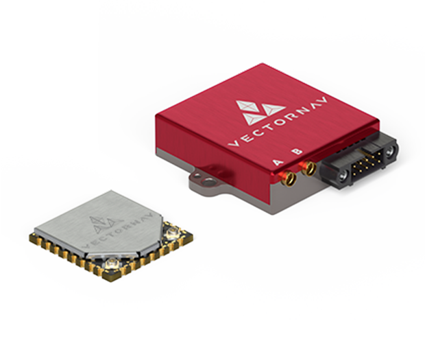

# VectorNav

VectorNav produces [IMU/AHRS](https://www.vectornav.com/resources/inertial-navigation-primer/theory-of-operation/theory-ahrs), [GNSS/INS](https://www.vectornav.com/resources/inertial-navigation-primer/theory-of-operation/theory-gpsins), [Dual GNSS/INS](https://www.vectornav.com/resources/inertial-navigation-primer/theory-of-operation/theory-gnsscompass) systems.

A VectorNav sensor can be implemented in two ways:

1. Used as an external INS, circumventing internal PX4 EKF
1. Used as raw sensor data, encorporated in internal PX4 EKF

<!-- is an open source [DroneCAN](index.md) [optical flow](../sensor/optical_flow.md), [distance sensor](../sensor/rangefinders.md), and IMU module. -->

## Where to Buy

Order this device from:

- [VectorNav Technologies](https://www.vectornav.com/store/products) (US)

## Hardware Specifications

- [Datasheets](https://www.vectornav.com/resources/datasheets)
- Sensors

    The PX4 driver supports all VectorNav sensors.

  - VN-200

    Recommended for fixed-wing systems without hovering, where static heading is not necessary.
  - VN-300

    Recommended for multicopter systems where hovering and low dynamics requires the use of static heading.

## Hardware Setup

### Wiring

All VectorNav sensors use a Serial interface. 

PX4 requires that it is communicating with VectorNav UART2 port.

### Mounting

The VectorNav sensor can be mounted in any orientation, in any position on the vehicle, without regard to center of gravity. All VectorNav sensors default to a coordinate system of x-forward, y-right, and z-down, making the default mounting as connector-back, base down. This can be changed to any rigid rotation using the VectorNav Reference Frame Rotation register.

If using a GNSS-enabled product, the GNSS antenna must be mounted rigidly with respect to the inertial sensor and with an unobstructed sky view. If using a dual-GNSS-enabled product (VN-3X0), the secondary antenna must be mounted rigidly with respect to the primary antenna and the inertial sensor with an unobstructed sky view.\
For more mounting requirements and recommendations, see the relevant [Quick Start Guide](https://www.vectornav.com/resources/quick-start-guides). 

## Firmware Setup

### PX4 Configuration

To use the VectorNav driver:

1. Enable the module by setting either `CONFIG_DRIVERS_INS_VECTORNAV` or `CONFIG_COMMON_INS` in the kconfig file.
1. Set the [SENS_VN_CFG](../advanced_config/parameter_reference.md#SENS_VN_CFG) parameter to the correct hardware port.
1. Disable magnetometer preflight checks by setting [SYS_HAS_MAG]() to `0`.
1. Configure driver as necessary:
    * If using the VectorNav as an external INS, set [VN_MODE](../advanced_config/parameter_reference.md#VN_MODE) to `INS`. This disables EKF2.
    * If using the VectorNav as external inertial sensors:
      1. Set [VN_MODE](../advanced_config/parameter_reference.md#VN_MODE) to `Sensors Only`
      1. If internal sensors are enabled, prioritize VectorNav sensors using `CAL_GYROX_PRIO`, `CAL_ACCELX_PRIO`, `CAL_BAROX_PRIO`, `CAL_MAGX_PRIO`, where X stands for the number of the IMU component.\
    Tip: In most cases the extenal IMU (VN) is the highest-numbered. You can get a list of the IMU components available using `uorb top -1`, you can differentiate between them using `listener` and looking through the data, or just the rates itself. Alternatively, you can check `CAL_GYROX_ID` to see the device id\
	  The priority is 0-255, where 0 is entirely disabled and 255 is highest priority.
1. Restart PX4

Once enabled, the module will be detected on boot. IMU data should be published at 800Hz (400Hz if using VN-300).

## VectorNav Configuration

Upon initialization, the PX4 configures the VectorNav unit as follows:
* Enables necessary binary outputs
* Disables ASCII outputs on active serial port
* Configures VPE Heading Mode to Absolute
* Autoscans baudrates and configures active port to 921600 bps

All other necessary configuration parameters must be separately loaded to the VectorNav unit manually. These most commonly include:
* GNSS Antenna A Offset\
  Necessary if using a GNSS-enabled product and the GNSS antenna is mounted more than 10 cm from the VectorNav unit
* GNSS Antenna Baseline\
  Necessary if using a dual-GNSS-enabled product
* Reference Frame Rotation\
  Necessary if not mounted as connector-back, base-down
* IMU Filtering Config\
  Recommended to adjust the default 200Hz IMU filtering

After setting these parameters, the settings must be set to persist over a power cycle using a Write Non Volatile command.

## Published Data

Upon initialization, the driver should print the following information to console (printed using `PX4_INFO`)
* Unit model number
* Unit hardware version
* Unit serial number
* Unit firmware number

This should be accessible using the `dmesg` command.

The VectorNav driver always publishes the unit's data to 
* external_ins_local_position
* external_ins_global_position
* external_ins_attitude
* sensor_accel
* sensor_gyro
* sensor_mag
* sensor_baro
* sensor_gps

and, if enabled as an external INS, publishes:
* vehicle_local_position
* vehicle_global_positon
* vehicle_attitude

Tip: This can be viewed using the `listener` command.
