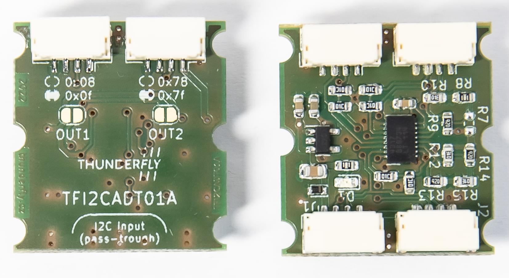
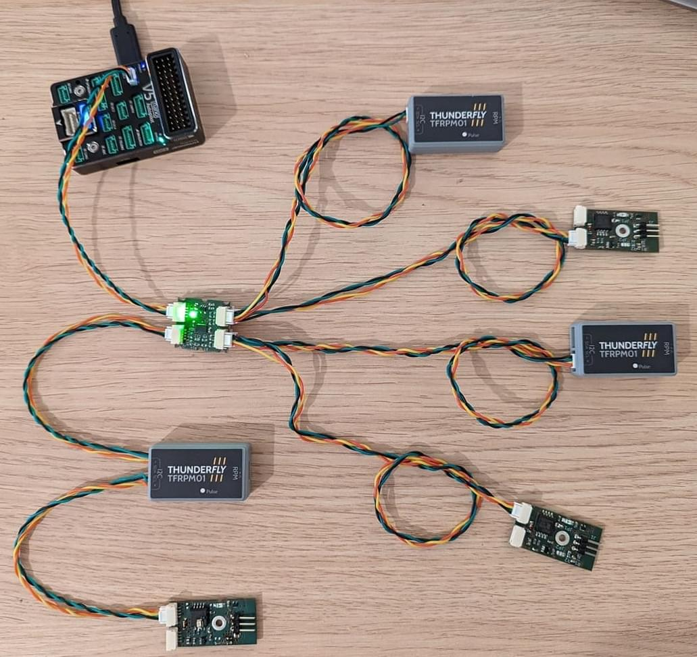

# I2C Bus Peripherals

[I2C](https://en.wikipedia.org/wiki/I2C) is a serial communication protocol that is commonly used (at least on smaller drones), for connecting peripheral components like rangefinders, LEDs, Compass, etc.

It is recommended for:
* Connecting off board components that require higher data rates than provided by a strict serial UART, such as rangefinders.
* Compatibility with peripheral devices that only support I2C.
* Allowing multiple devices to attach to a single bus, which is useful for conserving ports.

I2C allows multiple master devices to connect to multiple slave devices using only 2 wires per connection (SDA, SCL).
in theory a bus can support 128 devices, each accessed via its unique address.

> **Note** UAVCAN would normally be preferred where higher data rates are required, and on larger vehicles where sensors are be mounted further from the flight controller.


## Wiring

I2C uses a pair of wires: SDA (serial data) and SCL (serial clock).
The bus is of open-drain type, meaning that devices ground the data line.
It uses a pullup resistor to push it to `log.1` (idle state) - every wire has it usually located on the bus terminating devices.
One bus can connect to multiple I2C devices.
The individual devices are connected without any crossing.

For connection (according to dronecode standard) 4-wire cables equipped with JST-GH connectors are used.
To ensure reliable communication and to reduce crosstalk it is advised to apply recommendations concerning [cable twisting](../assembly/cable_wiring.md#i2c-cables) and pullup resistors placement.


## Common problems

### Insufficient Capacity

The capacity available for each individual device decreases as more devices are added.
If too many devices are added, it can cause transmission errors and network unreliability.

The problem can be analyzed using an oscilloscope, where we see that the edges of SDA/SCL signals are no longer sharp.

There are several ways to reduce the problem:
* Dividing the devices into groups, each with approximately the same number of devices and connecting each group to one autopilot port
* Using the shortest and the highest quality I2C cables possible
* Separating the devices with a weak open-drain driver to smaller bus with lower capacity
* [I2C Bus Accelerators](#i2c-bus-accelerators)


### Address Clashes

If two I2C devices on a bus have the same ID there will be a clash, and neither device will not work properly (or at all).
This usually occurs because a user needs to attach two sensors of the same type to the bus, but may also happen if devices use duplicate addresses by default.

Particular I2C may allow you to select a new address for one of the devices to avoid the clash.
Some devices do not support this option, or do not have broad options for the addresses that can be used (i.e. cannot be used to avoid a clash).

If you can't change the addresses, one option is to use an [I2C Address Translator](#i2c-address-translators).


## I2C Bus Accelerators

I2C bus accelerators are separate circuits that can be used to support more devices on the same I2C bus.
They work by physically dividing an I2C network into 2 parts and using their own transistors to amplify I2C signals.

Available accelerators include:
- [Thunderfly TFI2CEXT01](https://github.com/ThunderFly-aerospace/TFI2CEXT01): 
  
  - This has Dronecode connectors and is hence very easy to add to a Pixhawk I2C setup.
  - The module has no settings (it works out of the box).


## I2C Address Translators

I2C Address Translators can be used to prevent I2C address clashes in systems where there is no other way to assign unique addresses.
The work by listening for I2C communication and tranforming the address when a slave device is called (according to a preset algorithm).

Supported I2C Address Translators include:
- [TFI2CADT01](#TFI2CADT01)


### TFI2CADT01

[TFI2CADT01](https://github.com/ThunderFly-aerospace/TFI2CADT01) is a module that translates I2C addresses.
A sensor is connected to the master device on one side. On the output side sensors, whose addresses are to be translated, can be connected.
Module contains two pairs of connectors, each pair responsible for different translations.




#### Address translation method

TFI2CADT01 performs an XOR operation on the called address.
Therefore, a new device address can be found by taking the original address and applying an XOR operation with the value specified on the module.
By default, the output 1 performs XOR with 0x08 value and the second port with 0x78.
By short-circuiting the solder jumper you can change the XOR value to 0x0f for the first and 0x7f for the second port.

If you need your own value for address translation, changing the configuration resistors makes it possible to set any XOR value.

#### Example of use

The tachometer sensor [TFRPM01]() can be set to 2 different addresses using a solder jumper.
If the autopilot has 3 buses, only 6 sensors can be connected and no bus remains free. 
(2 available addresses * 3 i2c ports).
In case of some multicopters or VTOL solutions, there is a request for measuring RPM of e.g. 8 elements.
For this purpose, TFI2CEXT01 can be easily used.



The following scheme shows how to connect 6 TFRPM01 to one autopilot bus.
By adding another TFI2CADT01, 4 more devices can be connected to the same bus.

[](https://mermaid-js.github.io/mermaid-live-editor/edit#pako:eNptkd9rwjAQx_-VcE8dtJB2ukEfBLEWfJCJy8CHvgRznQH7gzSBDfF_33VZB2oCyf3I576XcBc4dgohh08j-xMTRdUyWuX2I6LNErY7zJh0tuv1ubNP_7csSRZsudlHS22GHlGxAduhM3fEfrdNI1GS4emK8a85fwSyGyC9A0S5yVbrg_DZKfLtCxH9JsjhaU7VvI7pfK3_NCg_NXmO3pwl5uYt9D0yAXoWoFNP4yM9H-kspJ0FtF8CdObpURtiaNA0UisaymWsrsCesMEKcnIV1tKdbQVVeyXU9UpaXCttOwO5NQ5jGKf1_t0ep9gzhZY04sYnrz9BI4mU)


<!-- original mermaid graph
graph TD
    FMU(FMU - PX4 autopilot)
    FMU -- > AIR(Airspeed sensor)
    FMU -- > RPM1(TFRPM01C 0x50)
    FMU -- > RPM2(TFRPM01C 0x51)
    FMU -- > TFI2CEXT
    TFI2CEXT -- > ADT(TFI2CADT01: 0x0f, 0x7f)
    ADT -- > RPM3(Out1: TFRPM01C 0x50 - 0x5f)
    ADT -- > RPM4(Out1: TFRPM01C 0x51 - 0x5e)
    ADT -- > RPM5(Out2: TFRPM01C 0x50 - 0x2f)
    ADT -- > RPM6(Out2: TFRPM01C 0x52 - 0x2e)
-->


:::note
TFI2CADT01 does not contain any I2C buffer or accelerator.
It itself creates an additional capacity on the bus.
Therefore it is advisable to combine TFI2CADT01 with some bus booster, e.g. TFI2CEXT01.
:::

## Checking the Bus and Device Status 

A useful tool for bus analysis is [i2cdetect](../modules/modules_command.md#i2cdetect).
This lists available I2C devices by their addresses.
It can be used to find out if a device on the bus is available and if the autopilot can communicate with it.

The tool can be run in the PX4 terminal with the following command:

```
i2cdetect -b 1
```
where the bus number is specified after `-b` parameter

## I2C Development

Software development for I2C devices is described in [I2C Bus (Development Overview)](../sensor_bus/i2c_development.md).

## Further Information

* [I2C](https://en.wikipedia.org/wiki/I%C2%B2C) (Wikipedia)
* [I2C Comparative Overview](https://learn.sparkfun.com/tutorials/i2c) (learn.sparkfun.com)
* [Driver Framework](../middleware/drivers.md)
