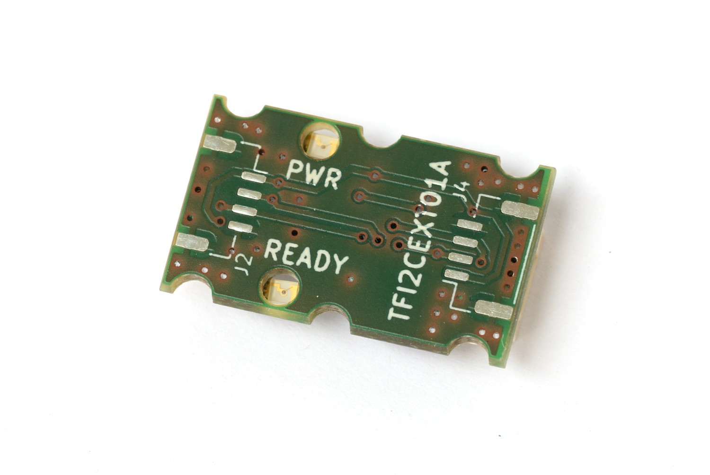
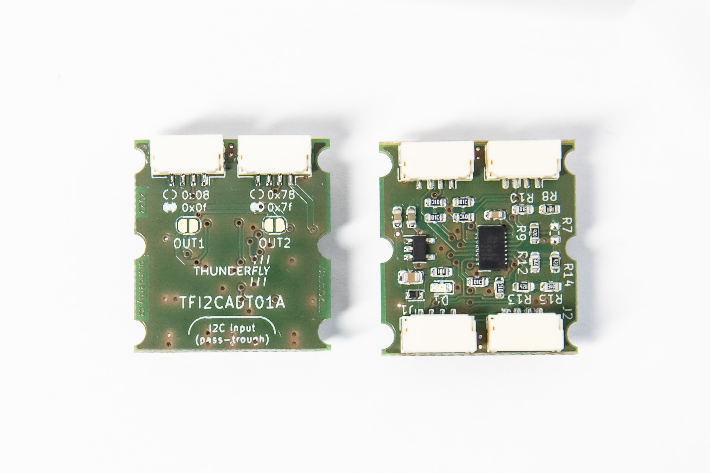
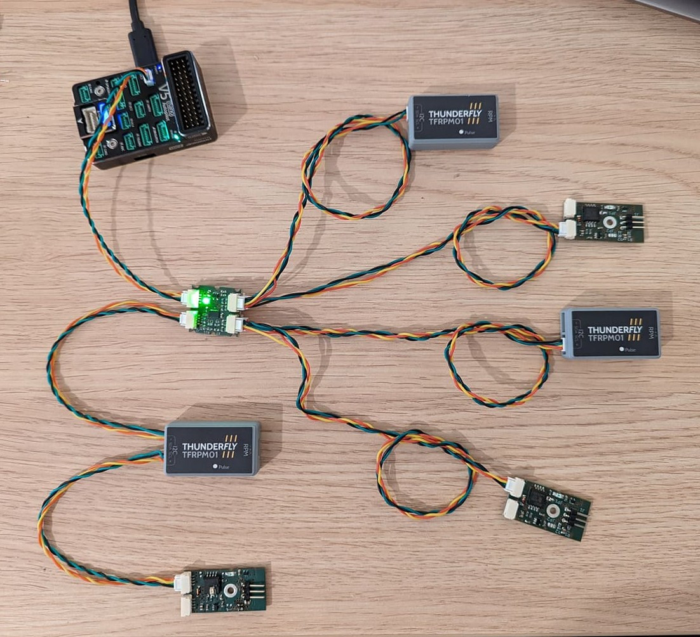

# I2C Bus Overview
[I2C](https://en.wikipedia.org/wiki/I2C) bus is a widely used bus originally designed for internal communication on computer motherboards. A lot of currently used sensors are equipped with this interface. I2C is easy to implement. It enables two-way communication via a pair of wires (SDA, SCL). The bus is based on master-slave principle and an individual slave device is addressable. One bus can theoretically connect with up to 128 devices, each with its unique address.

:::note
Details on software development for I2C devices are described on the page [i2c](./i2c_development.md) in development section.
:::

## Wiring
I2C uses a pair of wires: SDA - serial data and SCL - serial clock. The bus is of open-drain type, meaning that devices ground the data line. It uses a pullup resistor to push it to log.1 (idle state) - every wire has it usually located on the bus terminating devices. One bus can connect to multiple I2C devices. The individual devices are connected without any crossing.

For connection (according to dronecode standard) 4-wire cables equipped with JST-GH connectors are used. To ensure reliable communication and to reduce crosstalk it is advised to apply recommendations concerning [cable twisting](../assembly/cable_wiring.md#i2c-cables)  and pullup resistors placement.


## Common problems
With an increasing number of devices connected to the bus its capacity increases as well. This can cause transmission errors and network unreliability. The problem can be analyzed using e.g. oscilloscope, where we see that the edges of SDA/SCL signals are no longer sharp enough. There are several ways to eliminate the problem:
 * Dividing the devices into groups, each with approximately the same number of devices and connecting each group to one autopilot port
 * Using the shortest and the highest quality I2C cables possible
 * Separating the devices with a weak open-drain driver to smaller bus with lower capacity

### I2CEXTENDER
If none of the above mentioned can be applied or if the solution is not sufficient enough it is possible to use the so-called I2C bus accelerators. These are circuits that physically divide the I2C network into 2 parts and use their own transistors to amplify I2C signals.

For the pixhawk infrastructure there exists a [TFI2CEXT01](https://github.com/ThunderFly-aerospace/TFI2CEXT01) module that can be inserted into an extensive I2C network and extend its reach. TFI2CEXT01 is equipped with dronecode and connectors so its connection is very easy. The module has no settings.



## Address translator

A lot of sensors are supported by PX4 in a so-called multi-instance way, meaning that one autopilot can be connected to more identical sensors. As was already mentioned, the bus can connect up to 128 devices with unique addresses. Sensors often offer a choice between only a small number of addresses and thus only a limited number of sensors can be connected to autopilot.

A solution to this problem is an I2C address translator. The translator listens to I2C communication and when a slave device is called upon, it transforms its address according to a preset algorithm.

### TFI2CADT01

[TFI2CADT01](https://github.com/ThunderFly-aerospace/TFI2CADT01) is a module that translates I2C addresses. A sensor is connected to the master device on one side. On the output side sensors, whose addresses are to be translated, can be connected. Module contains two pairs of connectors, each pair responsible for different translations.




#### Address translation method
TFI2CADT01 performs an XOR operation on the called address. Therefore, a new device address can be found by taking the original address and applying an XOR operation with the value specified on the module. By default, the output 1 performs XOR with 0x08 value and the second port with 0x78. By short-circuiting the solder jumper you can change the XOR value to 0x0f for the first and 0x7f for the second port.

If you need your own value for address translation, changing the configuration resistors makes it possible to set any XOR value.

### Example of use
The tachometer sensor TFRPM01]() can be set to 2 different addresses using a solder jumper. If the autopilot has 3 buses, only 6 sensors can be connected and no bus remains free. (2 available addresses * 3 i2c ports). In case of some multicopters or VTOL solutions, there is a request for measuring RPM of e.g. 8 elements. For this purpose, TFI2CEXT01 can be easily used.




The following scheme shows how to connect 6 TFRPM01 to one autopilot bus. By adding another TFI2CADT01, 4 more devices can be connected to the same bus.

[](https://mermaid-js.github.io/mermaid-live-editor/edit#pako:eNptkd9rwjAQx_-VcE8dtJB2ukEfBLEWfJCJy8CHvgRznQH7gzSBDfF_33VZB2oCyf3I576XcBc4dgohh08j-xMTRdUyWuX2I6LNErY7zJh0tuv1ubNP_7csSRZsudlHS22GHlGxAduhM3fEfrdNI1GS4emK8a85fwSyGyC9A0S5yVbrg_DZKfLtCxH9JsjhaU7VvI7pfK3_NCg_NXmO3pwl5uYt9D0yAXoWoFNP4yM9H-kspJ0FtF8CdObpURtiaNA0UisaymWsrsCesMEKcnIV1tKdbQVVeyXU9UpaXCttOwO5NQ5jGKf1_t0ep9gzhZY04sYnrz9BI4mU)


<!-- original mermaid graph
graph TD
    FMU(FMU - PX4 autopilot)
    FMU -- > AIR(Airspeed sensor)
    FMU -- > RPM1(TFRPM01C 0x50)
    FMU -- > RPM2(TFRPM01C 0x51)
    FMU -- > TFI2CEXT
    TFI2CEXT -- > ADT(TFI2CADT01: 0x0f, 0x7f)
    ADT -- > RPM3(Out1: TFRPM01C 0x50 - 0x5f)
    ADT -- > RPM4(Out1: TFRPM01C 0x51 - 0x5e)
    ADT -- > RPM5(Out2: TFRPM01C 0x50 - 0x2f)
    ADT -- > RPM6(Out2: TFRPM01C 0x52 - 0x2e)
-->


:::note
TFI2CADT01 does not contain any I2C buffer or accelerator. It itself creates an additional capacity on the bus. Therefore it is advisable to combine TFI2CADT01 with some bus booster, e.g. TFI2CEXT01.
:::

## Checking the status of the bus and connected devices
A tool very useful for bus analysis is the `i2cdetect`. It lists devices available on the bus by their addresses. This tool can be used to find out if a device on the bus is available and if the autopilot can communicate with it.

The tool can be run in px4 terminal with the following command:
```
i2cdetect -b 1
```
where the bus number is specified after -b parameter


## Further Information

* [I2C](https://en.wikipedia.org/wiki/I%C2%B2C) (Wikipedia)
* [I2C Comparative Overview](https://learn.sparkfun.com/tutorials/i2c) (learn.sparkfun.com)
* [Driver Framework](../middleware/drivers.md)
