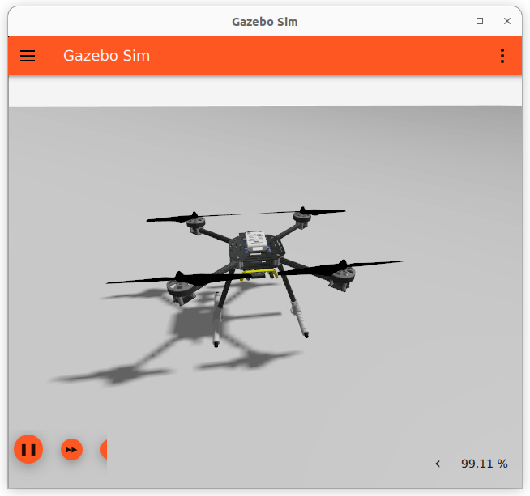
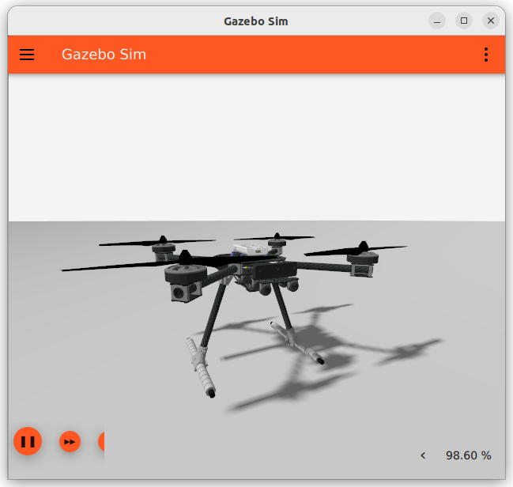
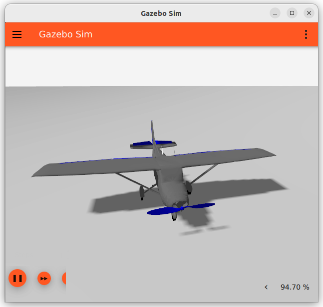

# Gazebo Vehicles

This topic lists/displays the vehicles supported by the PX4 [Gazebo](../sim_gazebo_gz/README.md) simulation, and the `make` commands required to run them (the commands are run from a terminal in the **PX4-Autopilot** directory).

Supported vehicle types include: mutirotor, VTOL, Plane.

:::note
The [Gazebo](../sim_gazebo_gz/README.md) page shows how to install Gazebo.
:::

:::warning
See [Gazebo Classic Vehicles](../sim_gazebo_classic/gazebo_vehicles.md) for vehicles that work with the older [Gazebo "Classic" simulation](../sim_gazebo_classic/README.md).
Note that vehicle models are not interchangable between the two versions of the simulator: the vehicles on this page only work with (new) [Gazebo](../sim_gazebo_gz/README.md).
:::

## Multicopter

### X500 Quadrotor

```sh
make px4_sitl gz_x500
```

### X500 Quadrotor with Visual Odometry

```sh
make px4_sitl gz_x500_vision
```



### X500 Quadrotor with Depth Camera

These models have a depth camera attached, modelled on the OAK-D.

_Forward-facing depth camera:_

```sh
make px4_sitl gz_x500_depth
```



<a id="fixed_wing"></a>
## Plane/Fixed-wing

<a id="rc-cessna"></a>
### Standard Plane

```sh
make px4_sitl gz_rc_cessna
```



## VTOL

### Standard VTOL

```sh
make px4_sitl gz_standard_vtol
```


