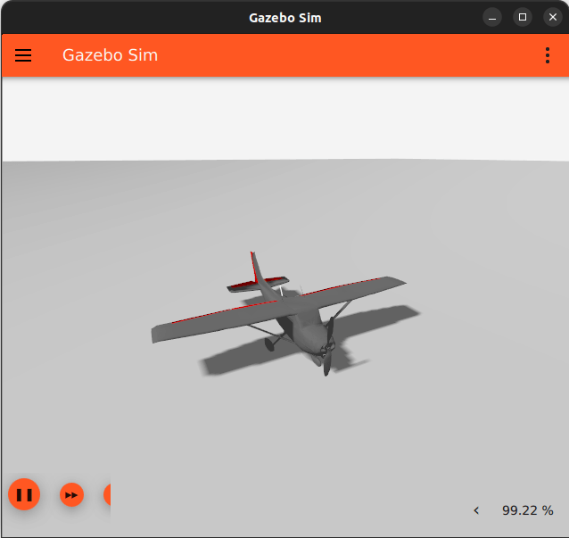
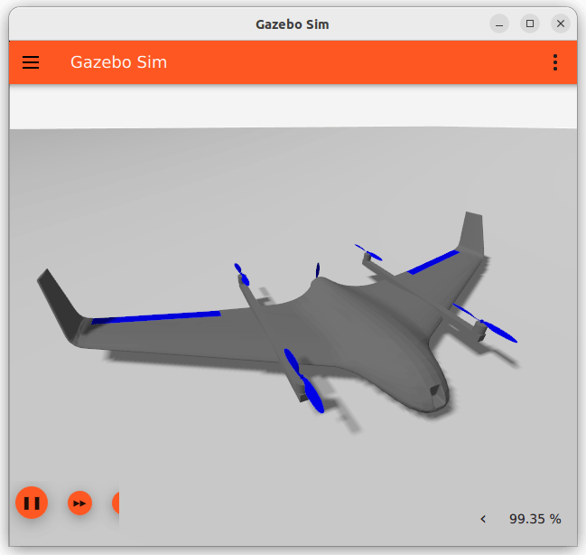

# Gazebo Vehicles

This topic lists/displays the vehicles supported by the PX4 [Gazebo](../sim_gazebo_gz/README.md) simulation, and the `make` commands required to run them (the commands are run from a terminal in the **PX4-Autopilot** directory). On first run, all models are fetched from the [PX4-gazebo-models](https://github.com/PX4/PX4-gazebo-models) repository and placed in the `/.simulation-gazebo` repository.

Supported vehicle types include: mutirotor, VTOL, Plane.

:::note
The [Gazebo](../sim_gazebo_gz/README.md) page shows how to install Gazebo.
:::

:::warning
See [Gazebo Classic Vehicles](../sim_gazebo_classic/vehicles.md) for vehicles that work with the older [Gazebo "Classic" simulation](../sim_gazebo_classic/README.md).
Note that vehicle models are not interchangable between the two versions of the simulator: the vehicles on this page only work with (new) [Gazebo](../sim_gazebo_gz/README.md).
:::

## Multicopter

### X500 Quadrotor

```sh
make px4_sitl gz_x500
```

### X500 Quadrotor with Visual Odometry

```sh
make px4_sitl gz_x500_vision
```


### X500 Quadrotor with Depth Camera

These models have a depth camera attached, modelled on the OAK-D.

_Forward-facing depth camera:_

```sh
make px4_sitl gz_x500_depth
```


## Plane/Fixed-wing

### Standard Plane

```sh
make px4_sitl gz_rc_cessna
```


### Advanced Plane

```sh
make px4_sitl gz_advanced_plane
```



:::note
The difference between the Advanced Plane and the "regular plane" lies in the Lift Physics that the two models use:

- You can configure the _Advanced Lift Drag_ plugin used by the model to more closely match a particular vehicle using the [Advanced Lift Drag Tool](../sim_gazebo_gz/tools_avl_automation.md).
- For more detail on the lift calculations for the Advanced Plane, see [PX4-SITL_gazebo-classic/src/liftdrag_plugin/README.md](https://github.com/PX4/PX4-SITL_gazebo-classic/blob/20ded0757b4f2cb362833538716caf1e938b162a/src/liftdrag_plugin/README.md)

:::

## VTOL

### Standard VTOL

```sh
make px4_sitl gz_standard_vtol
```


