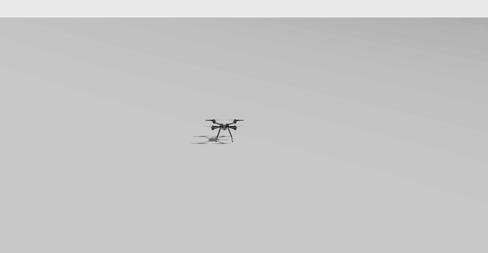
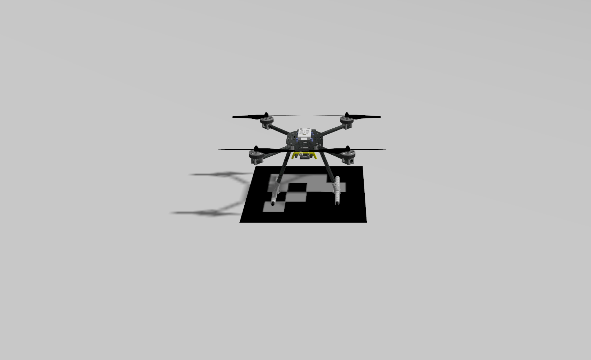
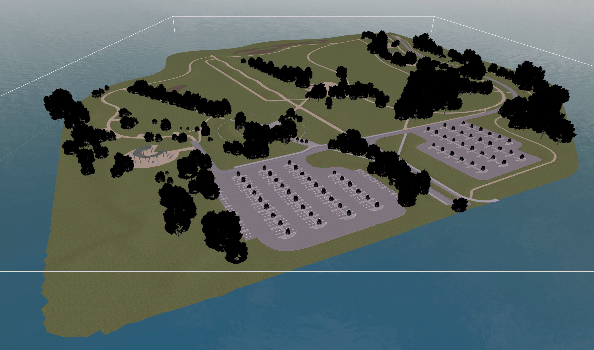
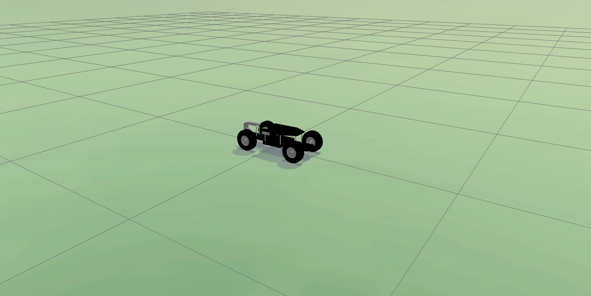
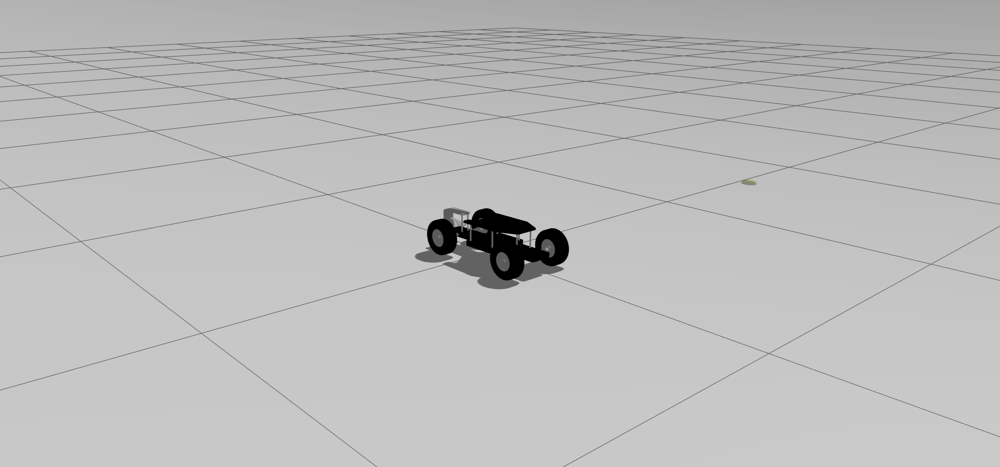
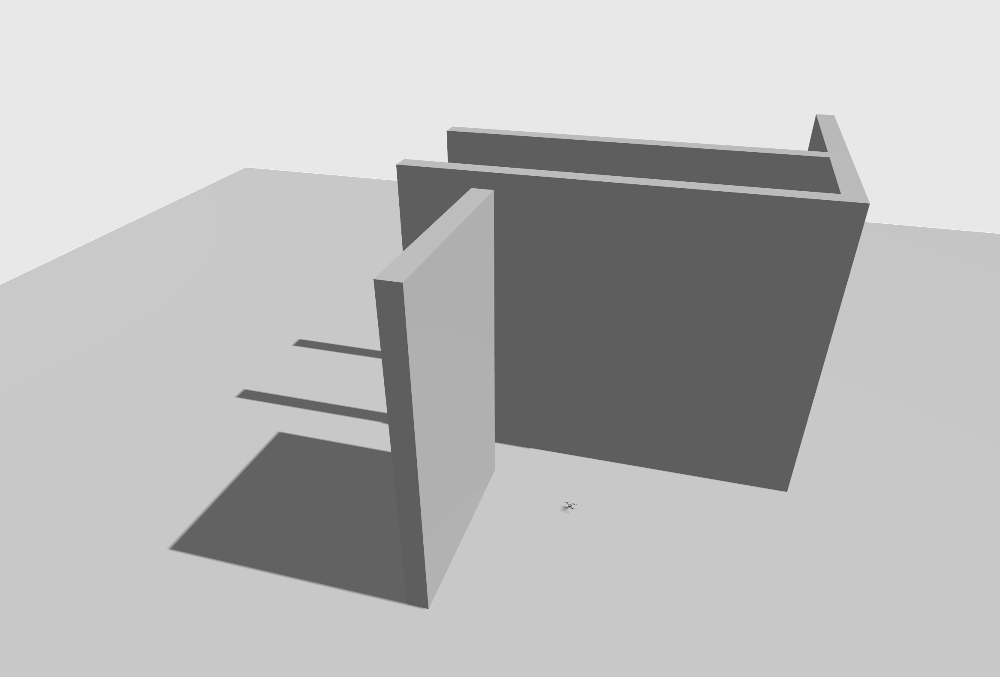

# Gazebo Worlds

This topic provides imagery/information about the [Gazebo](../sim_gazebo_gz/index.md) worlds supported by PX4.

The [default world](#default) is spawned by default, though this may be overridden by a [model specific world](#model_specific_worlds).
Developers can also manually specify the world to load: [Gazebo > Specify World](../sim_gazebo_gz/index.md#specify-world) (or [Gazebo Models Repository](../sim_gazebo_gz/gazebo_models.md#gazebo-models-repository-px4-gazebo-models)).

The source code for supported worlds can be found in the [Gazebo Models Repository](../sim_gazebo_gz/gazebo_models.md#gazebo-models-repository-px4-gazebo-models) on GitHub here: [PX4/PX4-gazebo-models/tree/main/worlds](https://github.com/PX4/PX4-gazebo-models/tree/main/worlds).

## Empty (Default) {#default}

Empty world (a grey plane).
This is used by default.

[PX4-gazebo-models/main/worlds/default.sdf](https://github.com/PX4/PX4-gazebo-models/blob/main/worlds/default.sdf)

## Aruco

TBD: What's it for? What vehicles should it be used with. Is it used by any vehicles by default?

[PX4-gazebo-models/main/worlds/aruco.sdf](https://github.com/PX4/PX4-gazebo-models/blob/main/worlds/aruco.sdf)

## Baylands

Baylands world surrounded by water.

[PX4-gazebo-models/main/worlds/bayland.sdf](https://github.com/PX4/PX4-gazebo-models/blob/main/worlds/baylands.sdf)

## Lawn

TBD: What's it for? What vehicles should it be used with. Is it used by any vehicles by default?

[PX4-gazebo-models/main/worlds/lawn.sdf](https://github.com/PX4/PX4-gazebo-models/blob/main/worlds/lawn.sdf)

## Rover

TBD: What's it for? What vehicles should it be used with. Is it used by any vehicles by default?

[PX4-gazebo-models/main/worlds/rover.sdf](https://github.com/PX4/PX4-gazebo-models/blob/main/worlds/rover.sdf)

## Walls

World for testing collision prevention.

[PX4-gazebo-models/main/worlds/walls.sdf](https://github.com/PX4/PX4-gazebo-models/blob/main/worlds/walls.sdf)

## Windy

[Empty world](#default) with wind enabled.

[PX4-gazebo-models/main/worlds/walls.sdf](https://github.com/PX4/PX4-gazebo-models/blob/main/worlds/windy.sdf)

## Model Specific Worlds {#model_specific_worlds}

Some [vehicle models](../sim_gazebo_gz/vehicles.md) rely on the physics / plugins of a specific world.
The PX4 toolchain will automatically spawn a world that has the same name as the vehicle model if one exists (instead of the [default world](#default)):

The model specific worlds are:

<!--
- [boat.world](https://github.com/PX4/PX4-SITL_gazebo-classic/blob/main/worlds/boat.world): Includes a surface to simulate buoyancy of the [boat](../sim_gazebo_classic/vehicles.md#unmanned-surface-vehicle-usv-boat).
- [uuv_hippocampus.world](https://github.com/PX4/PX4-SITL_gazebo-classic/blob/main/worlds/uuv_hippocampus.world): An empty world used to simulate an underwater environment for the [HippoCampus UUV](../sim_gazebo_classic/vehicles.md#hippocampus-tuhh-uuv).
- [typhoon_h480.world](https://github.com/PX4/PX4-SITL_gazebo-classic/blob/main/worlds/typhoon_h480.world): Used by [Typhoon H480 (Hexrotor)](../sim_gazebo_classic/vehicles.md#typhoon-h480-hexrotor) vehicle model and includes a video widget to enable / disable video streaming.
  The world includes a gazebo plugin for a simulated camera.
- [iris_irlock.world](https://github.com/PX4/PX4-SITL_gazebo-classic/blob/main/worlds/iris_irlock.world): Includes a IR beacon for testing [precision landing](../advanced_features/precland.md).
-->
