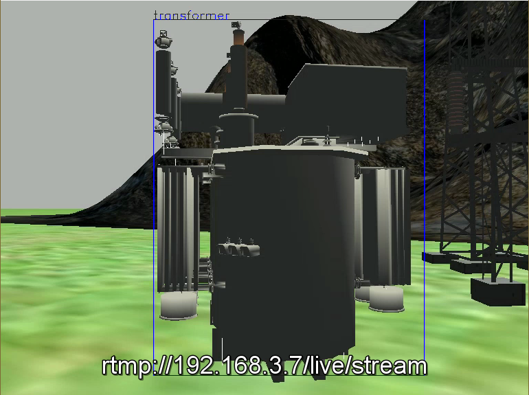

# Simulation of UAV's behavior control with visual feedback based on HUAWEI Atlas200DK

## Introduction

This example uses Gazebo for simulation, the video captured by the camera of the UAV in the simulation environment is transmitted to Atlas200DK. The model trained by yolov3_resnet18 is used for inference, and control instructions are generated according to the detection results and transmitted back to control the behavior of the aircraft. Finally, the UAV can approach the target autonomously and hover at the appropriate position.

The video captured by the camera in the simulation environment is pushed through ffmpeg to the nginx server through rtmp, Atlas200DK receives the video stream and makes model inference, gives the position of the detection box and other contents, and continues to return to the PC through socket. The `fly_control.py` (see [instance directory structure](###Instance-directory-structure) section for code introduction, the same below) receives and sends control instructions to the simulated UAV through mavros.

The UAV realizes speed control by applying `/mavros/set_velocity/cmd_vel` to control the speed of the UAV body system in three directions x, y and z respectively in real time. Where x is the forward direction of the UAV, a target proportion coefficient is set in the code, and the area proportion of the detection box area in the whole image captured by the camera is calculated in real time, which is taken as the controlled quantity. The 'y' and 'z' directions are respectively the right left and right above the fuselage. The central coordinates of the detection box are calculated in real time and taken as the controlled quantity. The target is the central coordinates of the whole image. In this way, speed control in three directions is realized. Here, PD control is used on each axis. When the speed instructions in three directions are all less than a certain set value for several times, it enters a stable state and only an instruction of 0 is sent.



## Hardware Preparation

- Ubuntu PC
- HUAWEI Atlas200DK

This case was tested under Ubuntu 18.04.

## Environment Configuration

### PC side

#### Install ROS

Under Ubuntu18.04, use[ROS-Melodic](http://wiki.ros.org/melodic/Installation/Ubuntu), ere we use the default installation:

```bash
$ sudo apt install ros-melodic-desktop-full
```

#### Configuration of Gazebo

For `ros-<ros_version>-desktop-full`, there is no need to install Gazebo separately.

- Download the official models model and unzip them
    
    ```bash
    $ mkdir ~/.gazebo/models
    $ cd ~/.gazebo/models
    $ wget http://file.ncnynl.com/ros/gazebo_models.txt
    $ wget -i gazebo_models.txt
    $ ls model.tar.g* | xargs -n1 tar xzvf
    ```

- Download project-related models

    In this case:

    - put `1 _sub`, `2 _sub`, `3 _sub` under `gazebo_models` to ` ~ /.gazebo_models`
    - put `cx2.world` under `simulation_setting_files` to `{your_PX4_Firmware_path}/Tools/sitl_gazebo/worlds`
    (clone `PX4-Autopilot` first) 

#### Install MAVROS

```bash
$ sudo apt install ros-melodic-mavros ros-melodic-mavros-extras
$ wget https://raw.githubusercontent.com/mavlink/mavros/master/mavros/scripts/install_geographiclib_datasets.sh
$ sudo chmod a+x ./install_geographiclib_datasets.sh
$ ./install_geographiclib_datasets.sh 
```

#### Compile the PX4 Firmware

```bash
$ git clone https://github.com/PX4/Firmware.git
$ cd Firmware
$ git checkout v1.10.1
$ git submodule update --init --recursive
$ sudo apt-get install libignition-math2-dev libgstreamer1.0-dev gstreamer1.0-plugins-good
$ gstreamer1.0-plugins-bad gstreamer1.0-plugins-ugly libgstreamer-plugins-base1.0-dev
```

Then:

```bash
make posix_sitl_default gazebo
```

#### Configure environment variables

Add the following at the end of `~/.bashrc`:

```bash
$ source ~/Firmware/Tools/setup_gazebo.bash ~/Firmware/ ~/Firmware/build/px4_sitl_default
$ export ROS_PACKAGE_PATH=$ROS_PACKAGE_PATH:~/Firmware
$ export ROS_PACKAGE_PATH=$ROS_PACKAGE_PATH:~/Firmware/Tools/sitl_gazebo
```

The path modifies itself based on the actual `Firmware` location.

#### Modify simulation parameters

- Modify the launch file to add a camera for Iris:
    - Change directory
    ```bash
    $ cd {your_PX4_Firmware_path}/launch
    ```
    - Backup
    ```bash
    $ mv mavros_posix_sitl.launch mavros_posix_sitl.launch.bak
    ```
    - Put `mavros_posix_sitl.launch` ubder `simulation_setting_files` in the project folder in the current location
- Modify camera resolution:
    - Change directory
    ```bash
    $ {your_PX4_Firmware_path}/Tools/sitl_gazebo/models/fpv_cam
    ```
    - Backup
    ```bash
    $ mv fpv_cam.sdf fpv_cam.sdf.bak
    ```
    - Put `fpv_cam.sdf` ubder `simulation_setting_files` in the project folder in the current location

#### Install ffmpeg

ffmpeg is used to push the flow of the UAV camera image in simulation to the nginx server:

```bash
$ sudo apt install ffmpeg
```

#### Set up the nginx push server

- [Build on Ubuntu](http://nginx.org/en/docs/)
- View the video stream: use [VLC](https://www.videolan.org/) to play the network video

### Atlas200DK side

#### Network configuration

#### hiai configuration

```bash
$ sudo apt-get install python3-setuptools python3-pip python-funcsigs python3-dev build-essential
$ pip3 install numpy Enum34 future
$ git clone https://gitee.com/HuaweiAscend/tools/blob/master/python3_hiai_install.sh
$ ./hiai_py3_install.sh
```

#### OpenCV configuration

```bash
$ apt-get install build-essential -y
$ apt-get install cmake git libgtk2.0-dev pkg-config libavcodec-dev libavformat-dev libswscale-dev libv4l-dev -y
$ git clone https://github.com/opencv/opencv.git
$ git clone https://github.com/opencv/opencv_contrib.git
$ cd opencv
$ mkdir release && cd release
$ cmake -D BUILD_opencv_python3=YES -D CMAKE_BUILD_TYPE=Release -D CMAKE_INSTALL_PREFIX=/usr/local -D WITH_LIBV4L=ON -D OPENCV_EXTRA_MODULES=../../opencv_contrib/modules -D PYTHON3_LIBRARIES=/usr/lib/arm-linux-gnueabihf/libpython3.5m.so -D PYTHON3_NUMPY_INCLUDE_DIRS=/usr/local/lib/python3.5/dist-packages/numpy/core/include/ ..
$ make -j8
$ make install
$ ldconfig
```

OpenCV may take several hours to compile, try to compile in 200DK where the system environment has not been configured yet.

#### Install ffmpeg

```bash
$ sudo apt-get install ffmpeg
```

Be sure to verify that it works properly after installation.

#### Upload the code to 200DK

In this case, upload `dk_simulation_demo` directory to 200DK.

## Model training and transformation

The built-in yolov3_resnet18 of Huawei ModelArts is used here to complete the training and transformation of the model. The model training and transformation should be completed according to the specific use requirements.

## Instance

### Instance directory structure

- gazebo_models
    - my_ground_plane
    - 1_sub
    - 2_sub
    - 3_sub
- simulation_setting_files
    - cx2.world
    - fpv_cam.sdf
    - mavros_posix_sitl.py
- pc_simulation_demo
    - commander.py
    - fly_control.py
    - image_process.py
    - px4_mavros_run.py
- dk_simulation_demo
    - config.json
    - inference.py
    - main.py

### Configure the relevant ports and addresses

#### pc_simulation_demo

- image_process.py
    - rtmpUrl: the target address of the captured video stream
- fly_control.py
    - IP: the LAN address on the PC side, used for socket server, receives the detection information from 200DK
    - PORT: port of the socket server above

#### dk_simulation_demo

- main.py
    - IP: the LAN address on the PC side, used as a target for the socket client, sends a 200DK detection message, and should be the same as the IP in `fly_control.py` when not using transit
    - PORT：the port of the target server for the above socket client, and should be the same as the port in `fly_control.py` when not using transit
    - irtmpurl: the camera video stream published on the PC side for cv2, and should be the same as the rtmpUrl in `image_process.py` above
    - ortmpUrl: The 200DK side can separately push stream all the way with detection box result video stream. This address is the target address of the stream.

### Instance running procedure

#### Start the simulation in the PC side

```bash
$ roslaunch px4 mavros_posix_sitl.launch
$ rqt_image_view
```

To view the plane's camera, select `iris/usb_cam/image_raw` in `rqt_image_view`.

#### Start the nginx service

#### Run the stream-pusing  program in the PC side

In this case:

```
$ cd pc_simulation_demo
$ python image_process.py
```

It can also be run in the ROS workspace

#### Run the processing main program in the 200DK side

In this case:

```bash
$ cd dk_simulation_demo
$ python3 main.py
```

The terminal prints out a series of test results indicating that the rtmp stream has been successfully received before proceeding to the next step.

#### Run the flight control program in the PC side

In this case, first take off the aircraft to 3.5m:

```bash
python px4_mavros_run.py
```

When the aircraft is stable, execute the following commands:

```bash
python fly_control.py
```

Note that the position may shift over time after stabilization, which is a normal phenomenon.

## Instructions

1. Considering the complexity of the simulation model and the high consumption of CPU resources in the simulation process, it is suggested to use the real machine instead of running in the virtual machine.
2. To run Gazebo using the VMware virtual machine, you need:
```bash
echo "export SVGA_VGPU10=0" >> ~/.bashrc
source ~/.bashrc
```
3. PX4+ Gazebo cannot be run using WSL
    - First, make sure that the graphical interface (in this case, Xming) is installed and configured correctly
    - modify the corresponding code, see [here](https://github.com/PX4/PX4-Autopilot/commit/01818b505f898f33176bf90f9563e84942ea56cf)
4. When using the virtual machine, it is necessary to transfer data back through socket or configure VMware port mapping to ensure that the ROS terminal can receive the returned data.
5. Our example aims to verify the feasibility of the visual feedback control algorithm, in which the altitude of the aircraft is limited by the control strategy and the existing model, which is different from the real situation.
6. In order to ensure the transmission efficiency, the 200DK side uses 4 processes and 3 queues, which are respectively used to read the image in the video stream, model inference, sending the result of detection box, and write the framed video stream into ffmgep pipe. For ffmgep pipe on the 200DK side and the PC side, the library Subprocess is used to complete both.

## Contributors

Hua Wu, Xiaotian Yu, Chenyue Jiao, Xinhui Lin from AMaze Industrial Intelligent Robot Research Center, North China Electric Power University.

If you have any question, contact us via <hw@amazething.io>.