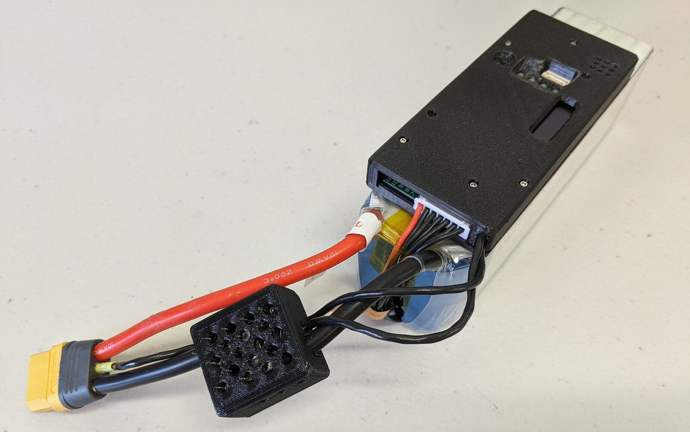
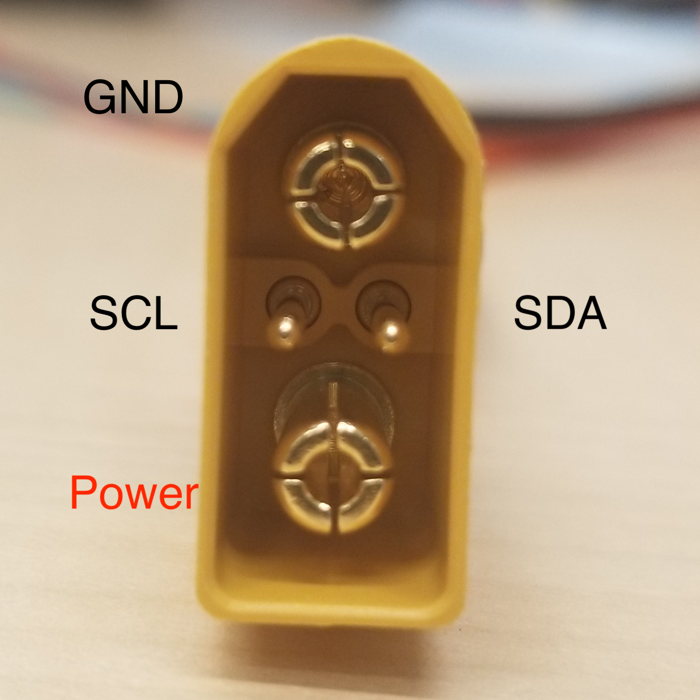

# Rotoye Batmon

Rotoye Batmon is a smartification kit for off-the-shelf Lithium-Ion and LiPo batteries. It can be purchased as a standalone unit or factory-assembled into a smart-battery. 

  

## Purchase

[Rotoye Store](https://rotoye.com/batmon/): Batmon kits, custom smart-batteries, and accessories

## Wiring/Connections

The Rotoye Batmon system uses an XT-90 battery connector with I2C pins to transmit data

## Further Information

[Quick Start Guide](https://rotoye.com/batmon-tutorial/) (Rotoye)
