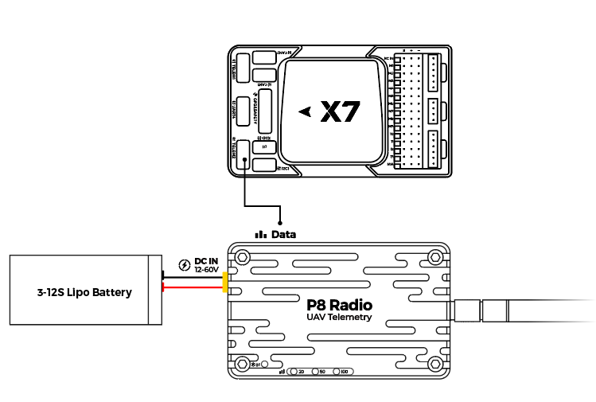

# CUAV P8 Telemetry Radio

CUAV P8 Radio is a long range (>60km) and high data rate (375Kbps) remote data transmission module for drones.

It supports multiple modes such as point-to-point, point-to-multipoint, and relay communication.

## Key Features

- Long range: >60km (depending on the antenna and environment, up to 100 km).
- Supports point-to-point, point-to-multipoint, and repeater modes.
- Up to 2W power (fixed frequency 2W; frequency hopping 1W)
- Up to 345Kbps transfer rate.
- Supports 12v~60V operating voltage.
- Unit can operate either as ground station modem or aircraft modem.
- Independent power supply for more stable operation
- USB Type-C port, integrated USB to UART converter

## Purchase

* [CUAV store](https://store.cuav.net/shop/cuav-p8-radio-uav-telemetry/)
* [CUAV alibaba](https://www.alibaba.com/product-detail/Free-shipping-CUAV-UAV-P8-Radio_1600324379418.html?spm=a2747.manage.0.0.2dca71d2bY4B0M)

## Pinouts

## Wiring

## More information

[P8 manual](http://manual.cuav.net/data-transmission/p8-radio/p8-user-manual-en.pdf)

[CUAV docs](https://doc.cuav.net/data-transmission/p8-radio/en/)
