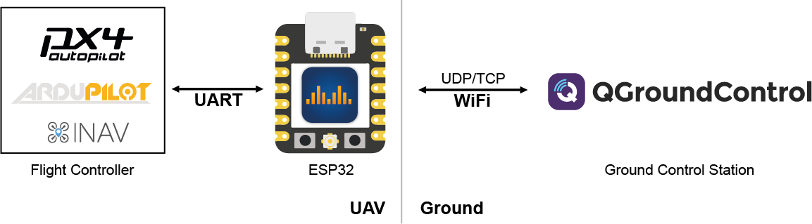

# ESP32 WiFi Module

ESP32 are readily available WiFi modules with dedicated UART, SPI and I2C interfaces, and full TCP/IP stack and microcontroller capability.
They come without firmware, but *DroneBridge for ESP32* can be installed to enable them as a transparent and bi-directional serial to WiFi bridge.
They can then be used as a WiFi telemetry module with any Pixhawk series controller.

No configuration is generally required if connected to `TELEM2`.
The typical range is approximately 50m-200m (depending on the antenna used).




## Recommended Hardware

*DroneBridge for ESP32* can run on almost every ESP32 development board.
Boards and modules with an external antenna connector are recommended, since these will offer more range.

:::warning
Many ESP32 modules support 3.3V and 5V power supply input, while some flight controllers (e.g. Pixhawk 4) output at 5V.
You will need to check compatibility and step down the voltage if needed.
:::

Modules and DevKits that accept 3.3V or 5V power supply:
* [AZ-Delivery — ESP-32 DevKit C](https://www.az-delivery.de/en/products/esp-32-dev-kit-c-v4)
* [TinyPICO — ESP32 Development Board - V2](https://www.adafruit.com/product/4335)
* [Adafruit HUZZAH32 — ESP32 Feather Board](https://www.adafruit.com/product/3405)
* [Adafruit AirLift — ESP32 WiFi Co-Processor Breakout Board](https://www.adafruit.com/product/4201) (requires FTDI adapter for flashing firmware)
* [Adafruit — HUZZAH32](https://www.adafruit.com/product/4172) (requires FTDI adapter for flashing firmware)


## Downloading and Flashing the Firmware

[Download the firmware from the GitHub repository](https://github.com/DroneBridge/ESP32/releases) and then [follow these flashing instructions](https://github.com/DroneBridge/ESP32#installationflashing-using-precompiled-binaries).

:::tip
The instructions on Github are recommended because they are always up to date.
Note that the parameters may differ between releases of *DroneBridge for ESP32*.
:::

The main steps are:
1. [Download the pre-compiled firmware binaries](https://github.com/DroneBridge/ESP32/releases)
1. Connect your DEVKit to your computer via USB/Serial bridge (most DevKits already offer a USB port for flashing and debugging)
1. Erase the flash and flash the DroneBridge for ESP32 firmware onto your ESP32
   * Using [Espressif Flash Download Tool](https://www.espressif.com/en/support/download/other-tools) (Windows only)  
   * Using esp-idf/esptool (all platforms)
1. Power Cycle the ESP32
1. [Connect to the "DroneBridge for ESP32" WiFi network and configure the firmware for your application](#configuring-dronebridge-for-esp32)


## Wiring

Wiring is very simple, and similar for all devices when connecting to the Pixhawk TELEM1/2 ports.
You can use 2.54mm pitch header connectors or solder the PX4 telemetry cables directly to the board.


1. Connect UART of ESP32 to a UART of your flight controller (e.g. TELEM 1 or TELEM 2 port).
   Make sure the voltage levels match: most ESP32 DevKits can only take 3.3V!
   * TX to RX
   * RX to TX
   * GND to GND
   * Provide a stable 3.3V or 5V power supply to the ESP32 (depending on the available inputs of your DevKit)
1. Set the flight controller port to the desired protocol.
1. Boards with an IPEX port for an external antenna often also offer an onboard antenna that is activated by default.
   You may need to resolder a resistor to activate the external antenna port.


:::note
- Follow the ESP32 board manufacturers recommendations on power supply.
  Some boards might have issues if they are simultaneously connected to a 5V power source and have a USB cable connected to the USB/Serial bridge (USB socket of the ESP32 dev board).
- Some ESP32 DevKits manufacturers use the wrong labels for the pins on their products.
  Make sure that the PINs on your board are labeled correctly if you encounter issues.
:::

## Configuring QGroundControl

QGroundControl should auto-detect the connection and no further actions should be necessary (*DroneBridge for ESP32* automatically forwards data from all connected WiFi devices via UDP to port 14550).

The following connection options are available:
* UDP unicast on port `14550` to all connected devices.
* TCP on port `5760`


## Configuring DroneBridge for ESP32

The *DroneBridge for ESP32* default configuration should work for connecting to PX4 "out of the box".
The only configuration that may be required is ensuring that the baud rates of the ESP32 and flight controller match.

You will want to change these settings if you want to use different pins on the ESP32, a different WiFi configuration, or to tweak the packet size.
Lower packet size means more overhead and load on the system but also less latency and faster recovery from a lost packet.

### Default Configuration

* SSID: `DroneBridge for ESP32`
* Password: `dronebridge`
* Transparent/MAVLink
* UART baud rate `115200`
* UART TX pin `17`
* UART RX pin `16`
* Gateway IP: `192.168.2.1`

### Custom Settings & Webinterface

You can change the default configuration via the Webinterface.
Connect to the ESP32 via WiFi and enter `dronebridge.local`, `http://dronebridge.local` or `192.168.2.1` in the address 
bar of your browser.


:::tip
Some settings require you to reboot the ESP32 to take effect.
:::

### API

DroneBridge for ESP32 offers a REST:API that allows you to read and write configuration options.
You are not limited to the options presented by the Webinterface (e.g. baud rates).
You can use the API to set custom baud rates or to integrate the system into your own setup.

**To request the settings**
``` http request
http://dronebridge.local/api/settings/request
```

**To request stats**
``` http request
http://dronebridge.local/api/system/stats
```

**Trigger a reboot**
``` http request
http://dronebridge.local/api/system/reboot
```

**Trigger a settings change:** Send a valid JSON
``` json
{
  "wifi_ssid": "DroneBridge ESP32",
  "wifi_pass": "dronebridge",
  "ap_channel": 6,
  "tx_pin": 17,
  "rx_pin": 16,
  "telem_proto": 4,
  "baud": 115200,
  "msp_ltm_port": 0,
  "ltm_pp": 2,
  "trans_pack_size": 64,
  "ap_ip": "192.168.2.1"
}
```
to
``` http request
http://dronebridge.local/api/settings/change
```

## Toubleshooting

* Always erase the flash of the ESP32 before flashing a new release/firmware
* Check if the pins on your ESP board are labeled correctly.
* Enter the IP address in your browsers address bar `http://192.168.2.1`.
  No https supported!
  You may need to disconnect from the cellular network when using a phone to be able to access the webinterface.
* If your network is operating in the same IP range as DB for ESP32 you need to change the Gateway IP address in the Webinterface to something like `192.168.5.1`.