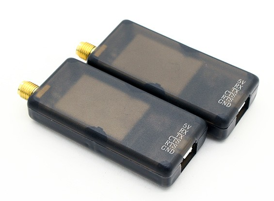

# HKPilot Telemetry Radio

HKPilot has a [SiK Radio](../telemetry/sik_radio.md)-compatible telemetry set that can be used with PX4, and which comes in 915MHz (USA) and 433MHz (Europe) versions.

The radios come with a 6-position DF13 connector, and are essentially plug-n-play with *Pixhawk 1* and other early flight controller boards.

## Purchase
 
* [Micro HKPilot Telemetry radio Set With Integrated PCB Antenna 433Mhz](https://hobbyking.com/en_us/micro-hkpilot-telemetry-radio-set-with-integrated-pcb-antenna-433mhz.html)
* [Micro HKPilot Telemetry radio Set With Integrated PCB Antenna 915Mhz](https://hobbyking.com/en_us/micro-hkpilot-telemetry-radio-set-with-integrated-pcb-antenna-915mhz.html)
