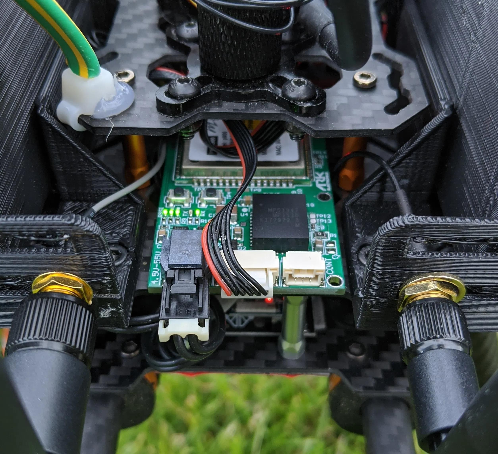

# Microhard Serial Radio

[Microhard Pico Serial](http://microhardcorp.com/P900.php) radios enable MAVLink communication between a radio on a vehicle and a GCS.
Microhard Pico Serial radios are 1 Watt output radios that support point to point, point to multi-point, and mesh modes.
A single ground station radio can be used to communicate with multiple vehicles using point to multi-point or mesh.
Vehicles must have different IDs.

## Purchase:

* [1W 900MHz Serial Telemetry Radio](https://arkelectron.com/product/1w-900mhz-serial-telemetry-air-radio/)
* [1W 900MHz USB Serial Telemetry Radio](https://arkelectron.com/product/1w-900mhz-serial-telemetry-ground-radio/)
* [1W 2.4GHz Serial Telemetry Radio](https://arkelectron.com/product/1w-2400mhz-serial-telemetry-radio/)
* [1W 2.4GHz USB Serial Telemetry Radio](https://arkelectron.com/product/1w-2400mhz-usb-serial-telemetry-radio/)

## Connecting

Connect the radio to the flight controller `TELEM1` port (any free serial port can be used).
A Pixhawk-standard 6 pin JST GH telemetry cable is supplied for this purpose.

The radio can be powered by the telemetry cable if the output power is set to less than 100mW.
For higher output levels, the radio must be separately powered (i.e. from a battery) via the 2 Pin Molex Nano-Fit.

Connect the ground station via USB C.
The radio does not need to be separately powered when using USB PD (1W power can be supplied).

## Setup/Configuration

The ground radio, air radio, PX4, and QGroundControl must all be set to the same baud rate.

PX4 is configured to use `TELEM1` for telemetry radios, with a default baud rate of 57600.
No further PX4 configuration is required if you are using this port and baud rate.

:::note
You can configure PX4 to use any other free serial port, or configure the baud rate, by following the instructions in [MAVLink Peripherals](../peripherals/mavlink_peripherals.md)
:::

The radios are configured using [Pico Config](https://arkelectron.com/wp-content/uploads/2020/09/PicoConfig-1.7.zip) (Windows only).

The ground station radio is connected via USB C (for both radio configuration and communication with QGroundControl):
- *Pico Config* will automatically detect and connect to the configuration port.
   Adjust the settings so that the baud rate matches PX4.
- *QGroundControl* should connect automatically. If not, you can add a new serial connection specifying the baud rate use in [Application Settings > Comm Links](https://docs.qgroundcontrol.com/master/en/SettingsView/SettingsView.html).

The vehicle-based radio is connected to the flight-controller's `TELEM1` port.
For configuration you will also have to connect an FTDI adapter between the 3 pin JST-GH Config port and a Windows PC running Pico Config.
The application will automatically detect the radio and the baud rate setting can be adjusted to match the ground station radio.

