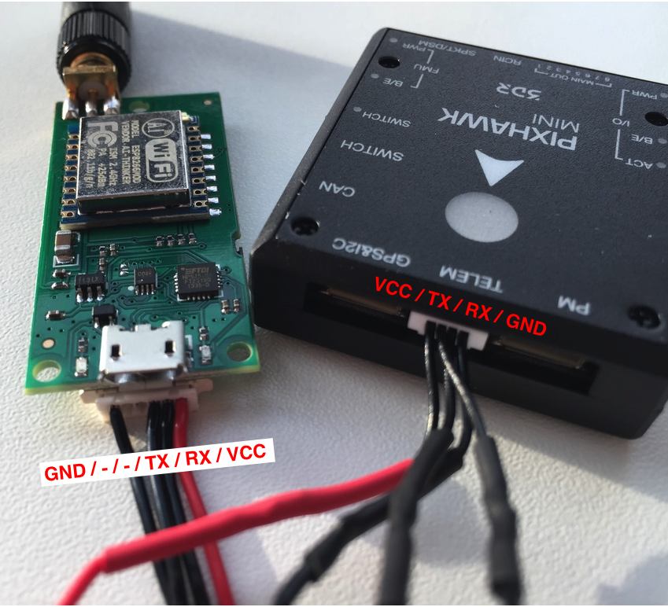

# WiFi Telemetry Radio

WiFi telemetry enables MAVLink communication between a WiFi radio on a vehicle and a GCS.  WiFi typically offers shorter range than a normal telemetry radio, but supports higher data rates, and makes it easier to support FPV/video feeds. Usually only a single radio unit for the vehicle is needed (assuming the ground station already has WiFi).

PX4 supports telemetry via UDP and Wifi. It broadcasts a heartbeat to port 14550 on 255.255.255.255 until it receives the first heartbeat from a ground control station, at which point it will only send data to this ground control station.


## 3DR WiFi Telemetry

The [3DR WiFi Telemetry Radio](https://store.3dr.com/products/wifi-telemetry-radio) is supported by PX4. Simply connect it to the flight controller's `TELEM1` port to create a WiFi "hotspot" for the vehicle with the details below:

```sh
essid: APM_PIX
password: 12345678
```

Connect your ground control station to the above WiFi SSID. After connecting the vehicle should automatically be detected and connect to *QGroundControl*.



