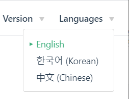

# PX4オートパイロット　ユーザーガイド

  

PX4 は *本格的なオートパイロットシステムです*. 世界中の産業界・アカデミアの開発者によって開発され，世界中のコミュニティによってサポートされており，レーシング用ドローンや運送用ドローンのみならず地上から潜水艇まで，様々なビークルに用いることができます．

このガイドはPX4を搭載する機体を組立て、パラメタを調し、安全に飛ばすために必要な全てのことを含んでいます。 貢献することに興味がありますか？ [開発](development/development.md) セクションを確認してください。
:::

## なにから始めればいいの？

[はじめに](getting_started/README.md) はすべてのユーザーが読むべきです！ 本章は，様々な機能(フライトモードや安全機能) や利用可能なハードウェア(フライトコントローラ，機体，テレメトリーシステム，無線機) など，PX4の概要について説明しています。

貴方の行いたいことに応じて、以下のヒントがこの解説書を探索するのに役に立ちます。

**既にドローンを持っていて，すぐ飛ばしたい：**

PX4をサポートしている，Ready To Fly (RTF) の機体を持っている：

* [基本設定](config/README.md) では，ファームウェアを最新版に更新する方法、主要センサー (コンパス, ジャイロ / IMU, 対気速度計 etc.) のキャリブレーション及びRC機器や安全機能のセットアップについて説明しています．
* [フライト](flying/README.md) では安全に飛行させる方法や，起動・フライト中に発生した問題への対処方法など，飛行に欠かせない事項について説明しています． また，フライトモードの詳細についても解説しています．

**PX4を使用してドローンを最初から作成したい：**

:::**Tip** サポートされている"機体のリストは [機体一覧](airframes/airframe_reference.md)にあります. これらの機体はテストされており，調整された設定値を*QGroundControl*を通して書き込むことができます.
:::

機体を一から手作りしたい：

* フレームの選択 - [機体の組み立て](airframes/README.md) にはサポートされている機体が列挙されています。更に機体を組み立てるための詳細な情報が提供されています．
* フライトコントローラの選択 - [さあ、はじめよう > フライトコントローラ](getting_started/flight_controller_selection.md) と [オートパイロット用ハードウェア](flight_controller/README.md)を参照してください。
* [組み立て](assembly/README.md) では，重要な周辺機器をオートパイロット用機器にどのように接続するか説明しています．
* [基本設定](config/README.md) では，ファームフェアのアップデート方法と，機体に応じた設定方法について説明しています。 また，本章ではメインセンサー (コンパス, ジャイロ/IMU, 機速計等) のキャリブレーション、RC装置や安全機能のセットアップについても説明しています。

飛行させる準備が完了したら、 [フライト](flying/README.md) 章を参照してください。

**ペイロードまたはカメラを追加したい：**

ペイロードセクションでは、カメラを追加する方法、または貨物を配送するためのPX4の設定方法について説明します。

* [ペイロード](payloads/README.md) はペイロードを統合する方法を説明しています

**サポートされた機体を変更したい：**

フライトコントローラと基本的なセンサの変更については、上記のリンクで説明されています。 新しいセンサを使用したり，飛行特性に影響を与える変更をした場合，以下を参照してください:

* [周辺機器](peripherals/README.md) では外部センサを使用するための追加情報を記載しています。
* [基本構成](config/README.md) では、メインセンサーのキャリブレーション方法を説明します。
* [高度な設定](advanced_config/README.md) はより良い調整や微調整に役立ちます．

**PX4を新しいハードウェアで実行し、プラットフォームを拡張したい：**

* [Development](development/development.md) explains how to support new airframes and types of vehicles, modify flight algorithms, add new modes, integrate new hardware, communicate with PX4 from outside the flight controller, and contribute to PX4.

## ヘルプの参照

The [Support](contribute/support.md) page explains how to get help from the core dev team and the wider community.

Among other things it covers:

* [Forums where you can get help](contribute/support.md#forums-and-chat)
* [Diagnosing issues](contribute/support.md#diagnosing-problems)
* [How to report bugs](contribute/support.md#issue-bug-reporting)
* [Weekly dev call](contribute/support.md#weekly-dev-call)

## バグ & 問題提起

If you have any problems using PX4 first post them on the [support forums](contribute/support.md#forums-and-chat) (as they may be caused by vehicle configuration).

If directed by the development team, code issues may be raised on [Github here](https://github.com/PX4/PX4-Autopilot/issues). Where possible provide [flight logs](getting_started/flight_reporting.md) and other information requested in the issue template.

## 貢献

Information on how to contribute to code and documentation can be found in the [Contributing](contribute/README.md) section:

* [Code](contribute/README.md)
* [Documentation](contribute/docs.md)
* [Translation](contribute/translation.md)

## Translations

There are several [translations](contribute/translation.md) of this guide. You can access these from the Languages menu (top right):

## License

PX4 code is free to use and modify under the terms of the permissive [BSD 3-clause license](https://opensource.org/licenses/BSD-3-Clause). This documentation is licensed under [CC BY 4.0](https://creativecommons.org/licenses/by/4.0/). For more information see: [Licences](contribute/licenses.md).

## Calendar & Events

The *Dronecode Calendar* shows important community events for platform users and developers. Select the links below to display the calendar in your timezone (and to add it to your own calendar):

* [Switzerland – Zurich](https://calendar.google.com/calendar/embed?src=linuxfoundation.org_g21tvam24m7pm7jhev01bvlqh8%40group.calendar.google.com&ctz=Europe%2FZurich)
* [Pacific Time – Tijuana](https://calendar.google.com/calendar/embed?src=linuxfoundation.org_g21tvam24m7pm7jhev01bvlqh8%40group.calendar.google.com&ctz=America%2FTijuana)
* [Australia – Melbourne/Sydney/Hobart](https://calendar.google.com/calendar/embed?src=linuxfoundation.org_g21tvam24m7pm7jhev01bvlqh8%40group.calendar.google.com&ctz=Australia%2FSydney)

:::tip
Calendar defaults to CET. ::: <iframe src="https://calendar.google.com/calendar/embed?title=Dronecode%20Calendar&amp;mode=WEEK&amp;height=600&amp;wkst=1&amp;bgcolor=%23FFFFFF&amp;src=linuxfoundation.org_g21tvam24m7pm7jhev01bvlqh8%40group.calendar.google.com&amp;color=%23691426&amp;ctz=Europe%2FZurich" style="border-width:0" width="800" height="600" frameborder="0" scrolling="no" mark="crwd-mark"></iframe> 

### アイコン

The following icons used in this library are licensed separately (as shown below):

 *placeholder* icon made by <a href="https://www.flaticon.com/authors/smashicons" title="Smashicons">Smashicons</a> from <a href="https://www.flaticon.com/" title="Flaticon">www.flaticon.com</a> is licensed by <a href="https://creativecommons.org/licenses/by/3.0/" title="Creative Commons BY 3.0" target="_blank">CC 3.0 BY</a>.

 *camera-automatic-mode* icon made by <a href="https://www.freepik.com" title="Freepik">Freepik</a> from <a href="https://www.flaticon.com/" title="Flaticon">www.flaticon.com</a> is licensed by <a href="http://creativecommons.org/licenses/by/3.0/" title="Creative Commons BY 3.0" target="_blank">CC 3.0 BY</a>.

## Governance

The PX4 flight stack is hosted under the governance of the [Dronecode Project](https://www.dronecode.org/).

&nbsp;

