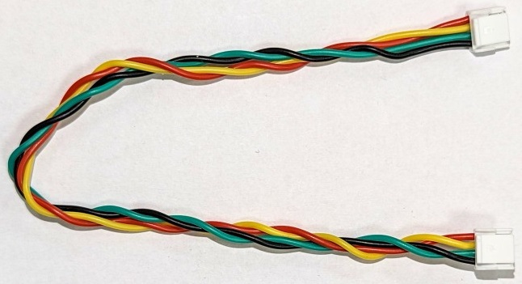
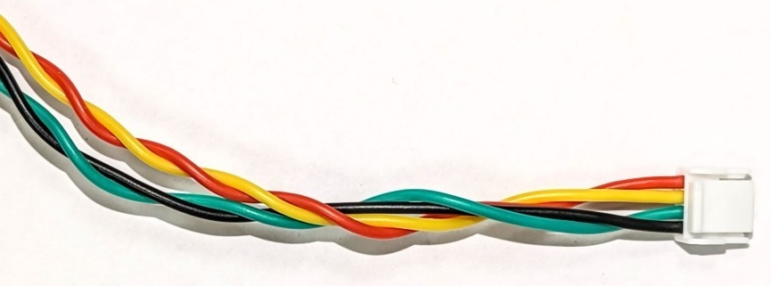
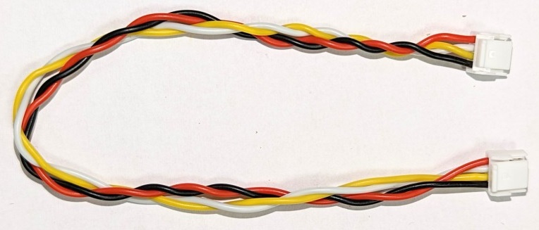
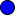

# Cable Wiring Basics

Cables are a common source of [electromagnetic interference (EMI)](https://en.wikipedia.org/wiki/Electromagnetic_interference), which can cause problems including flyways, "toilet bowling" and generally poor flight. These problems can be avoided by using appropriate cabling in the UAV.

The following basic concepts should be kept in mind when designing drone cabling:
* High-Power and signal cables should be separated as much as is practical.
* Cable lengths should be the minimum needed to enable easy handling of wired components. The wire tension should be adequate to survive possible airframe deformations even in a crash landing (wires must not be the first thing to break).
* Cable loops to reduce excess length should be avoided - use shorter lengths!
* For digital signals you can decrease the baudrate to reduce radiated energy and increase the robustness of data transfer. This means that you may be able to use longer cables when high data rates are not needed.

## Signal wiring

Signalling protocols have different characteristics, and therefore the cables used in each case require slightly different specifications.

This topic provides specific guidance of cabling for different signalling protocols, along with the [colour coding](#cable-colour-coding) used by a number different drone hardware vendors.

### I2C cables

The [I2C bus](https://en.wikipedia.org/wiki/I%C2%B2C) is widely used for connecting sensors. Cable colors from several vendors are specified in following table.

| Signal | Pixhawk Colors                                         | ThunderFly colors                                         | CUAV colors (I2C/CAN)                                     |
| ------ | ------------------------------------------------------ | --------------------------------------------------------- | --------------------------------------------------------- |
| +5V    |  Red       |  Red          |  Red          |
| SCL    |  Black |  Yellow |  White    |
| SDA    |  Black |  Green    |  Yellow |
| GND    |  Black |  Black    |  Black    |

The [Dronecode standard](https://github.com/pixhawk/Pixhawk-Standards/blob/master/DS-009%20Pixhawk%20Connector%20Standard.pdf) assumes a 1.5k ohm pull-up resistor on SDA and SCL signals in autopilot.

#### Cable twisting

I2C bus signal cross-talk and electromagnetic compatibility can be greatly improved by proper twisting of the cable wires. [Twisted pairs](https://en.wikipedia.org/wiki/Twisted_pair) is especially important for sensor wiring.

- 10 turns for each pair SCL/+5V and SDA/GND per 30cm cable length. 
- 4 turns of both pairs together per 30cm cable length. 

When using appropriate twisted pair cables, the I²C bus is generally suitable for submeter-scale airframes. For larger aircraft the use of CAN or other differential signaling based interface is generally more reliable.

:::note
This turns/cable-length recommendation has been successfully used with I2C sensors including the [ThunderFly TFSLOT airspeed sensor](../sensor/airspeed_tfslot.md) and [TFRPM01 Revolution Counter](../sensor/thunderfly_tachometer.md). :::

#### Pull-up resistors

Pull-up resistors are required for all ends of an I2C bus. This acts both as [signal termination](https://en.wikipedia.org/wiki/Electrical_termination) and as bus idle signal generator.

An oscilloscope measurement is sometimes required to check correct value of pull-up resistors. The signals on the I2C bus should have clear sharp rectangle-like edges and amplitude of few volts. In case the signal has a low amplitude, the value of pull-up resistors is too low and should be decreased. In the case of rounded signals, the value of pull-up resistors is too high.

### UAVCAN cables

| Signal | Pixhawk                                                | ThunderFly                                                | Zubax                                                     | CUAV (I2C/CAN)                                            |
| ------ | ------------------------------------------------------ | --------------------------------------------------------- | --------------------------------------------------------- | --------------------------------------------------------- |
| +5V    |  Red       |  Red          |  Red          |  Red          |
| CAN_H  |  Black |  White    |  White    |  White    |
| CAN_L  |  Black |  Yellow |  Yellow |  Yellow |
| GND    |  Black |  Black    |  Black    |  Black    |

#### Cable twisting

CAN cables should also be twisted, for exactly the same reason as I2C cables. For CAN the recommended twisting is:

- 10 turns for each pair GND/+5V and CAN_L/CAN_H per 30cm cable length. 

- 4 turns of both pairs together per 30cm cable length.

### SPI

[SPI](https://en.wikipedia.org/wiki/Serial_Peripheral_Interface) is synchronous serial communication interface used for connecting faster sensors and devices. This protocol is commonly use is for connecting [optical flow](../sensor/optical_flow.md) sensors or special telemetry modems.

| Signal | Pixhawk Color                                          | ThunderFly color                                          |
| ------ | ------------------------------------------------------ | --------------------------------------------------------- |
| +5V    |  Red       |  Red          |
| SCK    |  Black |  Yellow |
| MISO   |  Black |  Blue       |
| MOSI   |  Black |  Green    |
| CS!    |  Black |  White    |
| CS2    |  Black |  Blue       |
| GND    |  Black |  Black    |

### UART

UART is used to connect peripherals to the autopilot. By default, UART does not support networking and therefore it directly connects two devices together. It is often used to connect an autopilot and a [radio modem](../telemetry/README.md).

CTS and RTS are signals that are used to indicate that data is being transmitted on TX/RX pins. This hand-shake mechanism increases reliability of data transfer. CTS and RTS may remain loose when it is not used by the device.

The connecting cable is not crossed. Therefore, it is necessary to connect only the autopilot and peripherals with this straight cable. The device must cross the wiring internally by swapping RX/TX and RTS/CTS pins.

| Signal | Pixhawk Color                                          | ThunderFly color                                          |
| ------ | ------------------------------------------------------ | --------------------------------------------------------- |
| +5V    |  Red       |  Red          |
| TX     |  Black |  White    |
| RX     |  Black |  Green    |
| CTS    |  Black |  Blue       |
| RTS    |  Black |  Yellow |
| GND    |  Black |  Black    |

UART signals are common sources of low frequency EMI, therefore the length of the cable should be minimized as much as possible. Cable twisting is not needed for UART cables.

### GPS(UART) & SAFETY

[GPS receivers and magnetometers](../gps_compass/README.md) are generally very sensitive to EMI. Therefore thse should be mounted far away from RF sources (high-power cabling, ESCs, radio modems and its antenna). This may be insufficient if the cabling is badly designed.

| Signal          | Pixhawk Color                                          | ThunderFly color                                          |
| --------------- | ------------------------------------------------------ | --------------------------------------------------------- |
| +5V             |  Red       |  Red          |
| TX              |  Black |  White    |
| RX              |  Black |  Green    |
| SCL             |  Black |  Yellow |
| SDA             |  Black |  Green    |
| SAFETY_SW       |  Black |  White    |
| SAFETY_SW_LED |  Black |  Blue       |
| +3v3            |  Black |  Red          |
| BUZZER          |  Black |  Blue       |
| GND             |  Black |  Black    |

### GPS

| Signal | Pixhawk Color                                          | ThunderFly color                                          |
| ------ | ------------------------------------------------------ | --------------------------------------------------------- |
| +5V    |  Red       |  Red          |
| TX     |  Black |  White    |
| RX     |  Black |  Green    |
| SCL    |  Black |  Yellow |
| SDA    |  Black |  Green    |
| GND    |  Black |  Black    |

The GPS cable connects to both the UART and I2C bus. As twisting of UART is not applicable the length of the cable should be minimized as much as possible.

### Analog signal (power module)

| Signal  | Pixhawk Color                                          | ThunderFly color                                          | CUAV color                                                |
| ------- | ------------------------------------------------------ | --------------------------------------------------------- | --------------------------------------------------------- |
| VCC     |  Red       |  Red          |  Red          |
| VCC     |  Black |  Red          |  Red          |
| CURRENT |  Black |  White    |  White    |
| VOLTAGE |  Black |  Yellow |  Yellow |
| GND     |  Black |  Black    |  Black    |
| GND     |  Black |  Black    |  Black    |

This connector is example of mix of relatively high-power and low voltage signaling. Unfortunately, twisting is applicable for high-power GND and VCC wires only. That does not help much for noisy reading of analog signals by autopilot.

### SAFETY

| Signal          | Pixhawk Color                                          | ThunderFly color                                       |
| --------------- | ------------------------------------------------------ | ------------------------------------------------------ |
| SAFE_VCC        |  Red       |  Red       |
| SAFETY_SW_LED |  Black |  Blue    |
| SAFETY_SW       |  Black |  White |
| BUZZER          |  Black |  Blue    |
| +5V             |  Black |  Red       |
| GND             |  Black |  Black |

## High-power wiring

For high power wiring the most important design criteria is having an appropriate wire thickness, in order to allow sufficient current to flow. The general cross section requirement is area of 1 mm² per 8A of wire current.

While rarely practical, it is beneficial to have positive and negative wires twisted together.

EMI from high power cabling has a significant effect on magnetometers. For this reason a large seapration between high-power cables and navigation magnetometers is always required.

### Cable colour coding

Most manufacturers use red for the high voltage line and black for ground. Other colouring is at the manufacturer discretion. The [Pixhawk connector standard](https://github.com/pixhawk/Pixhawk-Standards/blob/master/DS-009%20Pixhawk%20Connector%20Standard.pdf) requires only that the Voltage Common Collector (VCC) pin/cable be red.

Color coding signal wires can help identify particular cables, making it easier to assemble your drone.

A colour coding scheme designed for easy cable identification might follow the following rules:
- The red and black colors are reserved for power.
- The same signal type should have the same colour.
- Color of the signal does not repeat in the connector for wires adjacent to each other.
- Wiring harnesses of the same pin count have to have a unique color sequence. This determines the cable type. (This is especially useful on photographs used in a manual).

An example of a cable colouring designed to these rules is:

| Color                                              | Name   | Preferred usage                             |
| -------------------------------------------------- | ------ | ------------------------------------------- |
|        | Red    | Power voltage                               |
|    | Green  | General purpose signal                      |
|    | White  | General purpose signal                      |
|  | Yellow | General purpose signal                      |
|      | Blue   | Power return, Open-collector control signal |
|    | Black  | GND, Power return ground                    |

<!-- references for the image source.
This approach just allows more compact markdown --> :::note The above rules were provided by Thunderfly and are used in their cable design.

The cable colour-coding for Thunderfly and some other vendors are given in the sections below. The pin labels correspond to the pinout on the autopilot side. All cables are straight (1:1). If they require crossover (e.g. UART), this should be solved by internal connection of the devices. :::
