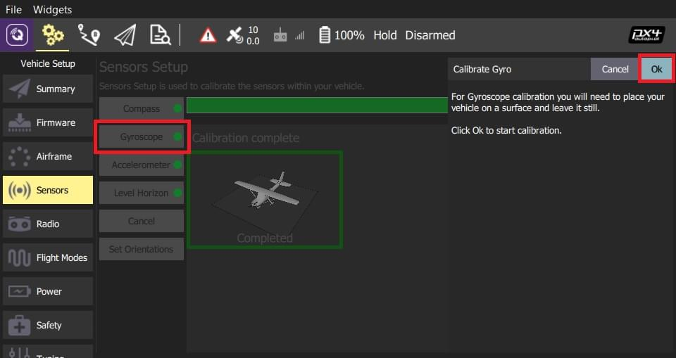
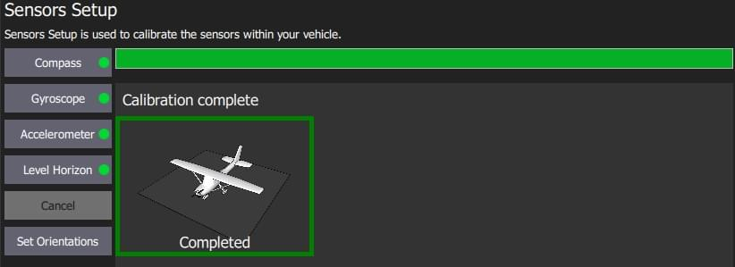

# Gyroscope Calibration

*QGroundControl* will guide you to place the vehicle on a flat surface and keep it still.

## Performing the Calibration

The calibration steps are:

1. Click the **Gyroscope** sensor button
    
    

2. Place the vehicle on a surface and leave it still.

3. Click **Ok** to start the calibration.
    
    The bar at the top shows the progress:
    
    

4. When finished, *QGroundControl* will display a progress bar *Calibration complete* 

:::note
If you move the vehicle *QGroundControl* will automatically restart the gyroscope calibration.
:::

## Further Information

* [QGroundControl User Guide > Gyroscope](https://docs.qgroundcontrol.com/en/SetupView/sensors_px4.html#gyroscope)