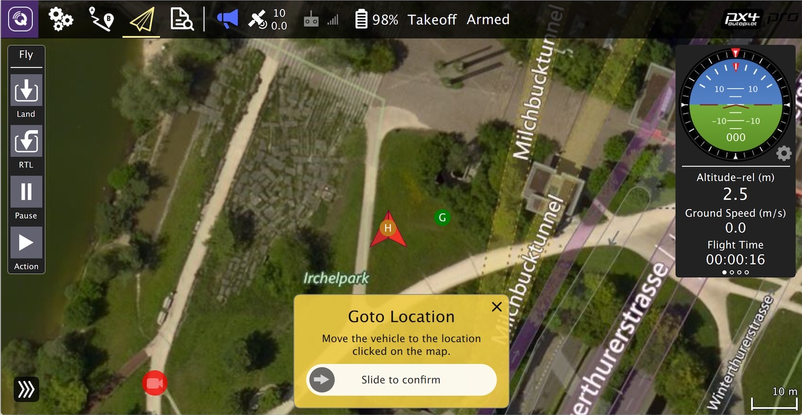

# General Development Tools

This section lists useful additional development tools that are not part of the core PX4 build toolchain.

## Ground Control Software

Download and install the [QGroundControl Daily Build](https://docs.qgroundcontrol.com/en/releases/daily_builds.html).

:::tip
The *daily build* includes development tools that hidden in release builds. It may also provide access to new PX4 features that are not yet supported in release builds.
:::

## IDE / Code Editors

The development team recommend [Visual Studio Code (VSCode)](../dev_setup/vscode.md), a popular open source IDE. VSCode is the "officially supported" IDE, primarily because it is the easiest of the IDEs to set up and use with PX4.

The following IDEs also work (but are not recommended unless you're an expert):
* [Eclipse for C/C++](https://www.eclipse.org/downloads/eclipse-packages/): Feature rich Java based IDE
* [Sublime Text](https://www.sublimetext.com): Fast and lean text editor.
* [Qt Creator IDE](../dev_setup/qtcreator.md): Popular cross-platform open-source IDE.

:::note
There is an [Eclipse project](https://github.com/PX4/PX4-Autopilot/blob/release/1.13/eclipse.project) and a [Sublime project](https://github.com/PX4/PX4-Autopilot/blob/release/1.13/Firmware.sublime-project) in the source tree.
:::
