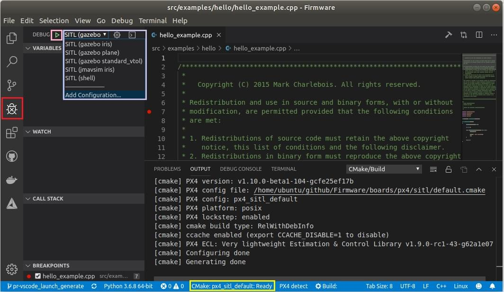

# Visual Studio Code IDE (VSCode)

[Visual Studio Code](https://code.visualstudio.com/) is a powerful cross-platform source code editor/IDE that can be used for PX4 development on Ubuntu 18.04 LTS and macOS (Windows support coming soon).

There are a number of reasons to use VSCode for PX4 development:
- Getting setup *really* only takes a few minutes.
- A rich extension ecosystem that enables a huge range of tools needed for PX4 development: C/C++ (with solid *cmake* integration), *Python*, *Jinja2*, ROS messages, and even UAVCAN dsdl.
- Excellent Github integration.

This topic explains how to setup the IDE and start developing.

:::note
There are other powerful IDEs, but they typically take more effort to integrate with PX4. With *VScode*, configuration is stored in the PX4/PX4-Autopilot tree ([PX4-Autopilot/.vscode](https://github.com/PX4/PX4-Autopilot/tree/master/.vscode)) so the setup process is as simple as adding the project folder.
:::

## Preconditions

You must already have installed the command line [PX4 developer environment](../dev_setup/dev_env.md) for your platform and downloaded the *Firmware* source code repo.

## Installation & Setup

1. [Download and install VSCode](https://code.visualstudio.com/) (you will be offered the correct version for your OS).
1. Open VSCode and add the PX4 source code:
   - Select *Open folder ...* option on the welcome page (or using the menu: **File > Open Folder**): 
   - A file selection dialog will appear. Select the **PX4-Autopilot** directory and then press **OK**.

   The project files and configuration will then load into *VSCode*.
1. Press **Install All** on the *This workspace has extension recommendations* prompt (this will appear on the bottom right of the IDE). 

   VSCode will open the *Extensions* panel on the left hand side so you can watch the progress of installation.

   
1. A number of notifications/prompts may appear in the bottom right corner

:::tip
If the prompts disappear, click the little "alarm" icon on the right of the bottom blue bar.
:::

   - If prompted to install a new version of *cmake*:
     - Say **No** (the right version is installed with the [PX4 developer environment](../dev_setup/dev_env.md)).
   - If prompted to sign into *github.com* and add your credentials:
     - This is up to you! It provides a deep integration between Github and the IDE, which may simplify your workflow.
   - Other prompts are optional, and may be installed if they seem useful. <!-- perhaps add screenshot of these prompts -->

## Building PX4

To build:
1. Select your build target ("cmake build config"):
   - The current *cmake build target* is shown on the blue *config* bar at the bottom (if this is already your desired target, skip to next step). 

:::note
The cmake target you select affects the targets offered for when [building/debugging](#debugging) (i.e. for hardware debugging you must select a hardware target like `px4_fmu-v5`).
:::
   - Click the target on the config bar to display other options, and select the one you want (this will replace any selected target).
   - *Cmake* will then configure your project (see notification in bottom right). 
   - Wait until configuration completes. When this is done the notification will disappear and you'll be shown the build location: .
1. You can then kick off a build from the config bar (select either **Build** or **Debug**). 

After building at least once you can now use \[code completion\](#code completion) and other *VSCode* features.

## Debugging

### SITL Debugging

To debug PX4 on SITL:
1. Select the debug icon on the sidebar (marked in red) to display the debug panel. 

1. Then choose your debug target (e.g. *Debug SITL (Gazebo Iris)*) from the top bar debug dropdown (purple box).

:::note
The debug targets that are offered (purple box) match your build target (yellow box on the bottom bar). For example, to debug SITL targets, your build target must include SITL.
:::
1. Start debugging by clicking the debug "play" arrow (next to the debug target in the top bar - pink box).

While debugging you can set breakpoints, step over code, and otherwise develop as normal.

### Hardware Debugging

The instructions in [SWD (JTAG) Hardware Debugging Interface](../debug/swd_debug.md) explain how to connect to the SWD interface on common flight controllers (for example, using the Dronecode or Blackmagic probes).

After connecting to the SWD interface, hardware debugging in VSCode is then the same as for [SITL Debugging](#debugging_sitl) except that you select a debug target appropriate for your debugger type (and firmware) - e.g. `jlink (px4_fmu-v5)`.

:::tip
To see the `jlink` option you must have selected a [cmake target for building firmware](#building-px4).
:::

## Code Completion

In order for the code completion to work (and other IntelliSense magic) you need an active configuration and to have [built the code](#building).

Once that is done you don't need to do anything else; the toolchain will automatically offer you symbols as you type.

