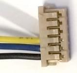
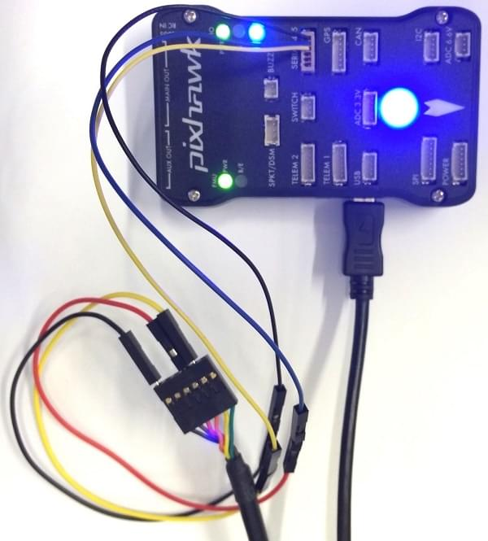
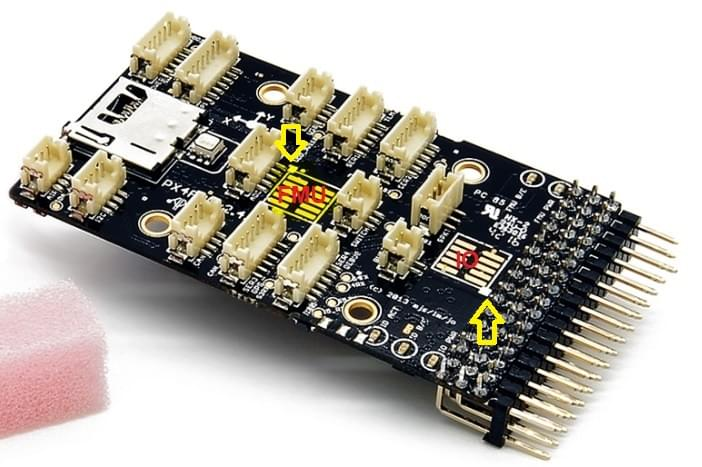

# 3DR Pixhawk 1 Flight Controller (Discontinued)

:::warning
This flight controller has been [discontinued](../flight_controller/autopilot_experimental.md) and is no longer commercially available. You can use the [mRo Pixhawk](../flight_controller/mro_pixhawk.md) as a drop-in replacement.
:::

:::warning
PX4 does not manufacture this (or any) autopilot.
Contact the manufacturer for support or compliance issues.
:::

The _3DR Pixhawk<sup>&reg;</sup> 1_ autopilot is a popular general purpose flight controller based on the [Pixhawk-project](https://pixhawk.org/) **FMUv2** open hardware design (it combines the functionality of the PX4FMU + PX4IO). It runs PX4 on the [NuttX](https://nuttx.apache.org/) OS.


Assembly/setup instructions for use with PX4 are provided here: [Pixhawk Wiring Quickstart](../assembly/quick_start_pixhawk.md)

## Key Features

- Main System-on-Chip: [STM32F427](http://www.st.com/web/en/catalog/mmc/FM141/SC1169/SS1577/LN1789)
  - CPU: 180 MHz ARM<sup>&reg;</sup> Cortex<sup>&reg;</sup> M4 with single-precision FPU
  - RAM: 256 KB SRAM (L1)
- Failsafe System-on-Chip: STM32F100
  - CPU: 24 MHz ARM Cortex M3
  - RAM: 8 KB SRAM
- Wifi: ESP8266 external
- GPS: u-blox<sup>&reg;</sup> 7/8 (Hobbyking<sup>&reg;</sup>) / u-blox 6 (3D Robotics)
- Optical flow: [PX4 Flow unit](../sensor/px4flow.md)
- Redundant power supply inputs and automatic failover
- External safety switch
- Multicolor LED main visual indicator
- High-power, multi-tone piezo audio indicator
- microSD card for high-rate logging over extended periods of time

Connectivity

- 1x I2C
- 1x CAN (2x optional)
- 1x ADC
- 4x UART (2x with flow control)
- 1x Console
- 8x PWM with manual override
- 6x PWM / GPIO / PWM input
- S.BUS / PPM / Spektrum input
- S.BUS output

# Where to Buy

Originally manufactured by 3DR&reg; this board was the original standard microcontroller platform for PX4&reg;. While the board is no longer manufactured by 3DR, you can use the [mRo Pixhawk](../flight_controller/mro_pixhawk.md) as a drop-in replacement.

Order mRo Pixhawk from:

- [Bare Bones](https://store.mrobotics.io/Genuine-PixHawk-1-Barebones-p/mro-pixhawk1-bb-mr.htm) - Just the board (useful as a 3DR Pixhawk replacement)
- [mRo Pixhawk 2.4.6 Essential Kit](https://store.mrobotics.io/Genuine-PixHawk-Flight-Controller-p/mro-pixhawk1-minkit-mr.htm) - includes everything except for telemetry radios
- [mRo Pixhawk 2.4.6 Cool Kit! (Limited edition)](https://store.mrobotics.io/product-p/mro-pixhawk1-fullkit-mr.htm) - includes everything you need including telemetry radios

## Specifications

### Processor

- 32bit STM32F427 [Cortex-M4F](http://en.wikipedia.org/wiki/ARM_Cortex-M#Cortex-M4) core with FPU
- 168 MHz
- 256 KB RAM
- 2 MB Flash
- 32 bit STM32F103 failsafe co-processor

### Sensors

- ST Micro L3GD20H 16 bit gyroscope
- ST Micro LSM303D 14 bit accelerometer / magnetometer
- Invensense MPU 6000 3-axis accelerometer/gyroscope
- MEAS MS5611 barometer

### Interfaces

- 5x UART (serial ports), one high-power capable, 2x with HW flow control
- 2x CAN (one with internal 3.3V transceiver, one on expansion connector)
- Spektrum DSM / DSM2 / DSM-X® Satellite compatible input
- Futaba S.BUS® compatible input and output
- PPM sum signal input
- RSSI (PWM or voltage) input
- I2C
- SPI
- 3.3 and 6.6V ADC inputs
- Internal microUSB port and external microUSB port extension

@[youtube](https://youtu.be/gCCC5A-Bvv4)

### Power System and Protection

- Ideal diode controller with automatic failover
- Servo rail high-power (max. 10V) and high-current (10A+) ready
- All peripheral outputs over-current protected, all inputs ESD protected

## Voltage Ratings

Pixhawk can be triple-redundant on the power supply if three power sources are supplied. The three rails are: Power module input, servo rail input, USB input.

### Normal Operation Maximum Ratings

Under these conditions all power sources will be used in this order to power the system

- Power module input (4.8V to 5.4V)
- Servo rail input (4.8V to 5.4V) **UP TO 10V FOR MANUAL OVERRIDE, BUT AUTOPILOT PART WILL BE UNPOWERED ABOVE 5.7V IF POWER MODULE INPUT IS NOT PRESENT**
- USB power input (4.8V to 5.4V)

### Absolute Maximum Ratings

Under these conditions the system will not draw any power (will not be operational), but will remain intact.

- Power module input (4.1V to 5.7V, 0V to 20V undamaged)
- Servo rail input (4.1V to 5.7V, 0V to 20V)
- USB power input (4.1V to 5.7V, 0V to 6V)

## Schematics

[FMUv2 + IOv2 schematic](https://raw.githubusercontent.com/PX4/Hardware/master/FMUv2/PX4FMUv2.4.5.pdf) -- Schematic and layout

:::note
As a CC-BY-SA 3.0 licensed Open Hardware design, all schematics and design files are [available](https://github.com/PX4/Hardware).
:::

## Connections

Pixhawk ports are shown below. These use Hirose DF13 connectors (predating the JST-GH connectors defined in the Pixhawk connector standard).

:::warning
Many 3DR Pixhawk clones use Molex picoblade connectors instead of DF13 connectors.
They have rectangular instead of square pins, and cannot be assumed to be compatible.
:::


:::tip
The `RC IN` port is for RC receivers only and provides sufficient power for that purpose. :::tip
The RC IN port is for RC receivers only and provides power.
:::

## Pinouts

#### TELEM1, TELEM2 ports

| Pin     | Signal    | Volt  |
| ------- | --------- | ----- |
| 1 (red) | VCC       | +5V   |
| 2 (blk) | TX (OUT)  | +3.3V |
| 3 (blk) | RX (IN)   | +3.3V |
| 4 (blk) | CTS (IN)  | +3.3V |
| 5 (blk) | RTS (OUT) | +3.3V |
| 6 (blk) | GND       | GND   |

#### GPS port

| Pin     | Signal   | Volt  |
| ------- | -------- | ----- |
| 1 (red) | VCC      | +5V   |
| 2 (blk) | TX (OUT) | +3.3V |
| 3 (blk) | RX (IN)  | +3.3V |
| 4 (blk) | CAN2 TX  | +3.3V |
| 5 (blk) | CAN2 RX  | +3.3V |
| 6 (blk) | GND      | GND   |

#### SERIAL 4/5 port

Due to space constraints two ports are on one connector.

| Pin     | Signal  | Volt  |
| ------- | ------- | ----- |
| 1 (red) | VCC     | +5V   |
| 2 (blk) | TX (#4) | +3.3V |
| 3 (blk) | RX (#4) | +3.3V |
| 4 (blk) | TX (#5) | +3.3V |
| 5 (blk) | RX (#5) | +3.3V |
| 6 (blk) | GND     | GND   |

#### ADC 6.6V

| Pin     | Signal | Volt        |
| ------- | ------ | ----------- |
| 1 (red) | VCC    | +5V         |
| 2 (blk) | ADC IN | up to +6.6V |
| 3 (blk) | GND    | GND         |

#### ADC 3.3V

| Pin     | Signal | Volt        |
| ------- | ------ | ----------- |
| 1 (red) | VCC    | +5V         |
| 2 (blk) | ADC IN | up to +3.3V |
| 3 (blk) | GND    | GND         |
| 4 (blk) | ADC IN | up to +3.3V |
| 5 (blk) | GND    | GND         |

#### I2C

| Pin     | Signal | Volt           |
| ------- | ------ | -------------- |
| 1 (red) | VCC    | +5V            |
| 2 (blk) | SCL    | +3.3 (pullups) |
| 3 (blk) | SDA    | +3.3 (pullups) |
| 4 (blk) | GND    | GND            |

#### CAN

| Pin     | Signal | Volt |
| ------- | ------ | ---- |
| 1 (red) | VCC    | +5V  |
| 2 (blk) | CAN_H  | +12V |
| 3 (blk) | CAN_L  | +12V |
| 4 (blk) | GND    | GND  |

#### SPI

| Pin     | Signal         | Volt |
| ------- | -------------- | ---- |
| 1 (red) | VCC            | +5V  |
| 2 (blk) | SPI_EXT_SCK  | +3.3 |
| 3 (blk) | SPI_EXT_MISO | +3.3 |
| 4 (blk) | SPI_EXT_MOSI | +3.3 |
| 5 (blk) | !SPI_EXT_NSS | +3.3 |
| 6 (blk) | !GPIO_EXT      | +3.3 |
| 7 (blk) | GND            | GND  |

#### POWER

| Pin     | Signal  | Volt  |
| ------- | ------- | ----- |
| 1 (red) | VCC     | +5V   |
| 2 (blk) | VCC     | +5V   |
| 3 (blk) | CURRENT | +3.3V |
| 4 (blk) | VOLTAGE | +3.3V |
| 5 (blk) | GND     | GND   |
| 6 (blk) | GND     | GND   |

#### SWITCH

| Pin     | Signal           | Volt  |
| ------- | ---------------- | ----- |
| 1 (red) | VCC              | +3.3V |
| 2 (blk) | !IO_LED_SAFETY | GND   |
| 3 (blk) | SAFETY           | GND   |

## Serial Port Mapping

| UART   | Device     | Port                  |
| ------ | ---------- | --------------------- |
| UART1  | /dev/ttyS0 | IO debug              |
| USART2 | /dev/ttyS1 | TELEM1 (flow control) |
| USART3 | /dev/ttyS2 | TELEM2 (flow control) |
| UART4  |            |                       |
| UART7  | CONSOLE    |                       |
| UART8  | SERIAL4    |                       |

<!-- Note: Got ports using https://github.com/PX4/PX4-user_guide/pull/672#issuecomment-598198434 -->

## Debug Ports

### Console Port

The [PX4 System Console](../debug/system_console.md) runs on the port labeled [SERIAL4/5](#serial-4-5-port).

:::tip
A convenient way to connect to the console is to use a [Dronecode probe](https://kb.zubax.com/display/MAINKB/Dronecode+Probe+documentation), as it comes with connectors that can be used with several different Pixhawk devices. Simply connect the 6-pos DF13 1:1 cable on the [Dronecode probe](https://kb.zubax.com/display/MAINKB/Dronecode+Probe+documentation) to the Pixhawk `SERIAL4/5` port.


:::

The pinout is standard serial pinout, designed to connect to a [3.3V FTDI](https://www.digikey.com/en/products/detail/TTL-232R-3V3/768-1015-ND/1836393) cable (5V tolerant).

| 3DR Pixhawk 1 |           | FTDI                    |
| ------------- | --------- | ----------------------- |
| 1             | +5V (red) | | N/C                   |
| 2             | S4 Tx     | | N/C                   |
| 3             | S4 Rx     | | N/C                   |
| 4             | S5 Tx     | 5    | FTDI RX (yellow) |
| 5             | S5 Rx     | 4    | FTDI TX (orange) |
| 6             | GND       | 1    | FTDI GND (black) |

The wiring for an FTDI cable to a 6-pos DF13 1:1 connector is shown in the figure below.



The complete wiring is shown below.



:::note
For information on how to _use_ the console see: [System Console](../debug/system_console.md).
:::

### SWD Port

The [SWD](../debug/swd_debug.md) (JTAG) ports are hidden under the cover (which must be removed for hardware debugging). There are separate ports for FMU and IO, as highlighted below.



The ports are ARM 10-pin JTAG connectors, which you will probably have to solder. The pinout for the ports is shown below (the square markers in the corners above indicates pin 1).


:::note
All Pixhawk FMUv2 boards have a similar SWD port.
:::

## Building Firmware

:::tip
Most users will not need to build this firmware! It is pre-built and automatically installed by _QGroundControl_ when appropriate hardware is connected.
:::

To [build PX4](../dev_setup/building_px4.md) for this target:

```
make px4_fmu-v2_default
```

## Parts / Housings

- **ARM MINI JTAG (J6)**: 1.27 mm 10pos header (SHROUDED), for Black Magic Probe: FCI 20021521-00010D4LF ([Distrelec](https://www.distrelec.ch/en/minitek-127-straight-male-pcb-header-surface-mount-rows-10-contacts-27mm-pitch-amphenol-fci-20021521-00010d4lf/p/14352308), [Digi-Key](https://www.digikey.com/en/products/detail/20021521-00010T1LF/609-4054-ND/2414951),) or Samtec FTSH-105-01-F-DV-K (untested) or Harwin M50-3600542 ([Digikey](https://www.digikey.com/en/products/detail/harwin-inc/M50-3600542/2264370) or [Mouser](http://ch.mouser.com/ProductDetail/Harwin/M50-3600542/?qs=%2fha2pyFadujTt%2fIEz8xdzrYzHAVUnbxh8Ki%252bwWYPNeEa09PYvTkIOQ%3d%3d))
  - JTAG Adapter Option #1: [BlackMagic Probe](https://1bitsquared.com/products/black-magic-probe). Note, may come without cables (check with manufacturer). If so, you will need the **Samtec FFSD-05-D-06.00-01-N** cable ([Samtec sample service](https://www.samtec.com/products/ffsd-05-d-06.00-01-n) or [Digi-Key Link: SAM8218-ND](http://www.digikey.com/product-search/en?x=0&y=0&lang=en&site=us&KeyWords=FFSD-05-D-06.00-01-N)) or [Tag Connect Ribbon](http://www.tag-connect.com/CORTEXRIBBON10) and a Mini-USB cable.
  - JTAG Adapter Option #2: [Digi-Key Link: ST-LINK/V2](https://www.digikey.com/product-detail/en/stmicroelectronics/ST-LINK-V2/497-10484-ND) / [ST USER MANUAL](http://www.st.com/internet/com/TECHNICAL_RESOURCES/TECHNICAL_LITERATURE/USER_MANUAL/DM00026748.pdf), needs an ARM Mini JTAG to 20pos adapter: [Digi-Key Link: 726-1193-ND](https://www.digikey.com/en/products/detail/texas-instruments/MDL-ADA2/1986451)
  - JTAG Adapter Option #3: [SparkFun Link: Olimex ARM-TINY](http://www.sparkfun.com/products/8278) or any other OpenOCD-compatible ARM Cortex JTAG adapter, needs an ARM Mini JTAG to 20pos adapter: [Digi-Key Link: 726-1193-ND](https://www.digikey.com/en/products/detail/texas-instruments/MDL-ADA2/1986451)
- **USARTs**: Hirose DF13 6 pos ([Digi-Key Link: DF13A-6P-1.25H(20)](https://www.digikey.com/products/en?keywords=H3371-ND))
  - Mates: Hirose DF13 6 pos housing ([Digi-Key Link: Hirose DF13-6S-1.25C](https://www.digikey.com/products/en?keywords=H2182-ND))
- **I2C and CAN**: Hirose DF13 4 pos ([Digi-Key Link: DF13A-4P-1.25H(20)](https://www.digikey.com/en/products/detail/hirose-electric-co-ltd/DF13A-4P-1-25H-20/530666) - discontinued)

## Supported Platforms / Airframes

Any multicopter / airplane / rover or boat that can be controlled with normal RC servos or Futaba S-Bus servos.
