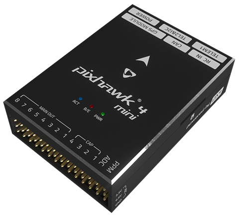
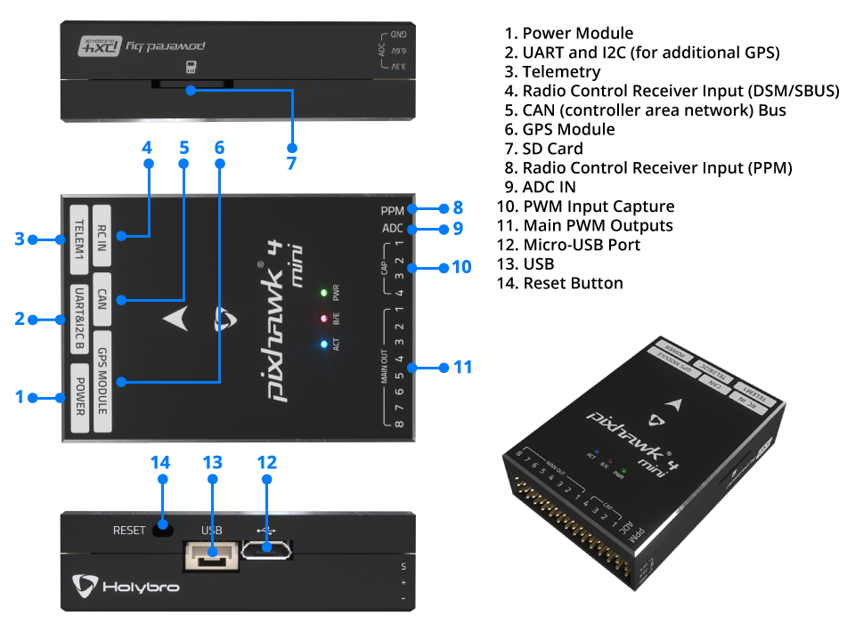
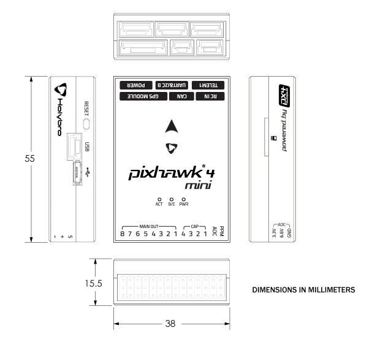

# Pixhawk 4 Mini

:::warning PX4 does not manufacture this (or any) autopilot. Contact the [manufacturer](https://shop.holybro.com/) for hardware support or compliance issues.
:::

The *Pixhawk<sup>&reg;</sup> 4 Mini* autopilot is designed for engineers and hobbyists who are looking to tap into the power of *Pixhawk 4* but are working with smaller drones. *Pixhawk 4 Mini* takes the FMU processor and memory resources from the *Pixhawk 4* while eliminating interfaces that are normally unused. This allows the *Pixhawk 4 Mini* to be small enough to fit in a 250mm racer drone.

*Pixhawk 4 Mini* was designed and developed in collaboration with Holybro<sup>&reg;</sup> and Auterion<sup>&reg;</sup>. It is based on the [Pixhawk](https://pixhawk.org/) **FMUv5** design standard and is optimized to run PX4 flight control software.



:::tip
This autopilot is [supported](../flight_controller/autopilot_pixhawk_standard.md) by the PX4 maintenance and test teams.
:::

## Quick Summary

* Main FMU Processor: STM32F765
  * 32 Bit Arm® Cortex®-M7, 216MHz, 2MB memory, 512KB RAM
* On-board sensors:
  * Accel/Gyro: ICM-20689
  * Accel/Gyro: BMI055 or ICM20602
  * Magnetometer: IST8310
  * Barometer: MS5611
* GPS: u-blox Neo-M8N GPS/GLONASS receiver; integrated magnetometer IST8310
* Interfaces:
  * 8 PWM outputs
  * 4 dedicated PWM/Capture inputs on FMU
  * Dedicated R/C input for CPPM
  * Dedicated R/C input for Spektrum / DSM and S.Bus with analog / PWM RSSI input
  * 3 general purpose serial ports
  * 2 I2C ports
  * 3 SPI buses
  * 1 CANBuses for CAN ESC
  * Analog inputs for voltage / current of battery
  * 2 additional analog input
* Power System:
  * Power Brick Input: 4.75~5.5V
  * USB Power Input: 4.75~5.25V
  * Servo Rail Input: 0~24V
  * Max current sensing: 120A
* Weight and Dimensions:
  * Weight: 37.2g
  * Dimensions: 38x55x15.5mm
* Other Characteristics:
  * Operating temperature: -40 ~ 85°c

Additional information can be found in the [*Pixhawk 4 Mini* Technical Data Sheet](https://github.com/PX4/PX4-user_guide/raw/main/assets/flight_controller/pixhawk4mini/pixhawk4mini_technical_data_sheet.pdf).

## Purchase

Order from [Holybro](https://shop.holybro.com/pixhawk4-mini_p1120.html).

## Interfaces



:::warning
The **RC IN** and **PPM** ports are for RC receivers only. These are powered! NEVER connect any servos, power supplies or batteries (or to any connected receiver).
:::


## Pinouts

Download *Pixhawk 4 Mini* pinouts from [here](https://github.com/PX4/PX4-user_guide/raw/main/assets/flight_controller/pixhawk4mini/pixhawk4mini_pinouts.pdf).

## Dimensions



## Voltage Ratings
*Pixhawk 4 Mini* can have power supply redundancy — if two power sources are supplied. The power rails are: **POWER** and **USB**.

:::note
The output power rail of **MAIN OUT** does not power the flight controller board (and is not powered by it). You must [supply power](../assembly/quick_start_pixhawk4_mini.md#power) to one of **POWER** or **USB** or the board will be unpowered.
:::

**Normal Operation Maximum Ratings**

Under these conditions all power sources will be used in this order to power the system:
1. **POWER** (4.75V to 5.5V)
1. **USB** input (4.75V to 5.25V)

**Absolute Maximum Ratings**

Under these conditions the system will remain intact.
1. **POWER** input (0V to 6V undamaged)
1. **USB** input (0V to 6V undamaged)
1. Servo input: VDD_SERVO pin of **MAIN OUT** (0V to 24V undamaged)

## Assembly/Setup

The [*Pixhawk 4 Mini* Wiring Quick Start](../assembly/quick_start_pixhawk4_mini.md) provides instructions on how to assemble required/important peripherals including GPS, Power Management Board, etc.


## Building Firmware

:::tip
Most users will not need to build this firmware! It is pre-built and automatically installed by *QGroundControl* when appropriate hardware is connected.
:::

To [build PX4](../dev_setup/building_px4.md) for this target:
```
make px4_fmu-v5_default
```

## Debug Port

The [PX4 System Console](../debug/system_console.md) and [SWD interface](../debug/swd_debug.md) run on the **FMU Debug** port. In order to access these ports, the user must remove the *Pixhawk 4 Mini* casing.


The port has a standard serial pinout and can be connected to a standard FTDI cable (3.3V, but it's 5V tolerant) or a [Dronecode probe](https://kb.zubax.com/display/MAINKB/Dronecode+Probe+documentation). The pinout uses the standard [Pixhawk debug connector](https://github.com/pixhawk/Pixhawk-Standards/blob/master/DS-009%20Pixhawk%20Connector%20Standard.pdf) pinout. Please refer to the [wiring](../debug/system_console.md) page for details of how to wire up this port.


## Serial Port Mapping

| UART   | Device     | Port                                  |
| ------ | ---------- | ------------------------------------- |
| UART1  | /dev/ttyS0 | GPS                                   |
| USART2 | /dev/ttyS1 | TELEM1 (flow control)                 |
| USART3 | /dev/ttyS2 | TELEM2 (flow control)                 |
| UART4  | /dev/ttyS3 | TELEM4                                |
| USART6 | /dev/ttyS4 | TX is RC input from SBUS_RC connector |
| UART7  | /dev/ttyS5 | Debug Console                         |
| UART8  | /dev/ttyS6 | Not connected (no PX4IO)              |


<!-- Note: Got ports using https://github.com/PX4/PX4-user_guide/pull/672#issuecomment-598198434 -->


## Peripherals

* [Digital Airspeed Sensor](https://store-drotek.com/848-sdp3x-airspeed-sensor-kit-sdp33.html)
* [Telemetry Radio Modules](../telemetry/README.md)
* [Rangefinders/Distance sensors](../sensor/rangefinders.md)


## Supported Platforms
Motors and servos are connected to the **MAIN OUT** ports in the order specified for your vehicle in the [Airframe Reference](../airframes/airframe_reference.md). This reference lists the output port to motor/servo mapping for all supported air and ground frames (if your frame is not listed in the reference then use a "generic" airframe of the correct type).

:::warning
*Pixhawk 4 Mini* does not have AUX ports. The board cannot be used with frames that require more than 8 ports or which use AUX ports for motors or control surfaces. It can be used for airframes that use AUX for non-essential peripherals (e.g. "feed-through of RC AUX1 channel").
:::

## Further info

- [*Pixhawk 4 Mini* Technical Data Sheet](https://github.com/PX4/PX4-user_guide/raw/main/assets/flight_controller/pixhawk4mini/pixhawk4mini_technical_data_sheet.pdf)
- [FMUv5 reference design pinout](https://docs.google.com/spreadsheets/d/1-n0__BYDedQrc_2NHqBenG1DNepAgnHpSGglke-QQwY/edit#gid=912976165).
