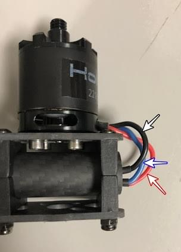
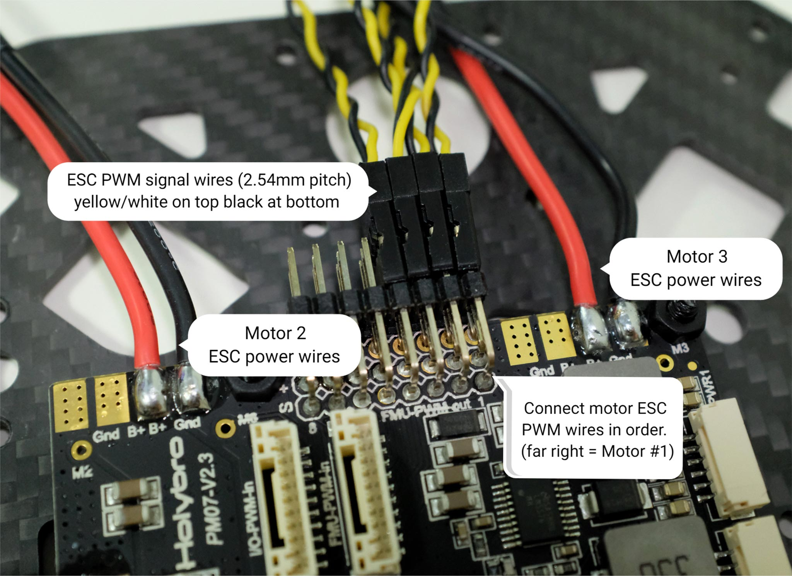
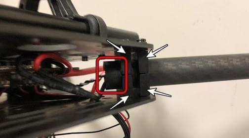

# Holybro X500 + Pixhawk4 Build

This topic provides full instructions for building the kit and configuring PX4 using *QGroundControl*.

## Key information

- **Full Kit:** [Holybro X500 Kit](https://shop.holybro.com/x500-kit_p1180.html)
- **Frame:** [Holybro X500](https://shop.holybro.com/x500-frame-kit_p1178.html)
- **Flight controller:** [Pixhawk 4](../flight_controller/pixhawk4.md)
- **Assembly time (approx.):** 3.75 hours (180 minutes for frame, 45 minutes for autopilot installation/configuration)

## Bill of materials

The Holybro [X500 Kit](https://shop.holybro.com/x500-kit_p1180.html) includes almost all the required components:

* [Pixhawk 4 autopilot](../flight_controller/pixhawk4.md)
* [Pixhawk 4 GPS](https://shop.holybro.com/pixhawk-4-gps-module_p1094.html)
* [Power Management - PM07](https://shop.holybro.com/pixhawk-4-power-module-pm07_p1095.html)
* [Holybro Motors - 2216 KV880 x4](https://shop.holybro.com/motor2216-880kv-1pc_p1154.html)
* [Holybro BLHeli S ESC 20A x4](https://shop.holybro.com/blheli-s-esc-20a_p1143.html)
* [Propellers - 1045 x4](https://shop.holybro.com/propeller10452pair_p1155.html)
* Battery Strap
* Power and Radio Cables
* Wheelbase - 500 mm
* Dimensions - 410x410x300 mm
* 433 MHz Telemetry Radio/915 MHz Telemetry Radio

Additionally you will need a battery and receiver ([compatible radio system](../getting_started/rc_transmitter_receiver.md)) if you want to control the drone manually.

## Main Hardware

This section lists all hardware for the frame and the autopilot installation.

| Item                         | Description                                      | Quantity |
| ---------------------------- | ------------------------------------------------ | -------- |
| Bottom plate                 | Carbon fiber (2mm thick)                         | 1        |
| Top plate                    | Carbon fiber (1.5mm thick)                       | 1        |
| Arm                          | Carbon fiber tube (Diameter: 16mm length: 200mm) | 4        |
| Landing gear - Vertical pole | Carbon fiber tube + engineering plastic          | 2        |
| Landing gear - Cross bar     | Carbon fiber tube + engineering plastic + foam   | 2        |
| Motor base                   | Consists of 6 parts and 4 screws 4 nuts          | 4        |
| Slide bar                    | Diameter: 10mm length: 250mm                     | 2        |
| Battery mounting board       | Thickness: 2mm                                   | 1        |
| Battery pad                  | 3mm Silicone sheet black                         | 1        |
| Platform board               | Thickness: 2mm                                   | 1        |
| Hanger & rubber ring gasket  | Inner hole diameter: 10mm black                  | 8        |

### Electronics

| Item Description                                           | Quantity |
| ---------------------------------------------------------- | -------- |
| Pixhawk4 & Assorted Cables                                 | 1        |
| Pixhawk4 GPS Module                                        | 1        |
| Power Management PM07 (with pre-soldered ESC power cables) | 1        |
| Motors 2216 KV880（V2 Update)                               | 4        |
| Holybro BLHeli S ESC 20A x4                                | 1        |
| 433MHz Telemetry Radio / 915MHz Telemetry Radio            | 1        |

### Tools needed

The following tools are used in this assembly:

- 1.5 mm Hex screwdriver
- 2.0 mm Hex screwdriver
- 2.5 mm Hex screwdriver
- 3mm Phillips screwdriver
- 5.5 mm socket wrench or small piler
- Wire cutters
- Precision tweezers

## Assembly

Estimate time to assemble is 3.75 hours (180 minutes for frame, 45 minutes for autopilot installation/configuration)

1. Start by assembling the landing gear. Unscrew the landing gear screws and insert the vertical pole (figures 1 and 2).

   

   _Figure 2_: Landing gear components

   

   _Figure 2_: Landing gear assembled

1. Then put the 4 arms through the 4 motor bases shown in figure 3. Make sure the rods protrude the base slightly and are consistent throughout all 4 arms, and be sure to have the motor wires facing outward.

   

   _Figure 3_: Attach arms to motor bases

1. Insert 4 nylon screws and nylon standoffs and attach the power module PM07 to the bottom plate using 4 nylon nuts as shown in Figures 4.

   

   _Figure 4_: Attach power module

1. Feed the 4 motor ESCs through each of the arms and connect the 3-wires end to the motors shown in Figure 5.

   

   _Figure 5_: Connect motors

1. Connect the ESCs power wires onto the power module PM07, black->black and red->red, ESC PWM signal wires goes to "FMU-PWM-Out". Make sure you connect the motor ESC PWM wires in the correct order. Refer to Figure 7 for airframe motor number and connect to the corresponding number on the PM07 board.

    _Figure 7_: ESC power module and signal wiring

   The color on top of the motor indicate the spin direction (figure 7-1), black tip is clockwise, and white tip is counter-clockwise. Make sure the follow the px4 quadrotor x airframe reference for motor direction (figure 7-2).

   

   _Figure 7_: Motor order/direction diagram

   

   _Figure 7-1_: Motor direction

1. Connect the 10 pin cables to FMU-PWM-in, the 6 pin cables to the PWR1 on the PM07 power module.

   

   _Figure 8_: Power module PWM and power wiring

1. If you want to mount the GPS on the top plate, you can now secure the GPS mount onto the top plate using 4 screws and nuts.

   

   _Figure 9_: Secure GPS mount onto top plate

1. Feed the PM07 cables through the top plate. Connect the top and bottom plate by using 4 U-shaped nylon straps, screws, and nuts on each side, ensure that the motor ESC cables are inside the U-shape nylon straps like Figure 10, keep the nut loose.

   

   _Figure 10-1_: Feed power module cables through top plate

   

   _Figure 10-2_: Connecting top and bottom plate

1. Push the arm tubes a bit into the frame and make sure the amount of protrusion (red square from Figure 11) are consistent on all 4 arms. Ensure all the motors are pointed directly upward, then tighten all the nuts and screws.

   

1. Put the hanger gaskets into the 4 hangers and mount them onto the bottom plate using 8 hex screws (Figure 11). The screw holes are noted by the white arrow in Figure 12. We recommend tilting the drone sideway to make the installation easier.

   

   _Figure 11_: Hanger gaskets

   

   _Figure 12_: Screw holes

1. Insert the slide bars onto the hanger rings (Figure 13). Assemble the battery mount and platform board and mount them onto the slide bars as shown in Figure 14.

   

   _Figure 13_: Slide bars

   

   _Figure 14_: Battery mount on slide bars

1. Mount the landing gear onto the bottom plate. We recommend tilting the drone sideway to make this installation process easier.

   

   _Figure 15_: Landing Gear

1. Use the tape and stick the GPS to the top of the GPS mast and mount the GPS mast. Make sure the arrow on the gps is pointing forward (Figure 16).

   

   _Figure 16_: GPS and mast

1. Mount the telemetry radio onto the top plate. Plug the telemetry cable into `TELEM1` port and GPS module to `GPS MODULE` port on the flight controller. Plug the cable from PM07 `FMU-PWM-in` to `I/O-PWM-out`on the FC and PM07 `PWR1` to `POWER1` on the FC, as shown in Figure 17.

   

   _Figure 17_: Mount telemetry radio/plug in PWM and Power cables to Flight controller.

Please refer to [Pixhawk 4 Quick Start](../assembly/quick_start_pixhawk4.md) for more information.

That's it. The fully assembled kit is shown below:

## Install/Configure PX4

:::tip
Full instructions for installing and configuring PX4 can be found in [Basic Configuration](../config/README.md).
:::

*QGroundControl* is used to install the PX4 autopilot and configure/tune it for the X500 frame. [Download and install](http://qgroundcontrol.com/downloads/) *QGroundControl* for your platform.

First update the firmware and airframe:
* [Firmware](../config/firmware.md)
* [Airframe](../config/airframe.md) - You will need to select the *Holybro S500* airframe (**Quadrotor x > Holybro S500**) 

Then perform the mandatory setup/calibration:
* [Sensor Orientation](../config/flight_controller_orientation.md)
* [Compass](../config/compass.md)
* [Accelerometer](../config/accelerometer.md)
* [Level Horizon Calibration](../config/level_horizon_calibration.md)
* [Radio Setup](../config/radio.md)
* [Flight Modes](../config/flight_mode.md)

Ideally you should also do:
* [ESC Calibration](../advanced_config/esc_calibration.md)
* [Battery](../config/battery.md)
* [Safety](../config/safety.md)

## Tuning

Airframe selection sets *default* autopilot parameters for the frame. These are good enough to fly with, but it is a good idea to tune the parameters for a specific frame build. For instructions on how, see: [Multicopter Basic PID Tuning](../config_mc/pid_tuning_guide_multicopter_basic.md).

## Acknowledgements

This build log was provided by the Dronecode Test Flight Team.
