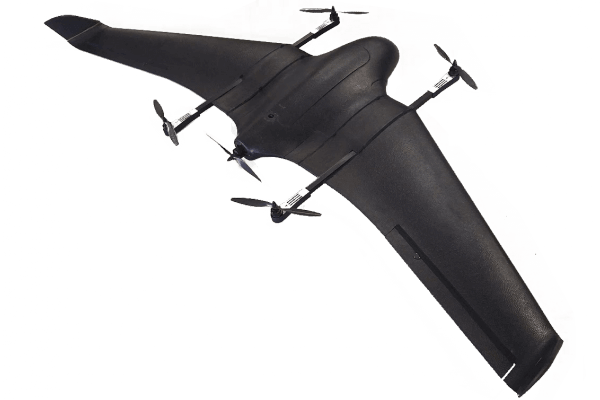

# Standard VTOL

A **Standard VTOL** is a [VTOL](../frames_vtol/README.md) that has _completely separate_ flight controls for multicopter and fixed wing flight.

*Vertical Technologies: Deltaquad QuadPlane VTOL*

## Videos

This section contains videos that are specific to Standard VTOL (videos that apply to all VTOL types can be found in [VTOL](../frames_vtol/README.md)).

---

[FunCub QuadPlane](../frames_vtol/vtol_quadplane_fun_cub_vtol_pixhawk.md)

@[youtube](https://www.youtube.com/watch?v=4K8yaa6A0ks&vq=hd720)

[Falcon Vertigo QuadPlane](../frames_vtol/vtol_quadplane_falcon_vertigo_hybrid_rtf_dropix.md)

@[youtube](https://youtu.be/h7OHTigtU0s)

[Ranger QuadPlane](../frames_vtol/vtol_quadplane_volantex_ranger_ex_pixhawk.md)

@[youtube](https://www.youtube.com/watch?v=7tGXkW6d3sA&vq=hd720)
