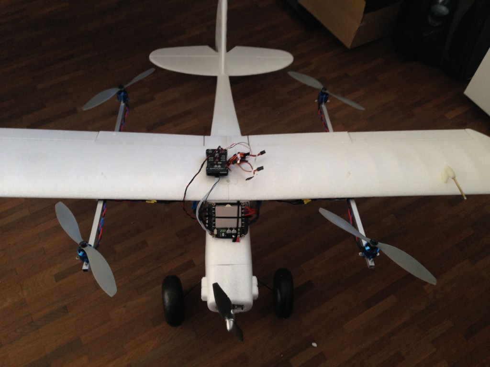
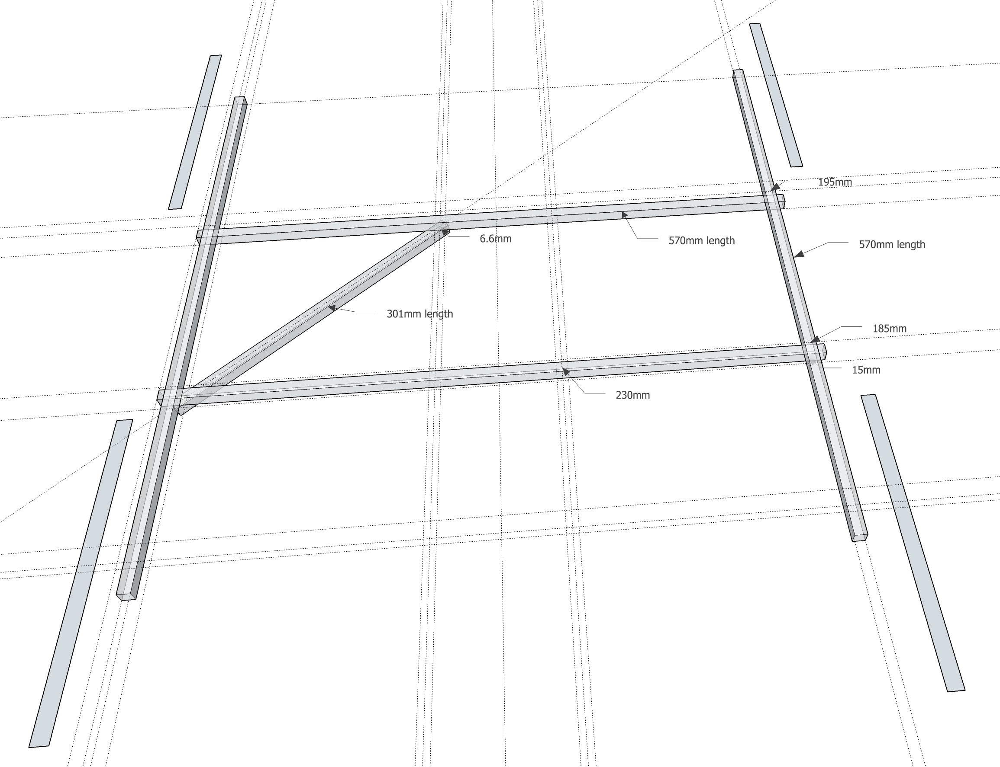
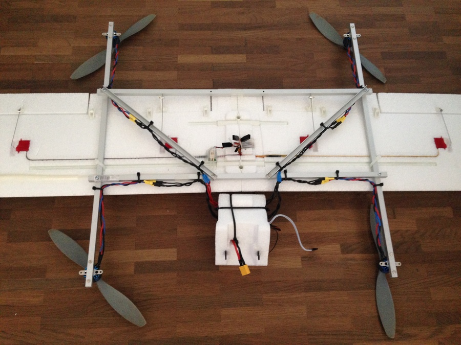
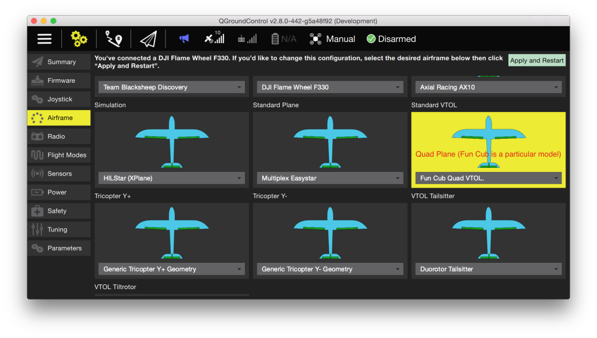

# FunCub QuadPlane (Pixhawk)

The Fun Cub QuadPlane VTOL is a standard tailplane aircraft (the Multiplex FunCub) that has been retrofitted with a QuadCopter system.

Key information:

- **Frame:** Multiplex FunCub
- **Flight controller:** Pixhawk

Unmodified, the Fun Cub is a relatively affordable plane and relatively easy to fly. After the conversion the plane is significantly heavier and less aerodynamic. It still flies quite well but needs around 75% throttle in forward flight.

## Bill of Materials

The actual plane looks roughly like as shown in the image above (other similar models will work just fine - this is a Multiplex Fun Cub). The minimal equipment required is:

- Multiplex FunCub (or similar)
- Pixhawk or compatible
- Digital airspeed sensor
- 900 kV motors (e.g. Iris propulsion set - motors and ESC)
- 10" props for quad motors (10x45 or 10x47)
- 10" prop for fixed-wing motor (10×7)
- GPS module
- 4S battery
- Aluminum frame for mounting the quad motors (10x10mm square tube, 1mm wall thickness)
- TOW is ~2.3kg with a 4200mAh 4S battery

## Structure

The structure is made out of aluminum booms as shown below.

 

## Wiring

The outputs of Pixhawk should be wired like this (orientation as seen like "sitting in the plane").

:::tip
The servo direction can be reversed using the [PWM_MAIN_REVn](../advanced_config/parameter_reference.md#PWM_MAIN_REV1) parameters in the PWM_OUTPUT group of *QGroundControl* (cogwheel tab, last item in the left menu). :::

| Port   | Connection              |
| ------ | ----------------------- |
| MAIN 1 | Front right motor (CCW) |
| MAIN 2 | Back left motor (CCW)   |
| MAIN 3 | Front left motor (CW)   |
| MAIN 4 | Back right motor (CW)   |
| AUX 1  | Left aileron TODO       |
| AUX 2  | Right aileron           |
| AUX 3  | Elevator                |
| AUX 4  | Rudder                  |
| AUX 5  | Throttle                |

For further instructions on wiring and configurations please see: [Standard VTOL Wiring and Configuration](../config_vtol/vtol_quad_configuration.md). <!-- replace with Pixhawk Wiring Quickstart -->

## Airframe Configuration

Configure the frame as shown in QGroundControl below (do not forget to click **Apply and Restart** in the top).

## Video

@[youtube](https://youtu.be/4K8yaa6A0ks)

## Support

If you have any questions regarding your VTOL conversion or configuration please visit <https://discuss.px4.io/c/px4/vtol>.

