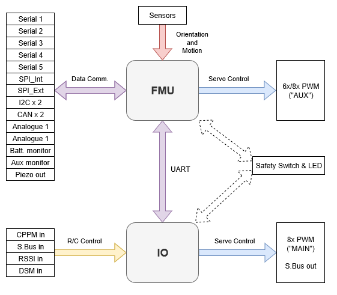

# PX4 Reference Flight Controller Design

The PX4 reference design is the [Pixhawk series](../flight_controller/pixhawk_series.md) of flight controllers. First released in 2011, this design is now in its 5th [generation](#reference_design_generations) (with the 6th generation board design in progress).

## Binary Compatibility

All boards manufactured to a particular design are expected to be binary compatible (i.e. can run the same firmware). From 2018 we will offer a binary compatibility test suite that will allow us to verify and certify this compatibility.

FMU generations 1-3 were designed as open hardware, while FMU generations 4 and 5 provided only pinout and power supply specifications (schematics were created by individual manufacturers). In order to better ensure compatibility, FMUv6 and onward will return to a complete reference design model.

## Reference Design Generations

* FMUv1: Development board \(STM32F407, 128 KB RAM, 1MB flash, [schematics](https://github.com/PX4/Hardware/tree/master/FMUv1)\) (no longer supported by PX4)
* FMUv2: Pixhawk \(STM32F427, 168 MHz, 192 KB RAM, 1MB flash, [schematics](https://github.com/PX4/Hardware/tree/master/FMUv2)\)
* FMUv3: Pixhawk variants with 2MB flash \(3DR Pixhawk 2 \(Solo\), Hex Pixhawk 2.1, Holybro Pixfalcon, 3DR Pixhawk Mini, STM32F427, 168 MHz, 256 KB RAM, 2 MB flash, [schematics](https://github.com/PX4/Hardware/tree/master/FMUv3_REV_D)\)
* FMUv4: Pixracer \(STM32F427, 168 MHz, 256 KB RAM, 2 MB flash, [pinout](https://docs.google.com/spreadsheets/d/1raRRouNsveQz8cj-EneWG6iW0dqGfRAifI91I2Sr5E0/edit#gid=1585075739)\)
* FMUv4 PRO: Drotek Pixhawk 3 PRO \(STM32F469, 180 MHz, 384 KB RAM, 2 MB flash, [pinout](https://docs.google.com/spreadsheets/d/1raRRouNsveQz8cj-EneWG6iW0dqGfRAifI91I2Sr5E0/edit#gid=1585075739)\)
* FMUv5: Holybro Pixhawk 4 \(STM32F765, 216 MHz, 512 KB RAM, 2 MB flash, [pinout](https://docs.google.com/spreadsheets/d/1-n0__BYDedQrc_2NHqBenG1DNepAgnHpSGglke-QQwY/edit#gid=912976165)\)
* FMUv6: work in progress, final name TBD, variant 6s \(STM32H7, 400 MHz, 2 MB RAM,  2 MB flash\) and variant 6i \(i.MX RT1050, 600 MHz, 512 KB RAM, external flash\)

## Main/IO Function Breakdown

The diagram below shows the division of bus and functional responsibilities between the FMU and I/O boards in a Pixhawk-series flight controller (the boards are incorporated into a single physical module).

<!-- Draw.io version of file can be found here: https://drive.google.com/file/d/1H0nK7Ufo979BE9EBjJ_ccVx3fcsilPS3/view?usp=sharing -->

Some Pixhawk-series controllers are built without the I/O board in order to reduce space or complexity, or to better address certain board use-cases.

The I/O board is disabled by setting parameter [SYS_USE_IO=0](../advanced_config/parameter_reference.md#SYS_USE_IO). When the I/O board is disabled:
- The MAIN mixer file is loaded into the FMU (so the "MAIN" outputs listed in the [Airframe Reference](../airframes/airframe_reference.md) appear on the port labeled AUX). The AUX mixer file isn't loaded, so outputs defined in this file are not used.
- RC input goes directly to the FMU rather than via the IO board.

Flight controllers without an I/O board have `MAIN` ports, but they *do not* have `AUX` ports. Consequently they can only be used in [airframes](../airframes/airframe_reference.md) that do not use `AUX` ports, or that only use them for non-essential purposes (e.g. RC passthrough). They can be used for most multicopters and *fully* autonomous vehicles (without a safety pilot using RC control), as these typically only use `MAIN` ports for motors/essential controls.

:::warning
Flight controllers without an I/O board cannot be used in [airframes](../airframes/airframe_reference.md) that map any `AUX` ports to essential flight controls or motors (as they have no `AUX` ports).
:::

:::note
Manufacturer flight controller variants without an I/O board are often named as a "diminutive" of a version that includes the I/O board: e.g. _Pixhawk 4_ **Mini**_, _CUAV v5 **nano**_.
:::

Most PX4 PWM outputs are mapped to either `MAIN` or `AUX` ports in mixers. A few specific cases, including camera triggering and Dshot ESCs, are directly mapped to the FMU pins (i.e. they will output to *either* `MAIN` or `AUX`, depending on whether or not the flight controller has an I/O board).
