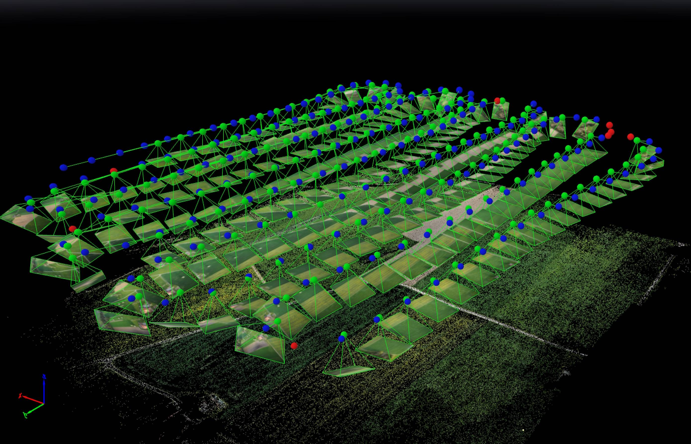

# カメラのトリガー

The camera trigger driver allows the use of the AUX ports to send out pulses in order to trigger a camera.

In addition to a pulse being sent out, the MAVLink [CAMERA_TRIGGER](https://mavlink.io/en/messages/common.html#CAMERA_TRIGGER) message is published containing a sequence number (i.e. the current session's image sequence number) and the corresponding timestamp. This timestamp can be used for several applications, including: timestamping photos for aerial surveying and reconstruction, synchronising a multi-camera system or visual-inertial navigation.

Cameras can also (optionally) use the flight controller [camera capture pin](#camera-capture) to signal the exact moment that a photo/frame is taken. This allows more precise mapping of images to GPS position for geotagging, or the right IMU sample for VIO synchronization, etc.

## Trigger Configuration

Camera triggering is usually configured from the *QGroundControl* [Vehicle Setup > Camera](https://docs.qgroundcontrol.com/en/SetupView/Camera.html#px4-camera-setup) section.


The different [trigger modes](#trigger-modes), [backend interfaces](#trigger-interface-backends) and [hardware setup](#trigger-hardware-configuration) are described below (these can also be set directly from [parameters](../advanced_config/parameters.md)).

:::note
The camera settings section is not available by default for FMUv2-based flight controllers (e.g. 3DR Pixhawk) because the camera module is not automatically included in firmware. For more information see [Finding/Updating Parameters > Parameters Not In Firmware](../advanced_config/parameters.md#parameter-not-in-firmware).
:::

## Trigger Modes

Four different modes are supported, controlled by the [TRIG_MODE](../advanced_config/parameter_reference.md#TRIG_MODE) parameter:

| モード | 説明                                                                                                                                     |
| --- | -------------------------------------------------------------------------------------------------------------------------------------- |
| 0   | カメラトリガーは無効                                                                                                                             |
| 1   | MAVLinkの`MAV_CMD_DO_TRIGGER_CONTROL` コマンドによってオンオフ可能なインターバル撮影モードとして機能します。 See [command interface](#command-interface) for more details. |
| 2   | インターバル撮影を常に行います。                                                                                                                       |
| 3   | 距離に応じてトリガーを行うモードです。 あらかじめ設定された水平距離を飛行するたびに，撮影が行われます。 ただし，2トリガー間の最短時間は設定されたトリガーインターバル時間以上となるよう制限されます。                                   |
| 4   | Missionモードで飛行中，ミッション設定に応じて自動的にトリガーされます。                                                                                                |

:::note
If it is your first time enabling the camera trigger app, remember to reboot after changing the `TRIG_MODE` parameter.
:::

## Trigger Hardware Configuration

The pins used to trigger image capture for GPIO, PWM or Seagull-based triggering (i.e. when not using a MAVLink camera) are set using the [TRIG_PINS](../advanced_config/parameter_reference.md#TRIG_PINS) parameter. The default is 56, which means that trigger is enabled on *FMU* pins 5 and 6.

:::note
On a Pixhawk flight controller that has both FMU and I/O boards these FMU pins map to `AUX5` and `AUX6` (e.g. Pixhawk 4, CUAV v5+). On a controller that only has an FMU, the pins map to `MAIN5` and `MAIN6` (e.g. Pixhawk 4 mini, CUAV v5 nano). At time of writing triggering only works on FMU pins - you can't trigger a camera using pins on the I/O board.
:::

:::warning
With `TRIG_PINS=56` (default) you can use the AUX pins 1 to 4 as actuator outputs (for servos/ESCs). With `TRIG_PINS=78`, you can use the AUX pins 1-6 as actuator outputs. Any other combination of pins can be selected, but this will disable use of the other FMU pins as outputs.
:::

## Trigger Interface Backends

The camera trigger driver supports several backends - each for a specific application, controlled by the [TRIG_INTERFACE](../advanced_config/parameter_reference.md#TRIG_INTERFACE) parameter:

| 番号 | 説明                                                                                                                                                                                                                                                                                                                                                                                                                                                                                                               |
| -- | ---------------------------------------------------------------------------------------------------------------------------------------------------------------------------------------------------------------------------------------------------------------------------------------------------------------------------------------------------------------------------------------------------------------------------------------------------------------------------------------------------------------- |
| 1  | GPIOインターフェースを有効にします。 AUX出力からHIGHもしくはLOWのパルス信号 (`TRIG_POLARITY` パラメータによって極性は設定されます) が [TRIG_INTERVAL](../advanced_config/parameter_reference.md#TRIG_INTERVAL) で設定した間隔で出力されます。 本設定は多くのマシンビジョンカメラのトリガーに直接使用することができます。 なお、PX4FMUシリーズのハードウェア (Pixhawk, Pixracerなど) では信号レベルが3.3Vであることに注意してください。                                                                                                                                                                                                                       |
| 2  | Seagull MAP2用のインターフェースを有効にします。 本設定を選択すると、 [Seagull MAP2](http://www.seagulluav.com/product/seagull-map2/) を用いて様々なカメラの制御が可能となります。 Pin/Channel 1 (camera trigger) and Pin/Channel 2 (mode selector) of the MAP2 should be connected to the lower and higher AUX pins of `TRIG_PINS`, respectively (therefore, channel/pin 1 to AUX 5 and channel/pin 2 to AUX 6 by default). Using Seagull MAP2, PX4 also supports automatic power control and keep-alive functionalities of Sony Multiport cameras like the QX-1. |
| 3  | MAVLinkインターフェースを有効にします。 本モードでは，ハードウェア的な出力は行われません。 MAVLinkの `CAMERA_TRIGGER` メッセージのみが出力されます。(標準の設定では，`onboard`モードでのみ動作します。 その他のモードで使用する場合，カスタムのストリーミング設定を行う必要があります)。                                                                                                                                                                                                                                                                                                                                              |
| 4  | 汎用的なPWMインターフェースを有効にします。 本モードでは、 [赤外線トリガー](https://hobbyking.com/en_us/universal-remote-control-infrared-shutter-ir-rc-1g.html) やサーボを用いたトリガーが可能となります。 The trigger signal is duplicated on both pins specified using `TRIG_PINS`.                                                                                                                                                                                                                                                                                  |

## その他のパラメータ

| パラメータ                                                                      | 説明                                                                                                            |
| -------------------------------------------------------------------------- | ------------------------------------------------------------------------------------------------------------- |
| [TRIG_POLARITY](../advanced_config/parameter_reference.md#TRIG_POLARITY)   | GPIOインターフェースを使用している時のみ反映されます。 トリガーピンの極性を設定します。 アクティブハイは、通常はロー状態であり、トリガーイベント発生時にハイとなることを意味します。 アクティブローはその反対です。 |
| [TRIG_INTERVAL](../advanced_config/parameter_reference.md#TRIG_INTERVAL)   | 連続する2つのトリガーイベント間の時間をミリ秒単位で設定します。                                                                              |
| [TRIG_ACT_TIME](../advanced_config/parameter_reference.md#TRIG_ACT_TIME) | トリガー信号は”アクティブ”に保持される時間の長さをミリ秒単位で設定します。 PWMモードでは、アクティブパルスを常に50Hz PWM信号に適合させるために、最小値は40ミリ秒に制限されています。            |

The full list of parameters pertaining to the camera trigger module can be found on the [parameter reference](../advanced_config/parameter_reference.md#camera-trigger) page.

## Camera Capture

Cameras can also (optionally) use the flight controller camera capture pin to signal the exact moment when a photo/frame is taken. This allows more precise mapping of images to GPS position for geotagging, or the right IMU sample for VIO synchronization, etc.

Camera capture/feedback is enabled in PX4 by setting [CAM_CAP_FBACK = 1](../advanced_config/parameter_reference.md#CAM_CAP_FBACK). The capture pin used depends on the hardware:

* Pixhawk FMUv5x boards use the board-specific camera capture pin (PI0).
* Other board use FMU PWM pin 6 (hardcoded) for camera capture.

PX4 detects a rising edge with the appropriate voltage level on the camera capture pin (for Pixhawk flight controllers this is normally 3.3V). If the camera isn't outputing an appropriate voltage, then additional circuitry will be required to make the signal compatible.

Cameras that have a hotshoe connector (for connecting a flash) can usually be connected via a hotshoe-adaptor. For example, the [Seagull #SYNC2 Universal Camera Hot Shoe Adapter](https://www.seagulluav.com/product/seagull-sync2/) is an optocoupler that decouples and shifts the flash voltage to the Pixhawk voltage. This slides into the flash slot on the top of the camera. The red and black ouptputs are connected to the servo rail/ground and the white wire is connected to the input capture pin.


:::note PX4 emits the MAVLink [CAMERA_TRIGGER](https://mavlink.io/en/messages/common.html#CAMERA_TRIGGER) message on both camera trigger and camera capture. If camera capture is configured, the timestamp from the camera capture driver is used, otherwise the triggering timestamp.
:::

## Command Interface

**TODO : NEEDS UPDATING updating**

The camera trigger driver supports several commands:

[MAV_CMD_DO_TRIGGER_CONTROL](https://mavlink.io/en/messages/common.html#MAV_CMD_DO_TRIGGER_CONTROL) - Accepted in "command controlled" mode (`TRIG_MODE` 1).

| コマンドパラメーター | 説明                                                     |
| ---------- | ------------------------------------------------------ |
| Param #1   | トリガーの有効化/無効化 (0は無効，1は有効)                               |
| Param #2   | トリガーのサイクル時間をミリ秒単位で指定します。(`TRIG_INTERVAL` パラメータを設定します。) |
| Param #3   | シーケンスのリセット(1を指定すると画像の連番のリセットを、0を指定すると現在のカウントを保持します。)   |

[MAV_CMD_DO_DIGICAM_CONTROL](https://mavlink.io/en/messages/common.html#MAV_CMD_DO_DIGICAM_CONTROL) - Accepted in all modes. This is used by the GCS to test-shoot the camera from the user interface. The trigger driver does not yet support all camera control parameters defined by the MAVLink spec.

| コマンドパラメータ | 説明                                     |
| --------- | -------------------------------------- |
| Param #5  | 1枚のみの撮影信号をトリガーします(1を指定すると1枚のみ撮影を行います)。 |

[MAV_CMD_DO_SET_CAM_TRIGG_DIST](https://mavlink.io/en/messages/common.html#MAV_CMD_DO_SET_CAM_TRIGG_DIST) - Accepted in "mission controlled" mode (`TRIG_MODE` 4)

This command is autogenerated during missions to trigger the camera based on survey missions from the GCS.

## Testing Trigger Functionality

1. PX4 のコンソール画面にて: ```camera_trigger test```
2. *QGroundControl*にて:
    
    **Trigger Camera** と書かれたメイン画面上のボタンをクリックします。 これらの撮影はログに反映されず、ジオタグにもカウントされません。
    
    

## Sony QX-1 example (Photogrammetry)


In this example, we will use a Seagull MAP2 trigger cable to interface to a Sony QX-1 and use the setup to create orthomosaics after flying a fully autonomous survey mission.

### Trigger Settings

The recommended camera settings are:

* `TRIG_INTERFACE=2` (Seagull MAP2).
* `TRIG_MODE=4` (Mission controlled).
* Leave the remaining parameters at their defaults.

You will need to connect the Seagull MAP2 to the auxiliary/FMU pins on your autopilot. Pin 1 goes to `AUX 5`, and Pin 2 to `AUX 6`. The other end of the MAP2 cable will go into the QX-1's "MULTI" port.

### Camera Configuration

We use a Sony QX-1 with a 16-50mm f3.5-5.6 lens for this example.

To avoid autofocus and metering lag when the camera is triggered, the following guidelines should be followed:

* Manual focus to infinity
* Set camera to continuous shooting mode
* Manually set exposure and aperture
* ISO should be set as low as possible
* Manual white balance suitable for scene

### Mission Planning


### Geotagging

Download/copy the logfile and images from the flight and point QGroundControl to them. Then click on "Start Tagging".


You can verify the geotagging using a free online service like [Pic2Map](https://www.pic2map.com/). Note that Pic2Map is limited to only 40 images.

### Reconstruction

We use [Pix4D](https://pix4d.com/) for 3D reconstruction.



## Camera-IMU sync example (VIO)

In this example, we will go over the basics of synchronising IMU measurements with visual data to build a stereo Visual-Inertial Navigation System (VINS). To be clear, the idea here isn't to take an IMU measurement exactly at the same time as we take a picture but rather to correctly time stamp our images so as to provide accurate data to our VIO algorithm.

The autopilot and companion have different clock bases (boot-time for the autopilot and UNIX epoch for companion), so instead of skewing either clock, we directly observe the time offset between the clocks. This offset is added or subtracted from the timestamps in the MAVLink messages (e.g `HIGHRES_IMU`) in the cross-middleware translator component (e.g MAVROS on the companion and `mavlink_receiver` in PX4). The actual synchronisation algorithm is a modified version of the Network Time Protocol (NTP) algorithm and uses an exponential moving average to smooth the tracked time offset. This synchronisation is done automatically if MAVROS is used with a high-bandwidth onboard link (MAVLink mode `onboard`).

For acquiring synchronised image frames and inertial measurements, we connect the trigger inputs of the two cameras to a GPIO pin on the autopilot. The timestamp of the inertial measurement from start of exposure and a image sequence number is recorded and sent to the companion computer (`CAMERA_TRIGGER` message), which buffers these packets and the image frames acquired from the camera. They are matched based on the sequence number (first image frame is sequence 0), the images timestamped (with the timestamp from the `CAMERA_TRIGGER` message) and then published.

The following diagram illustrates the sequence of events which must happen in order to correctly timestamp our images.


<!-- Could generate using Mermaid: https://mermaidjs.github.io/mermaid-live-editor
{/% mermaid %/}
sequenceDiagram
  Note right of PX4 : Time sync with mavros is done automatically
  PX4 ->> mavros : Camera Trigger ready
  Note right of camera driver : Camera driver boots and is ready
  camera driver ->> mavros : mavros_msgs::CommandTriggerControl
  mavros ->> PX4 : MAVLink::MAV_CMD_DO_TRIGGER_CONTROL
  loop Every TRIG_INTERVAL milliseconds
  PX4 ->> mavros : MAVLink::CAMERA_TRIGGER
  mavros ->> camera driver : mavros_msgs::CamIMUStamp
  camera driver ->> camera driver : Match sequence number
  camera driver ->> camera driver : Stamp image and publish
end
{/% endmermaid %/}
-->

### Step 1

First, set the TRIG_MODE to 1 to make the driver wait for the start command and reboot your FCU to obtain the remaining parameters.

### Step 2

For the purposes of this example we will be configuring the trigger to operate in conjunction with a Point Grey Firefly MV camera running at 30 FPS.

* `TRIG_INTERVAL`: 33.33 ms
* `TRIG_POLARITY`: 0 (active low)
* `TRIG_ACT_TIME`: 0.5 ms. The manual specifies it only has to be a minimum of 1 microsecond.
* `TRIG_MODE`: 1, because we want our camera driver to be ready to receive images before starting to trigger. This is essential to properly process sequence numbers.
* `TRIG_PINS`: 56, Leave default.

### Step 3

Wire up your cameras to your AUX port by connecting the ground and signal pins to the appropriate place.

### Step 4

You will have to modify your driver to follow the sequence diagram above. Public reference implementations for [IDS Imaging UEye](https://github.com/ProjectArtemis/ueye_cam) cameras and for [IEEE1394 compliant](https://github.com/andre-nguyen/camera1394) cameras are available.