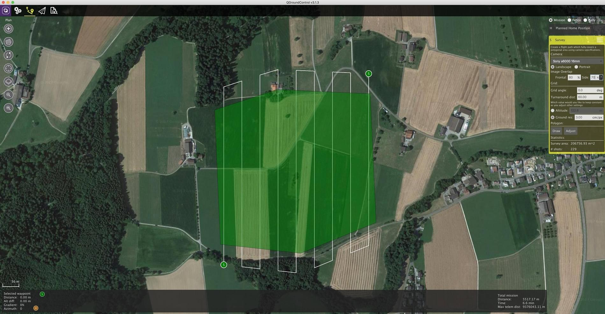

# カメラのトリガー

カメラトリガードライバーを用いると，AUXポートを使用して，カメラトリガー用のパルス信号を出力することができます。 本機能は，航空測量や3次元復元のためのタイムスタンプ付き画像の取得や，複数のカメラの同期撮影，VIO(Visual Inertial Navigation, 光学慣性航法) に役立ちます。

パルス信号の計測に加えて，連番(つまり，現在のセッションの画像番号) とタイムスタンプを含んだMAVLinkメッセージも出力されます。

## トリガー設定 {#trigger_setup_qgc}

トリガー設定は通常 *QGroundControl* を用いて、 [Vehicle Setup > Camera](https://docs.qgroundcontrol.com/en/SetupView/Camera.html#px4-camera-setup) セクションより行います。


[トリガーモード](#trigger_mode)の違い, [バックエンドインターフェース](#trigger_backend),[ハードウェア設定](#hardware_setup) について、以下で説明します。(各項目は[パラメータ](../advanced_config/parameters.md)を用いて設定することも可能です)。

> **Note** カメラ設定は、通常FMU-v2ベースのフライトコントローラ (例. 3DR Pixhawk) では、ファームウェアに標準では含まれていないため、利用不可能です。 詳細については [パラメータの検索/変更 > ファームウェアに含まれないパラメータ](../advanced_config/parameters.md#parameter-not-in-firmware)を参照してください。

## トリガーモード {#trigger_mode}

トリガーモードは全部で4種類あり, [TRIG_MODE](../advanced_config/parameter_reference.md#TRIG_MODE) パラメータを用いて変更可能です。:

| モード | 説明                                                                                                                        |
| --- | ------------------------------------------------------------------------------------------------------------------------- |
| 0   | カメラトリガーは無効                                                                                                                |
| 1   | MAVLinkの`MAV_CMD_DO_TRIGGER_CONTROL` コマンドによってオンオフ可能なインターバル撮影モードとして機能します。 詳細は[コマンドインターフェース](#command_interface) を参照してください。 |
| 2   | インターバル撮影を常に行います。                                                                                                          |
| 3   | 距離に応じてトリガーを行うモードです。 あらかじめ設定された水平距離を飛行するたびに，撮影が行われます。 ただし，2トリガー間の最短時間は設定されたトリガーインターバル時間以上となるよう制限されます。                      |
| 4   | Missionモードで飛行中，ミッション設定に応じて自動的にトリガーされます。                                                                                   |

> **Info** はじめてカメラーのトリガー設定を行う場合, `TRIG_MODE` パラメータの変更後に再起動を忘れずに行ってください。

## トリガーハードウェア設定 {#hardware_setup}

どのピンを用いてトリガーを行うかは，[TRIG_PINS](../advanced_config/parameter_reference.md#TRIG_PINS) パラメータを用いて設定することができます。 標準値は56となっており、これは *FMU* の5番と6番のピンを使用することを意味しています。

> **Note** FMU 基板と I/O 基板を両方有するPixhawkフライトコントローラでは、このFMUピン設定は `AUX5` と `AUX6` を使用することを意味します(例： Pixhawk 4, CUAV v5+)。 FMU基板のみを有するフライトコントローラでは、`MAIN5` と `MAIN6` です(例：Pixhawk 4 mini, CUAV v5 nano)。 現時点では，トリガー機能はFMUピンでのみ動作し，I/Oボード上のピンではトリガーを行うことはできません。

<span></span>

> **Warning** `TRIG_PINS` を **標準の** 56に設定した場合のみ、 AUXピンの1, 2, 3, 4番を(サーボ/ESCなどの) アクチュエータ出力として利用可能です。 ハードウェアタイマーの実装方法の都合で (1234 と 56 はそれぞれ2つの独立したタイマーで駆動される別々のグループとなっています), 本設定がカメラトリガーとFMUからのアクチュエータ出力を同時に可能とする唯一の設定です。 **アクチュエータ出力が必要な場合 `TRIG_PINS` の設定を絶対に変更しないでください。**

## Trigger Interface Backends {#trigger_backend}

The camera trigger driver supports several backends - each for a specific application, controlled by the [TRIG_INTERFACE](../advanced_config/parameter_reference.md#TRIG_INTERFACE) parameter:

| Number | Description                                                                                                                                                                                                                                                                                                                                                                                                                                           |
| ------ | ----------------------------------------------------------------------------------------------------------------------------------------------------------------------------------------------------------------------------------------------------------------------------------------------------------------------------------------------------------------------------------------------------------------------------------------------------- |
| 1      | enables the GPIO interface. The AUX outputs are pulsed high or low (depending on the `TRIG_POLARITY` parameter) every [TRIG_INTERVAL](../advanced_config/parameter_reference.md#TRIG_INTERVAL) duration. This can be used to trigger most standard machine vision cameras directly. Note that on PX4FMU series hardware (Pixhawk, Pixracer, etc.), the signal level on the AUX pins is 3.3v.                                                          |
| 2      | Enables the Seagull MAP2 interface. This allows the use of the [Seagull MAP2](http://www.seagulluav.com/product/seagull-map2/) to interface to a multitude of supported cameras. Pin 1 of the MAP2 should be connected to the lower AUX pin of `TRIG_PINS` (therefore, pin 1 to AUX 5 and pin 2 to AUX 6 by default). In this mode, PX4 also supports automatic power control and keep-alive functionalities of Sony Multiport cameras like the QX-1. |
| 3      | Enables the MAVLink interface. In this mode, no actual hardware output is used. Only the `CAMERA_TRIGGER` MAVLink message is sent by the autopilot (by default, if the MAVLink application is in `onboard` mode. Otherwise, a custom stream will need to be enabled).                                                                                                                                                                                 |
| 4      | Enables the generic PWM interface. This allows the use of [infrared triggers](https://hobbyking.com/en_us/universal-remote-control-infrared-shutter-ir-rc-1g.html) or servos to trigger your camera.                                                                                                                                                                                                                                                  |

## Other Parameters

| Parameter                                                                  | Description                                                                                                                                                                                                                      |
| -------------------------------------------------------------------------- | -------------------------------------------------------------------------------------------------------------------------------------------------------------------------------------------------------------------------------- |
| [TRIG_POLARITY](../advanced_config/parameter_reference.md#TRIG_POLARITY)   | Relevant only while using the GPIO interface. Sets the polarity of the trigger pin. Active high means that the pin is pulled low normally and pulled high on a trigger event. Active low is vice-versa.                          |
| [TRIG_INTERVAL](../advanced_config/parameter_reference.md#TRIG_INTERVAL)   | Defines the time between two consecutive trigger events in milliseconds.                                                                                                                                                         |
| [TRIG_ACT_TIME](../advanced_config/parameter_reference.md#TRIG_ACT_TIME) | Defines the time in milliseconds the trigger pin is held in the "active" state before returning to neutral. In PWM modes, the minimum is limited to 40 ms to make sure we always fit an activate pulse into the 50Hz PWM signal. |

The full list of parameters pertaining to the camera trigger module can be found on the [parameter reference](../advanced_config/parameter_reference.md#camera-trigger) page.

## Command Interface {#command_interface}

**TODO : NEEDS UPDATING updating**

The camera trigger driver supports several commands:

[MAV_CMD_DO_TRIGGER_CONTROL](https://mavlink.io/en/messages/common.html#MAV_CMD_DO_TRIGGER_CONTROL) - Accepted in "command controlled" mode (`TRIG_MODE` 1).

| Command Parameter | Description                                                                                 |
| ----------------- | ------------------------------------------------------------------------------------------- |
| Param #1          | Trigger enable/disable (set to 0 for disable, 1 for start)                                  |
| Param #2          | Trigger cycle time in milliseconds (sets the `TRIG_INTERVAL` parameter.)                    |
| Param #3          | Sequence reset (set to 1 to reset image sequence number, 0 to keep current sequence number) |

[MAV_CMD_DO_DIGICAM_CONTROL](https://mavlink.io/en/messages/common.html#MAV_CMD_DO_DIGICAM_CONTROL) - Accepted in all modes. This is used by the GCS to test-shoot the camera from the user interface. The trigger driver does not yet support all camera control parameters defined by the MAVLink spec.

| Command Parameter | Description                                                          |
| ----------------- | -------------------------------------------------------------------- |
| Param #5          | Trigger one-shot command (set to 1 to trigger a single image frame). |

[MAV_CMD_DO_SET_CAM_TRIGG_DIST](https://mavlink.io/en/messages/common.html#MAV_CMD_DO_SET_CAM_TRIGG_DIST) - Accepted in "mission controlled" mode (`TRIG_MODE` 4)

This command is autogenerated during missions to trigger the camera based on survey missions from the GCS.

## Testing Trigger Functionality

1. On the PX4 console: ```camera_trigger test```
2. From *QGroundControl*:
    
    Click on **Trigger Camera** in the main instrument panel. These shots are not logged or counted for geotagging.
    
    

## Sony QX-1 example (Photogrammetry)


In this example, we will use a Seagull MAP2 trigger cable to interface to a Sony QX-1 and use the setup to create orthomosaics after flying a fully autonomous survey mission.

### Trigger Settings

The recommended camera settings are:

* `TRIG_INTERFAC=2` (Seagull MAP2).
* `TRIG_MODE=4` (Mission controlled).
* Leave the remaining parameters at their defaults.

You will need to connect the Seagull MAP2 to the auxiliary/FMU pins on your autopilot. Pin 1 goes to `AUX 5`, and Pin 2 to `AUX 6`. The other end of the MAP2 cable will go into the QX-1's "MULTI" port.

### Camera Configuration

We use a Sony QX-1 with a 16-50mm f3.5-5.6 lens for this example.

To avoid autofocus and metering lag when the camera is triggered, the following guidelines should be followed:

* Manual focus to infinity
* Set camera to continuous shooting mode
* Manually set exposure and aperture
* ISO should be set as low as possible
* Manual white balance suitable for scene

### Mission Planning




### Geotagging

Download/copy the logfile and images from the flight and point QGroundControl to them. Then click on "Start Tagging".


You can verify the geotagging using a free online service like [Pic2Map](https://www.pic2map.com/). Note that Pic2Map is limited to only 40 images.

### Reconstruction

We use [Pix4D](https://pix4d.com/) for 3D reconstruction.


## Camera-IMU sync example (VIO)

In this example, we will go over the basics of synchronising IMU measurements with visual data to build a stereo Visual-Inertial Navigation System (VINS). To be clear, the idea here isn't to take an IMU measurement exactly at the same time as we take a picture but rather to correctly time stamp our images so as to provide accurate data to our VIO algorithm.

The autopilot and companion have different clock bases (boot-time for the autopilot and UNIX epoch for companion), so instead of skewing either clock, we directly observe the time offset between the clocks. This offset is added or subtracted from the timestamps in the MAVLink messages (e.g `HIGHRES_IMU`) in the cross-middleware translator component (e.g MAVROS on the companion and `mavlink_receiver` in PX4). The actual synchronisation algorithm is a modified version of the Network Time Protocol (NTP) algorithm and uses an exponential moving average to smooth the tracked time offset. This synchronisation is done automatically if MAVROS is used with a high-bandwidth onboard link (MAVLink mode `onboard`).

For acquiring synchronised image frames and inertial measurements, we connect the trigger inputs of the two cameras to a GPIO pin on the autopilot. The timestamp of the inertial measurement from start of exposure and a image sequence number is recorded and sent to the companion computer (`CAMERA_TRIGGER` message), which buffers these packets and the image frames acquired from the camera. They are matched based on the sequence number (first image frame is sequence 0), the images timestamped (with the timestamp from the `CAMERA_TRIGGER` message) and then published.

The following diagram illustrates the sequence of events which must happen in order to correctly timestamp our images.


<!-- Could generate using Mermaid: https://mermaidjs.github.io/mermaid-live-edito
{/% mermaid %/}
sequenceDiagram
  Note right of PX4 : Time sync with mavros is done automatically
  PX4 ->> mavros : Camera Trigger ready
  Note right of camera driver : Camera driver boots and is ready
  camera driver ->> mavros : mavros_msgs::CommandTriggerControl
  mavros ->> PX4 : MAVLink::MAV_CMD_DO_TRIGGER_CONTROL
  loop Every TRIG_INTERVAL milliseconds
  PX4 ->> mavros : MAVLink::CAMERA_TRIGGER
  mavros ->> camera driver : mavros_msgs::CamIMUStamp
  camera driver ->> camera driver : Match sequence number
  camera driver ->> camera driver : Stamp image and publish
end
{/% endmermaid %/}
-->

### Step 1

First, set the TRIG_MODE to 1 to make the driver wait for the start command and reboot your FCU to obtain the remaining parameters.

### Step 2

For the purposes of this example we will be configuring the trigger to operate in conjunction with a Point Grey Firefly MV camera running at 30 FPS.

* `TRIG_INTERVAL`: 33.33 ms
* `TRIG_POLARITY`: 0 (active low)
* `TRIG_ACT_TIME`: 0.5 ms. The manual specifies it only has to be a minimum of 1 microsecond.
* `TRIG_MODE`: 1, because we want our camera driver to be ready to receive images before starting to trigger. This is essential to properly process sequence numbers.
* `TRIG_PINS`: 56, Leave default.

### Step 3

Wire up your cameras to your AUX port by connecting the ground and signal pins to the appropriate place.

### Step 4

You will have to modify your driver to follow the sequence diagram above. Public reference implementations for [IDS Imaging UEye](https://github.com/ProjectArtemis/ueye_cam) cameras and for [IEEE1394 compliant](https://github.com/andre-nguyen/camera1394) cameras are available.