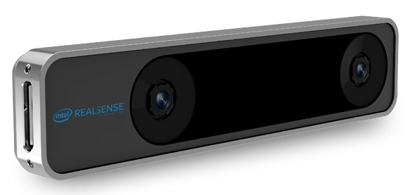

# T265 Intel Realsense Tracking Camera (VIO)

The [Intel Realsense Tracking Camera T265](https://www.intelrealsense.com/tracking-camera-t265/) provides odometry information that can be used for [VIO](../computer_vision/visual_inertial_odometry.md), augmenting or replacing other positioning systems on PX4.

:::tip
This camera is recommended, and is used in the [Visual Inertial Odometry (VIO) > Supported Setup](../computer_vision/visual_inertial_odometry.md#supported_setup).
:::




## Purchase Link

[Intel® RealSense™ Tracking Camera T265](https://store.intelrealsense.com/buy-intel-realsense-tracking-camera-t265.html) (store.intelrealsense.com)


## Setup Instructions

The instructions in [Visual Inertial Odometry (VIO)](../computer_vision/visual_inertial_odometry.md) explain how to set up this camera.

At high level:
- The [VIO bridge ROS node](https://github.com/Auterion/VIO_bridge) provides a bridge between ROS and this camera. This node is only intended for use with this camera.
- The camera should be mounted with lenses facing down (default). For other orientations modify [bridge_mavros.launch](https://github.com/Auterion/VIO/blob/master/launch/bridge_mavros.launch) in the section below:
    ```xml
    <node pkg="tf" type="static_transform_publisher" name="tf_baseLink_cameraPose"
        args="0 0 0 0 1.5708 0 base_link camera_pose_frame 1000"/>
    ```
   This is a static transform that links the camera ROS frame `camera_pose_frame` to the mavros drone frame `base_link`.
   - the first three `args` specify *translation* x,y,z in metres from the center of flight controller to camera. For example, if the camera is 10cm in front of the controller and 4cm up, the first three numbers would be : [0.1, 0, 0.04,...]
   - the next three `args` specify rotation in radians (yaw, pitch, roll). So `[... 0, 1.5708, 0]` means pitch down by 90deg (facing the ground). Facing straight forward would be [... 0 0 0].
- The camera is sensitive to high frequency vibrations! It should be soft-mounted with, for example, vibration isolation foam.
<span id="launch_files"></span> Launch files are provided for a number of different scenarios.

| Launch File                                                                                                 | Starts               | Description                                                      |
| ----------------------------------------------------------------------------------------------------------- | -------------------- | ---------------------------------------------------------------- |
| [bridge_mavros.launch](https://github.com/Auterion/VIO/blob/master/launch/bridge_mavros.launch)             | Bridge, MAVROS       | Use on vehicle in most cases                                     |
| [bridge.launch](https://github.com/Auterion/VIO/blob/master/launch/bridge.launch)                           | Bridge only          | Use if some other component is responsible for starting MAVROS). |
| [bridge_mavros_sitl.launch](https://github.com/Auterion/VIO/blob/master/launch/bridge_mavros_sitl.launch) | Bridge, MAVROS, SITL | Use for simulation.                                              |