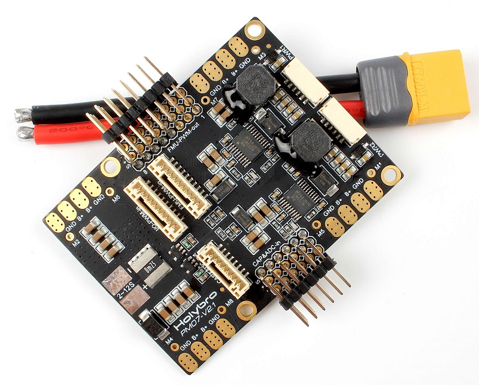
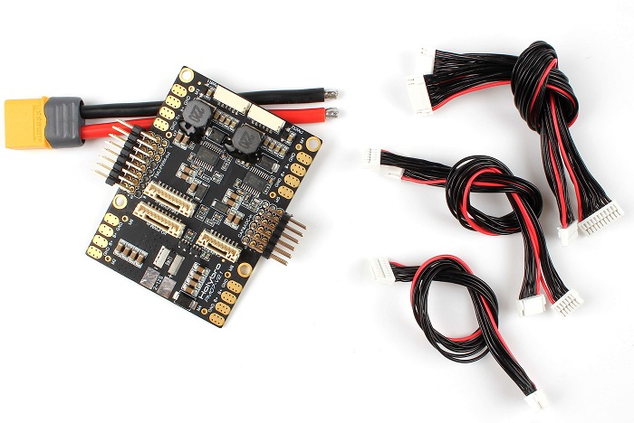
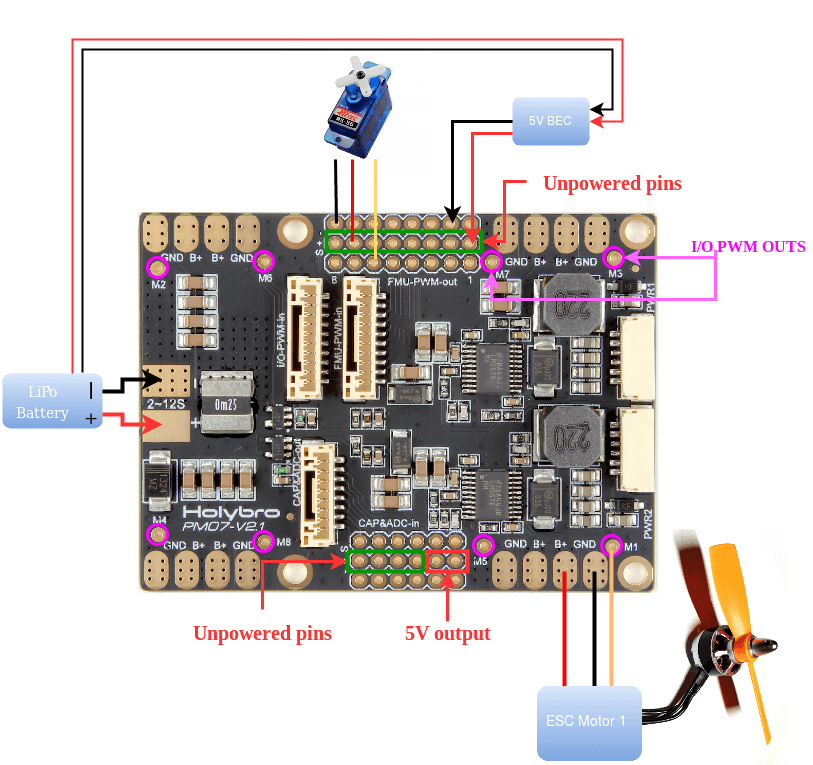

# Holybro Pixhawk 4 Power Module (PM07)

The Power Management Board (PM Board) serves the purpose of a Power Module as well as a Power Distribution Board. In addition to providing regulated power to Pixhawk 4 and the ESCs, it sends information to the autopilot about battery’s voltage and current supplied to the flight controller and the motors.

:::note
This module is included with [Pixhawk 4](../assembly/quick_start_pixhawk4.md), but can also be used with other flight controllers.
:::

## Specifications

- **PCB Current:** total 120A outputs (MAX)
- **UBEC 5v output current:** 3A
- **UBEC input voltage:** 7~51v (2~12s LiPo)
- **Dimensions:** 68*50*8 mm
- **Mounting Holes:** 45x45mm
- **Weight:** 36g

## Package Contents

- PM07 board (1)
- 80mm XT60 connector wire (1)

## Purchase

[Pixhawk 4 Power Module (PM07)](https://shop.holybro.com/pixhawk-4-power-module-pm07_p1095.html)

## Wiring/Connections

Wiring and connection information can be found in: [Pixhawk 4 > Power](../assembly/quick_start_pixhawk4.md#power).

## Further Information

[Quick Start Guide](http://www.holybro.com/manual/PM07-Quick-Start-Guide.pdf) (Holybro)
