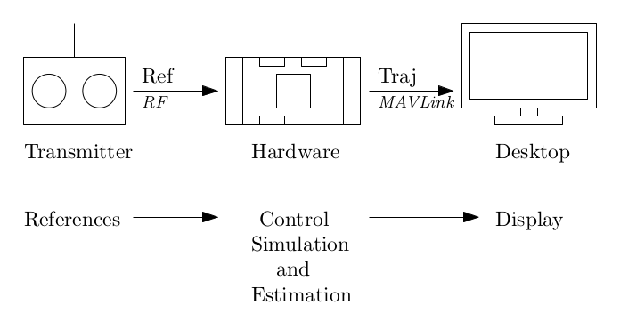

# Simulation-In-Hardware (SIH)

Simulation-In-Hardware (SIH) is an alternative to [Hardware In The Loop simulation (HITL)](../simulation/hitl.md) for quadrotors, fixed-wing vehicles (airplane), and tailsitters. In this setup, everything is running on embedded hardware - the controller, the state estimator, and the simulator. The Desktop computer is only used to display the virtual vehicle.



The SIH provides two benefits over the HITL:
- It ensures synchronous timing by avoiding the bidirectional connection to the computer. As a result the user does not need such a powerful desktop computer.

- The whole simulation remains inside the PX4 environment. Developers who are familiar with PX4 can more easily incorporate their own mathematical model into the simulator. They can, for instance, modify the aerodynamic model, or noise level of the sensors, or even add a sensor to be simulated.

The SIH can be used by new PX4 users to get familiar with PX4 and the different modes and features, and of course to learn to fly a quadrotor or an airplane with the real RC controller.

The quadrotor dynamic model is described in this [pdf report](https://github.com/PX4/PX4-user_guide/raw/main/assets/simulation/SIH_dynamic_model.pdf).

The aerodynamic model for the fixed-wing airplane is inspired from the PhD thesis:
> "Dynamics modeling of agile fixed-wing unmanned aerial vehicles." Khan, Waqas, supervised by Nahon, Meyer, McGill University, PhD thesis, 2016.

The model for the tailsitter vehicle is inspired from the Master thesis:
> "Modeling and control of a flying wing tailsitter unmanned aerial vehicle." Chiappinelli, Romain, supervised by Nahon, Meyer, McGill University, Masters thesis, 2018.

Furthermore, the physical parameters representing the vehicle (such as mass, inertia, and maximum thrust force) can easily be modified from the [SIH parameters](../advanced_config/parameter_reference.md#simulation-in-hardware).

@[youtube](https://youtu.be/PzIpSCRD8Jo)

## Requirements

To run the SIH, you will need a [flight controller](../flight_controller/README.md) (e.g. a Pixhawk-series board). you will also need either a [radio control transmitter and receiver pair](../getting_started/rc_transmitter_receiver.md) or a [joystick](https://docs.qgroundcontrol.com/en/SetupView/Joystick.html) (a joystick can be used via QGroundControl to emulate a radio control system).

- SIH is compatible with all Pixhawk-series boards except those based on FMUv2.
- SIH for quadrotor supported from PX4 v1.9.
- SIH for fixed-wing (airplane) and tailsitter are supported in versions after PX v1.12 (currently in the master branch).

## Setting up SIH

Running the SIH is as easy as selecting an airframe. Plug the autopilot to the desktop computer with a USB cable, let it boot, then using a ground control station select [SIH Quadcopter X](../airframes/airframe_reference.md#simulation-copter), `SIH plane AERT`, or 'SIH Tailsitter Duo'. The autopilot will then reboot.

When the SIH airframe is selected, the module `sih` starts by itself, the vehicle should be displayed on the ground control station map.

:::warning
The airplane needs to takeoff in manual mode at full throttle. Also, if the airplane hits the floor the state estimator might lose its fix.
:::

## Setting up the Display

The simulated vehicle can be displayed in jMAVSim for the following PX4 versions:
- Quadrotor from PX4 v1.11.
- Fixed-wing from the PX4 master (or the release version after PX4 v1.12).

To display the simulated vehicle:
1. Close *QGroundControl* (if open).
1. Unplug and replug the hardware autopilot (allow a few seconds for it to boot).
1. Start jMAVSim by calling the script **jmavsim_run.sh** from a terminal:
   ```
   ./Tools/jmavsim_run.sh -q -d /dev/ttyACM0 -b 2000000 -o
   ```
   where the flags are
   - `-q` to allow the communication to *QGroundControl* (optional).
   - `-d` to start the serial device `/dev/ttyACM0` on Linux. On macOS this would be `/dev/tty.usbmodem1`.
   - `-b` to set the serial baud rate to `2000000`.
   - `-o` to start jMAVSim in *display Only* mode (i.e. the physical engine is turned off and jMAVSim only displays the trajectory given by the SIH in real-time).
   - add a flag `-a` to display an aircraft or '-t' to display a tailsitter. If this flag is not present a quadrotor will be displayed by default.
1. After few seconds, *QGroundControl* can be opened again.

At this point, the system can be armed and flown. The vehicle can be observed moving in jMAVSim, and on the QGC __Fly__ view.


## Credits

The SIH was originally developed by Coriolis g Corporation, then the airplane model and tailsitter models were added by Altitude R&D inc. Both are Canadian companies, Coriolis develops a new type of Vertical Takeoff and Landing (VTOL) vehicles based on passive coupling systems [www.vogi-vtol.com](http://www.vogi-vtol.com/); Altitude R&D is specialized in dynamics, control, and real-time simulation [www.altitude-rd.com](https://www.altitude-rd.com/). They provide the SIH as a simple simulator for quadrotors and airplanes released for free under BSD license.
