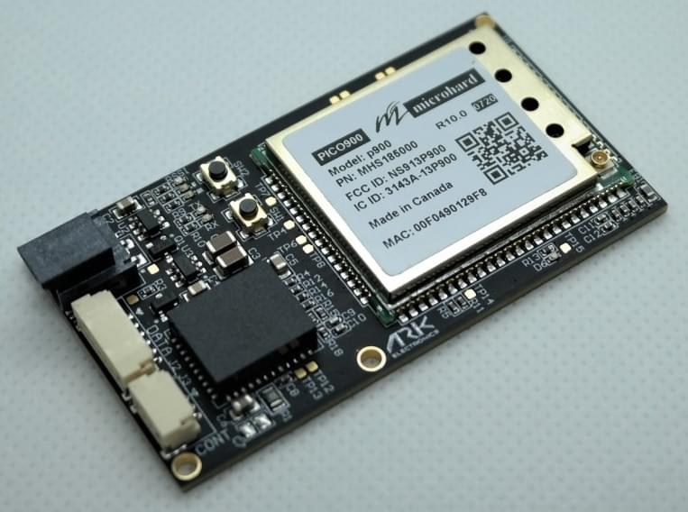
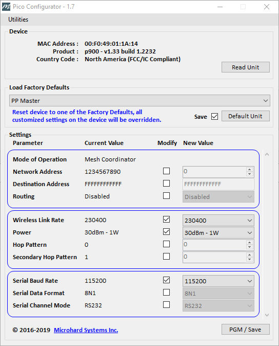

# ARK Electron Microhard Serial Telemetry Radios

[Microhard Pico Serial](http://microhardcorp.com/P900.php) radios enable MAVLink communication between a radio on a vehicle and a GCS. Microhard Pico Serial radios are (up to) 1 Watt output radios that support point to point, point to multi-point, and mesh modes. The Microhard Pico radios can also be ordered with AES-256 encryption.

The approximate range with output power set to 1W is 8km (5miles) when using default settings. A single ground station radio can be used to communicate with multiple vehicles using point to multi-point or mesh. Vehicles must have different MAVLINK IDs.

## Purchase:

* [1W 900MHz Serial Telemetry Radio](https://arkelectron.com/product/1w-900mhz-serial-telemetry-air-radio/) (vehicle)
* [1W 900MHz USB Serial Telemetry Radio](https://arkelectron.com/product/1w-900mhz-serial-telemetry-ground-radio/) (ground station)
* [1W 2.4GHz Serial Telemetry Radio](https://arkelectron.com/product/1w-2400mhz-serial-telemetry-radio/) (vehicle)
* [1W 2.4GHz USB Serial Telemetry Radio](https://arkelectron.com/product/1w-2400mhz-usb-serial-telemetry-radio/) (ground station)

## Connecting

### Vehicle Radio
Connect the vehicle radio to the flight controller `TELEM1` port (any free serial port can be used). A Pixhawk-standard 6 pin JST GH telemetry cable is supplied for this purpose.

The radio can be powered by the telemetry cable if the output power is set to less than 100mW. For higher output levels, the radio must be separately powered via the 2 Pin Molex Nano-Fit (i.e. from a battery).

### Ground Station Radio

Connect the ground radio to the ground station via USB C. The radio does not need to be separately powered when using USB PD (1W power can be supplied).

## Setup/Configuration

The ground radio, air radio, PX4, and QGroundControl must all be set to the same baud rate.

PX4 is configured to use `TELEM1` for telemetry radios, with a default baud rate of 57600 (recommended). No further PX4 configuration is required if you are using this port and baud rate.

:::note
You can configure PX4 to use any other free serial port, or configure the baud rate, by following the instructions in [MAVLink Peripherals](../peripherals/mavlink_peripherals.md)
:::

The radios are configured using [Pico Config](https://arkelectron.com/wp-content/uploads/2021/04/PicoConfig-1.7.zip) (Windows only).

For vehicle radio configuration you will have to connect an FTDI adapter between the radio's 3 pin JST-GH Config port and a Windows PC running *Pico Config* (the radio must be powered, which you can do from battery or the data connection to the flight-controller's `TELEM1` port). *Pico Config* will automatically detect the radio. Adjust the baud rate setting to match PX4 (and the ground station radio).

The ground station radio USB C connection can be used for configuring the radio (as well as for telemetry data). *Pico Config* will automatically detect and connect to the configuration port. Adjust the settings so that the baud rate matches PX4.

Once the radios and PX4 are all configured to use the same baud rate you can connect QGroundControl to the vehicle via the radio. *QGroundControl* will not automatically detect the radio, so first create a new "serial connection" in [Application Settings > Comm Links](https://docs.qgroundcontrol.com/master/en/SettingsView/SettingsView.html) (set the same baud rate as used by PX4/radios).
