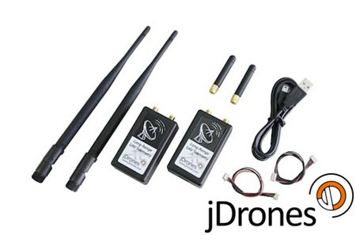

# RFD900 Long-Range Telemetry

[jDrones](http://store.jDrones.com) and [RFDesign](http://rfdesign.com.au/) offer *long-range* [SiK](../telemetry/sik_radio.md)-compatible telemetry radios. The radios provide reliable connectivity at greater than 5km ranges with normal antennas (and have been reported to achieve much greater ranges).

:::tip
*jDrones* have productized *RFDesign* modems (added a casing with power management, filtering and other electronics inside, along with cables to connect to popular flight controllers, and individually validated antennas). The first such modem was the *RFD900*, but both *RFDesign* and *jDrones* have since iterated to new versions.
:::

The *jDrones* radios have a JST-GH connector, and come with cables for: *JST-GH to JST-GH* and *JST-GH to DF-13*. They can therefore be used in a "plug-n-play" way with most [Pixhawk Series](../flight_controller/pixhawk_series.md) controllers (you might have to change/use an appropriate connector for some "non-standard" boards).

There are a number of versions available:

* [jD-RF900Plus Longrange (900Mhz)](http://store.jdrones.com/jD_RD900Plus_Telemetry_Bundle_p/rf900set02.htm) (USA)
* [jD-RF868Plus Longrange (868Mhz)](http://store.jdrones.com/jD_RD868Plus_Telemetry_Bundle_p/rf868set02.htm) (Europe)
* [RFD 900+ Modem](http://store.rfdesign.com.au/rfd-900p-modem/)
* [RFD 868+ Modem](http://store.rfdesign.com.au/rfd-868-modem/)
* [RFD900u](http://store.rfdesign.com.au/rfd-900u-radio-modem/) \(small\)
