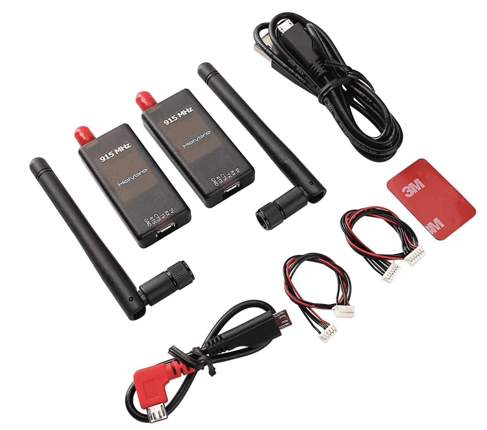

# SiK Radio

[SiK radio](https://github.com/LorenzMeier/SiK) is a collection of firmware and tools for telemetry radios.

PX4 is protocol-compatible with radios that use *SiK*. SiK Radios often come with appropriate connectors/cables allowing them to be directly connected to [Pixhawk Series](../flight_controller/pixhawk_series.md) controllers (in some cases you may need to obtain an appropriate cable/connector). Typically you will need a pair of devices - one for the vehicle and one for the ground station.

Hardware for the SiK radio can be obtained from various manufacturers/stores in variants that support different range and form factors.

## Vendors

* [RFD900 Telemetry Radio](../telemetry/rfd900_telemetry.md)
* [Holybro Telemetry Radio](../telemetry/holybro_sik_radio.md)
* <del><em>HKPilot Telemetry Radio</em></del> (Discontinued)
* <del><em>3DR Telemetry Radio</em></del> (Discontinued)

## Setup/Configuration

The ground station-based radio is connected via USB (essentially plug-n-play).

The vehicle-based radio is connected to the flight-controller's `TELEM1` port, and typically requires no further configuration.

## Firmware Update

Hardware sourced from most [vendors](#vendors) should come pre-configured with the latest firmware. You may need to update older hardware with new firmware, for example to gain support for MAVLink 2.

You can update the radio firmware using *QGroundControl*: [QGroundControl User Guide > Loading Firmware](https://docs.qgroundcontrol.com/master/en/SetupView/Firmware.html).

## Advanced Setup/Configuration

The Development section has [additional information](../data_links/sik_radio.md) about building firmware and AT-command based configuration. This should not be required by non-developers.
