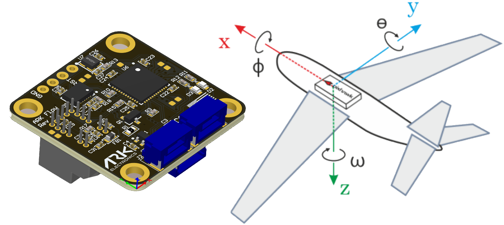

# ARK Flow

ARK Flow is an open source [UAVCAN](README.md) [optical flow](../sensor/optical_flow.md), [distance sensor](../sensor/rangefinders.md), and IMU module.


## Where to Buy

Order this module from:

* [ARK Electronics](https://arkelectron.com/product/ark-flow/) (US)

## Specifications

* [Open Source Schematic and BOM](https://github.com/ARK-Electronics/ARK_Flow)
* Runs [PX4 Open Source Firmware](https://github.com/PX4/PX4-Autopilot/tree/release/1.13/boards/ark/can-flow)
* Supports [UAVCAN](README.md) [Firmware Updating](node_firmware.md)
* Dynamic [UAVCAN](README.md) node enumeration
* Sensors
  * PixArt PAW3902 Optical Flow Sensor
    * Tracks under super low light condition of >9 lux
    * Wide working range from 80mm up to 30m
    * Up to 7.4 rad/s
  * 40mW IR LED built onto board for improved low light operation
  * Broadcom AFBR-S50LV85D Time-of-Flight Distance Sensor
    * Integrated 850 nm laser light source
    * Field-of-View (FoV) of 12.4° x 6.2° with 32 pixels
    * Typical distance range up to 30m
    * Operation of up to 200k Lux ambient light
    * Works well on all surface conditions
    * Transmitter beam of 2° x 2° to illuminate between 1 and 3 pixels
  * Bosch BMI088 6-Axis IMU or Invensense ICM-42688-P 6-Axis IMU
* STM32F412CEU6 MCU
* Two Pixhawk Standard CAN Connectors
  * 4 Pin JST GH
* Pixhawk Standard Debug Connector
  * 6 Pin JST SH
* Small Form Factor
  * 3cm x 3cm x 1.4cm
* LED Indicators
* USA Built


### Wiring/Connecting

The ARK Flow is connected to the CAN bus using a Pixhawk standard 4 pin JST GH cable. Multiple sensors can be connected by plugging additional sensors into the ARK Flow's second CAN connector.

General instructions for UAVCAN wiring can also be found in [UAVCAN > Wiring](../uavcan/README.md#wiring).

<a id="mounting"></a>

### Mounting/Orientation

The recommended mounting orientation is with the connectors on the board pointing towards **back of vehicle**, as shown in the following picture.



This corresponds to the default value (`0`) of the parameter [SENS_FLOW_ROT](../advanced_config/parameter_reference.md#SENS_FLOW_ROT). Change the parameter appropriately if using a different orientation.

The sensor can be mounted anywhere on the frame, but you will need to specify the focal point position, relative to vehicle centre of gravity, during [PX4 configuration](#px4-configuration).


## PX4 Setup

### Enabling UAVCAN

In order to use the ARK Flow board, connect it to the Pixhawk CAN bus and enable the UAVCAN driver by setting parameter [UAVCAN_ENABLE](../advanced_config/parameter_reference.md#UAVCAN_ENABLE) to `2` for dynamic node allocation (or `3` if using [UAVCAN ESCs](../uavcan/escs.md)).

The steps are:
- In *QGroundControl* set the parameter [UAVCAN_ENABLE](../advanced_config/parameter_reference.md#UAVCAN_ENABLE) to `2` or `3` and reboot (see [Finding/Updating Parameters](../advanced_config/parameters.md)).
- Connect ARK Flow CAN to the Pixhawk CAN.

Once enabled, the module will be detected on boot. Flow data should arrive at 10Hz.

### PX4 Configuration

You need to set the EKF optical flow parameters to enable fusing optical flow measurements for velocity calculation, set necessary [UAVCAN](README.md) parameters, and define offsets if the sensor is not centred within the vehicle.

- In *QGroundControl* manually set the parameter [EKF2_AID_MASK](../advanced_config/parameter_reference.md#EKF2_AID_MASK) to `2` to use optical flow only or `3` to use GPS and optical flow. To manually set the value, select `Advanced Settings` and check `manual entry`, then enter the value at the top and save.
- Set [EKF2_RNG_A_HMAX](../advanced_config/parameter_reference.md#EKF2_RNG_A_HMAX) to `10`.
- Set [EKF2_RNG_QLTY_T](../advanced_config/parameter_reference.md#EKF2_RNG_QLTY_T) to `0.2`.
- Set [UAVCAN_RNG_MIN](../advanced_config/parameter_reference.md#UAVCAN_RNG_MIN) to `0.08`.
- Set [UAVCAN_RNG_MAX](../advanced_config/parameter_reference.md#UAVCAN_RNG_MAX) to `30`.
- Set [SENS_FLOW_MINHGT](../advanced_config/parameter_reference.md#SENS_FLOW_MINHGT) to `0.08`.
- Set [SENS_FLOW_MAXHGT](../advanced_config/parameter_reference.md#SENS_FLOW_MAXHGT) to `25`.
- Set [SENS_FLOW_MAXR](../advanced_config/parameter_reference.md#SENS_FLOW_MAXR) to `7.4` to match the PAW3902 maximum angular flow rate.
- Enable [UAVCAN_SUB_FLOW](../advanced_config/parameter_reference.md#UAVCAN_SUB_FLOW).
- Enable [UAVCAN_SUB_RNG](../advanced_config/parameter_reference.md#UAVCAN_SUB_RNG).
- The parameters [EKF2_OF_POS_X](../advanced_config/parameter_reference.md#EKF2_OF_POS_X), [EKF2_OF_POS_Y](../advanced_config/parameter_reference.md#EKF2_OF_POS_Y) and [EKF2_OF_POS_Z](../advanced_config/parameter_reference.md#EKF2_OF_POS_Z) can be set to account for the offset of the Ark Flow from the vehicle centre of gravity.

On the ARK Flow, you may need to configure the following parameters:

| Parameter                                                                                       | Description                   |
| ----------------------------------------------------------------------------------------------- | ----------------------------- |
| <a id="CANNODE_TERM"></a>[CANNODE_TERM](../advanced_config/parameter_reference.md#CANNODE_TERM) | CAN built-in bus termination. |


## Building Ark Flow Firmware

Ark Flow is sold with a recent firmware build. Developers who want to update to the very latest version can build and install it themselves using the normal PX4 toolchain and sources.

The steps are:
1. Install the [PX4 toolchain](../dev_setup/dev_env.md).
1. Clone the PX4-Autopilot sources, including Ark Flow, using *git*:
   ```
   git clone https://github.com/PX4/PX4-Autopilot --recursive
   cd PX4-Autopilot
   ```
1. Build the Ark Flow firmware:
   ```
   make ark_can-flow_default
   ```
1. That will have created a binary in **build/ark_can-flow_default** named **XX-X.X.XXXXXXXX.uavcan.bin**. Put this binary on the root directory of the flight controller’s SD card to flash the Ark Flow. Next time you power your flight controller with the SD card installed, Ark Flow will automatically be flashed and you should notice the binary is no longer in the root directory and there is now a file named **80.bin** in the ufw directory of the SD card.  :::note
 The Ark Flow will not boot if there is no SD card in the flight controller when powered on.

:::


## Updating Ark Flow Bootloader

The Ark Flow comes with the bootloader pre-installed. You can, however, rebuild and reflash it within the PX4-Autopilot environment.

The steps are:
1. Build the Ark Flow bootloader firmware:
   ```
   make ark_can-flow_canbootloader
   ```
:::note
This will setup your `launch.json` file if you are in VS code. If using the Black Magic Probe and VS code, make sure to update `BMPGDBSerialPort` within this file to the correct port that your debugger is connected to. On MacOS, the port name should look something like `cu.usbmodemE4CCA0E11`.
:::
1. Connect to your Ark Flow to any Serial Wire Debugging (SWD) device that supports use of GNU Project Debugger (GDB), such as the Black Magic Probe and then connect power to your Ark Flow via one of the CAN ports.
1. Flash the Ark Flow with `ark_can-flow_canbootloader`. To do so in VS code, you should see `CMake: [ark_can-flow_canbootloader]: Ready` on the bottom bar of VS code, indicating what you are flashing. You then flash the bootloader by selecting `Start Debugging` in the Run and Debug window of VS code and then selecting `Continue` after the first breakpoint.
1. With the bootloader flashed, you are ready to build and flash the Ark Flow firmware `ark_can-flow_default` as outlined above.


## LED Meanings

You will see both red and blue LEDs on the ARK Flow when it is being flashed, and a solid blue LED if it is running properly.

If you see a solid red LED there is an error and you should check the following:
- Make sure the flight controller has an SD card installed.
- Make sure the Ark Flow has `ark_can-flow_canbootloader` installed prior to flashing `ark_can-flow_default`.
- Remove binaries from the root and ufw directories of the SD card and try to build and flash again.

## Video

@[youtube](https://www.youtube.com/watch?v=SAbRe1fi7bU&list=PLUepQApgwSozmwhOo-dXnN33i2nBEl1c0)
<!-- ARK Flow with PX4 Optical Flow Position Hold: 20210605 -->
*PX4 holding position using the ARK Flow sensor for velocity estimation (in [Position Mode](../flight_modes/position_mc.md)).* 
